# Professional Writing Mind Map

This document uses **Mermaid.js** syntax to render a dynamic flowchart. You can view this diagram in any Markdown editor that supports Mermaid (like VS Code, GitHub, Obsidian, or Notion).

## Visual Flowchart

```mermaid
graph TD
    Root["Professional Writing"]
    
    %% Styles
    classDef main fill:#f9f,stroke:#333,stroke-width:4px,font-weight:bold;
    classDef type fill:#e1f5fe,stroke:#0277bd,stroke-width:2px,font-weight:bold;
    classDef detail fill:#fff9c4,stroke:#fbc02d,stroke-width:1px;
    
    class Root main;

    %% Branch 1: Memo / Notice
    Root --> Memo["Memo / Notice"]
    class Memo type;
    
    Memo --> M_P["Purpose:<br/>Internal communication,<br/>announcement, instructions"]
    Memo --> M_K["Key Questions:<br/>Who? What? When?<br/>Where? Why? Action?"]
    Memo --> M_S["Structure:<br/>To/From/Date/Subject<br/>→ Body → Attachments"]
    Memo --> M_T["Tone:<br/>Concise, neutral, professional"]
    class M_P,M_K,M_S,M_T detail;

    %% Branch 2: Cover Letter
    Root --> Cover["Cover Letter"]
    class Cover type;
    
    Cover --> C_P["Purpose:<br/>Apply for job/internship,<br/>highlight skills"]
    Cover --> C_K["Key Questions:<br/>Position, Skills, Projects,<br/>Motivation, Call to action"]
    Cover --> C_S["Structure:<br/>Intro → Skills/Experience<br/>→ Motivation → Closing"]
    Cover --> C_T["Tone:<br/>Professional + personality"]
    class C_P,C_K,C_S,C_T detail;

    %% Branch 3: Resume / CV
    Root --> Resume["Resume / CV"]
    class Resume type;
    
    Resume --> R_P["Purpose:<br/>Showcase education,<br/>skills, experience"]
    Resume --> R_K["Key Questions:<br/>Education, Skills, Projects,<br/>Experience, Achievements"]
    Resume --> R_S["Structure:<br/>Contact → Summary → Education<br/>→ Skills → Projects → Experience"]
    Resume --> R_T["Tone:<br/>Factual, concise, scannable"]
    class R_P,R_K,R_S,R_T detail;

    %% Branch 4: Report
    Root --> Report["Report"]
    class Report type;
    
    Report --> Rep_P["Purpose:<br/>Analyze, summarize,<br/>recommend"]
    Report --> Rep_K["Key Questions:<br/>Topic, Data/Findings,<br/>Analysis, Conclusions"]
    Report --> Rep_S["Structure:<br/>Title → Executive Summary<br/>→ Intro → Findings → Conclusion"]
    Report --> Rep_T["Tone:<br/>Formal, factual"]
    class Rep_P,Rep_K,Rep_S,Rep_T detail;

    %% Branch 5: Inquiry Letter
    Root --> Inquiry["Inquiry / Request"]
    class Inquiry type;
    
    Inquiry --> I_P["Purpose:<br/>Request info, clarification,<br/>or quotation"]
    Inquiry --> I_K["Key Questions:<br/>Recipient, Purpose,<br/>Info needed, Action"]
    Inquiry --> I_S["Structure:<br/>Intro → Details<br/>→ Request → Closing"]
    Inquiry --> I_T["Tone:<br/>Polite, formal"]
    class I_P,I_K,I_S,I_T detail;

    %% Branch 6: Formal Letter
    Root --> Formal["Formal Business Letter"]
    class Formal type;
    
    Formal --> F_P["Purpose:<br/>External or formal<br/>communication"]
    Formal --> F_K["Key Questions:<br/>Recipient, Purpose,<br/>Body, Closing"]
    Formal --> F_S["Structure:<br/>Address → Date<br/>→ Recipient → Salutation → Body"]
    Formal --> F_T["Tone:<br/>Formal, professional"]
    class F_P,F_K,F_S,F_T detail;

    %% Branch 7: Minutes of Meeting
    Root --> MoM["Minutes of Meeting"]
    class MoM type;
    
    MoM --> Mom_P["Purpose:<br/>Record discussions<br/>and decisions"]
    MoM --> Mom_K["Key Questions:<br/>Date/Time, Attendance,<br/>Agenda, Decisions"]
    MoM --> Mom_S["Structure:<br/>Meeting Info → Attendance<br/>→ Agenda → Decisions → Adjournment"]
    MoM --> Mom_T["Tone:<br/>Factual, concise"]
    class Mom_P,Mom_K,Mom_S,Mom_T detail;
```

## How to Use This File

1. **VS Code**: 
   - Install the "Markdown Preview Mermaid Support" extension
   - Open the file and preview it

2. **Obsidian**: 
   - Paste this directly; it renders natively

3. **GitHub**: 
   - Upload this file to a repository
   - GitHub will automatically render the diagram

4. **Mermaid Live Editor**: 
   - Copy the code block and paste it into [Mermaid Live](https://mermaid.live)
   - Customize colors or export as PNG/SVG

5. **Notion / OneNote**: 
   - Copy the mermaid code block and paste it into these platforms if they support Mermaid

## For Exam Prep

Quick scan checklist when analyzing a professional writing question:

✓ **Identify the type** → Match to one of the 7 categories above  
✓ **Extract Key Questions** → What information must you include?  
✓ **Follow the Structure** → Use the flow to organize your answer  
✓ **Match the Tone** → Write with appropriate formality/style
