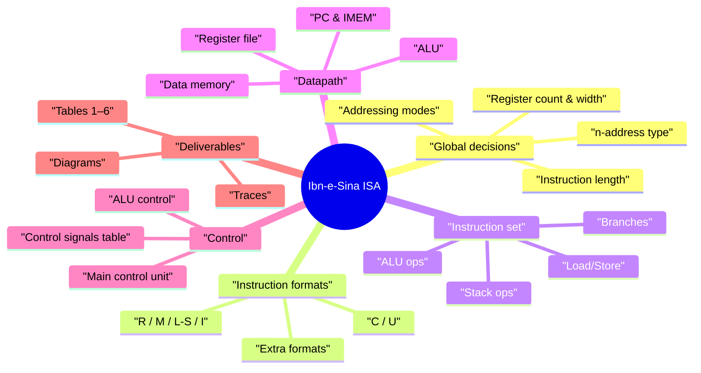

```markdown
# CEP ISA Playbook – Ibn‑e‑Sina Processor (2026)

Design your own **Instruction Set Architecture (ISA)** and datapath for the **Ibn‑e‑Sina** processor used by **Al‑Tusi**.  
This file is your all‑in‑one guide, template, and study board for the CEP.

> Goal: Follow this file from top to bottom, fill in the blanks, and you’ll have everything you need for the handwritten submission.

---

## 1. Quick understanding – what is this CEP?

You are part of a team designing the **ISA** for a new processor called **Ibn‑e‑Sina**.

The teacher fixed some things for you:

- Memory is **byte‑addressable**.
- Multi‑byte data is stored in **big‑endian** order.
- You must design:
  - An **original ISA** (not just RISC‑V/MIPS/x86 with new names).
  - Instruction formats + encodings.
  - General‑purpose registers + special‑purpose registers.
  - At least **16 instructions** from required categories.
  - A datapath (single‑cycle or multi‑cycle).
  - Execution traces for 1 instruction per format.
  - Control signals table + ALU control + main control unit + ALU diagram.

You cannot:

- Use a **32‑register × 32‑bit** register file.
- Support **floating‑point arithmetic**.
- Ignore the division rule (if you support integer division):
  - quotient → destination register,
  - remainder → accumulator.

---

## 2. Submission checklist (tick these as you go)

### Core items

- [ ] Table 1 – Instruction formats and their binary codes (with unused codes).
- [ ] Table 2 – General‑purpose registers (names, codes, purpose).
- [ ] Table 3 – Special‑purpose registers (names, purpose).
- [ ] Table 4 – Instruction list (mnemonic, opcode, syntax, format, action).
- [ ] Table 5 – Bit‑level encodings for all instructions.
- [ ] Table 6 – Control signals per implemented instruction.
- [ ] Datapath diagram (single‑cycle or multi‑cycle).
- [ ] Execution traces (at least one instruction per format).
- [ ] ALU control unit (truth table, equations, logic diagram).
- [ ] Main control unit (truth table, equations, logic diagram).
- [ ] ALU logic diagram.

### Style & logic

- [ ] Every major choice is justified (in simple words).
- [ ] All assumptions are written clearly.
- [ ] Your ISA is obviously **not** a copy/subset of RISC‑V/MIPS/x86.

---

## 3. Global design decisions (fill this once)

These choices control everything else. Lock them in early.

### 3.1 Instruction length

- Type: `Fixed` / `Variable`
- If fixed: **Instruction width** = `__` bits  
  (e.g. 16, 24, or 32)
- If variable:
  - Allowed lengths: `__` bits, `__` bits, …
  - How you encode “length”: `__________________________________`

**Tip:** Fixed‑length (like 16 or 24 bits) is easier to implement and explain.

---

### 3.2 General‑purpose registers (GPRs)

- Total number of GPRs: `__` (must be ≥ 4, but not 32×32).
- Width of each register: `8 / 16 / 32 / 64 / 128` bits.
- Names: `R0, R1, …, R(__)`

Design roles (you can change these):

- **R0** → Accumulator (Acc), commonly used:
  - As an implicit operand for ALU ops.
  - For load/store.
  - To hold division remainder.
- R1–R? → General purpose, base registers, temporaries, etc.
- One register can act as **SP** (stack pointer).
- One register can act as **LR** (link register / return address).

---

### 3.3 n‑address type (0 ≤ n ≤ 3)

Choose the style of your architecture:

- `3‑address` (e.g. `ADD rd, rs1, rs2`) – flexible, uses more bits.
- `2‑address` (e.g. `ADD A, B` ⇒ A = A + B) – saves bits.
- `1‑address` (use Acc as implicit second operand).
- `0‑address` (stack machine).

**Your choice:**  
My ISA is basically a `__‑address` machine because:  
`________________________________________________________`

---

### 3.4 Addressing modes

You **must include** at least:

- Immediate
- Direct
- Register direct
- Base (register + displacement)
- PC‑relative

You can also add others if needed (like register indirect or auto‑increment).

**Your final list of modes:**

- Immediate: `________________________________________`
- Direct: `___________________________________________`
- Register direct: `___________________________________`
- Base (reg + offset): `_______________________________`
- PC‑relative: `______________________________________`
- Extra 1 (optional): `_______________________________`
- Extra 2 (optional): `_______________________________`

---

## 4. Instruction formats (high‑level structure)

You must support these formats:

- R – Register format
- M – Register–Memory format
- L/S – Load/Store format
- I – Immediate format
- C – Conditional branch format
- U – Unconditional branch format
- + up to 2 extra formats (your choice)

### 4.1 Table 1 – Instruction formats

```markdown

### Table 1 – Instruction Formats

| S.No. | Instruction Format | Format Code (bin) | Description                                |
|------:|--------------------|-------------------|--------------------------------------------|
| 1     | Register (R)       | ___               | Reg–reg ALU operations                     |
| 2     | Reg–Mem (M)        | ___               | One reg + one mem, result in reg           |
| 3     | Load/Store (L/S)   | ___               | Move data between memory and registers     |
| 4     | Immediate (I)      | ___               | Reg/mem + immediate constant               |
| 5     | Conditional (C)    | ___               | Conditional branches (PC‑relative offset)  |
| 6     | Unconditional (U)  | ___               | Jumps / calls (PC‑relative offset)         |
| 7     | Extra 1 (e.g. S)   | ___               | e.g. Stack ops with SP                     |
| 8     | Extra 2 / Unused   | ___               | Extra format or mark as unused             |
```

> Put the format code in the most significant bits (top bits) of the instruction.

---

## 5. Registers (Tables 2 and 3)

### 5.1 Table 2 – General‑purpose registers

```markdown

### Table 2 – General‑Purpose Registers

| S.No. | Register Name | Abbrev. | Binary Code | Purpose                                                                  |
|------:|---------------|---------|-------------|--------------------------------------------------------------------------|
| 1     | Accumulator   | R0/Acc  | ___         | Implicit ALU operand; used in load/store; holds division remainder       |
| 2     | Register 1    | R1      | ___         | General purpose / arithmetic                                             |
| 3     | Register 2    | R2      | ___         | General purpose / base register                                          |
| 4     | Register 3    | R3      | ___         | General purpose / base register                                          |
| 5     | Register 4    | R4      | ___         | General purpose                                                         |
| 6     | Register 5    | R5      | ___         | General purpose                                                         |
| 7     | Register 6    | R6      | ___         | May act as SP (stack pointer) or general purpose                         |
| 8     | Register 7    | R7      | ___         | May act as link register or general purpose                              |
| …     | (optional)    | …       | …           | Extra registers or mark codes as unused                                  |
```


---

### 5.2 Table 3 – Special‑purpose registers

```markdown

### Table 3 – Special‑Purpose Registers

| S.No. | Register Name     | Purpose                                         |
|------:|-------------------|-------------------------------------------------|
| 1     | Program Counter   | Address of next instruction                     |
| 2     | Status Register   | Flags (Z, N, C, V) for branches and compares    |
| 3     | Stack Pointer (SP)| Top of the stack for PUSH/POP                   |
| 4     | (optional)        | e.g. Exception PC, loop counter, etc.           |
```


---

## 6. Instruction set (Table 4) – your “language”

You need **at least 16 instructions** across:

- Data transformation (ALU).
- Data transfer (load/store).
- Control transfer (conditional \& unconditional).
- Stack operations.


### 6.1 Ideas for each category

**Data transformation (ALU):**

- Arithmetic: ADD, SUB, NEG.
- Logic: AND, OR, XOR.
- Shifts: SHL (shift left), SHR (shift right).
- Compare: CMP (sets flags only).

**Data transfer:**

- Load: LDW (word), LDB (byte).
- Store: STW (word), STB (byte).

**Control transfer:**

- Conditional: BEQ, BNE, BLT, BGE, BGT, BLE.
- Unconditional: J (jump), CALL, RET.

**Stack operations:**

- PUSH, POP using SP.

---

### 6.2 Table 4 – Instruction reference sheet

```markdown

### Table 4 – Instruction Reference Sheet

| S.No. | Mnemonic | Opcode (bin) | Syntax                | Addr. Mode       | Format | Action / Semantics                                  |
|------:|----------|--------------|-----------------------|------------------|--------|-----------------------------------------------------|
| 1     | ADD      | ____         | ADD rd, rs1, rs2      | reg direct       | R      | rd ← rs1 + rs2                                      |
| 2     | ADDI     | ____         | ADDI rd, rs, imm      | reg + immediate  | I      | rd ← rs + imm                                       |
| 3     | SUB      | ____         | SUB rd, rs1, rs2      | reg direct       | R      | rd ← rs1 - rs2                                      |
| 4     | AND      | ____         | AND rd, rs1, rs2      | reg direct       | R      | rd ← rs1 AND rs2                                    |
| 5     | OR       | ____         | OR rd, rs1, rs2       | reg direct       | R      | rd ← rs1 OR rs2                                     |
| 6     | LDW      | ____         | LDW rd, off(base)     | base + offset    | L/S    | rd ← MEM[base + off]                                |
| 7     | STW      | ____         | STW rs, off(base)     | base + offset    | L/S    | MEM[base + off] ← rs                                |
| 8     | BEQ      | ____         | BEQ rs1, rs2, off     | PC‑relative      | C      | if rs1 == rs2 then PC ← PC + off                    |
| 9     | BNE      | ____         | BNE rs1, rs2, off     | PC‑relative      | C      | if rs1 ≠ rs2 then PC ← PC + off                     |
| 10    | J        | ____         | J off                 | PC‑relative      | U      | PC ← PC + off                                       |
| 11    | CALL     | ____         | CALL off              | PC‑relative      | U      | LR ← PC + 1; PC ← PC + off                          |
| 12    | RET      | ____         | RET                   | implied (LR)     | U/S    | PC ← LR                                             |
| 13    | PUSH     | ____         | PUSH rs               | SP‑relative      | S      | SP ← SP - w; MEM[SP] ← rs                           |
| 14    | POP      | ____         | POP rd                | SP‑relative      | S      | rd ← MEM[SP]; SP ← SP + w                           |
| 15    | CLR      | ____         | CLR rd                | reg direct       | R      | rd ← 0                                              |
| 16    | NOP      | ____         | NOP                   | —                | R/U    | Do nothing                                          |
```

You can add more rows if you want extra instructions.

---

## 7. Encodings (Table 5) – bit layouts

Here you prove that your instruction width and field sizes actually work.

### 7.1 Decide your fields for each format

Example for a 16‑bit R‑format (you can change):

- Bits [15:13] → format (3 bits)
- Bits [12:9] → opcode (4 bits)
- Bits [8:6] → rd (3 bits)
- Bits [5:3] → rs1 (3 bits)
- Bits [2:0] → rs2 (3 bits)

Now design similar layouts for M, L/S, I, C, U, and S.

---

### 7.2 Table 5 – Instruction encodings

```markdown

### Table 5 – Instruction Encodings

| S.No. | Instruction Syntax      | Encoding (MSB → LSB, by fields)                       |
|------:|-------------------------|-------------------------------------------------------|
| 1     | ADD rd, rs1, rs2        | [fmt][opcode][rd][rs1][rs2]                           |
| 2     | ADDI rd, rs, imm        | [fmt][opcode][rd][rs][imm(____ bits)]                 |
| 3     | LDW rd, off(base)       | [fmt][opcode][rd][base][off(____ bits)]               |
| 4     | STW rs, off(base)       | [fmt][opcode][rs][base][off(____ bits)]               |
| 5     | BEQ rs1, rs2, off       | [fmt][opcode][rs1][rs2][off(____ bits, signed)]       |
| 6     | J off                   | [fmt][opcode][off(____ bits, signed)]                 |
| 7     | PUSH rs                 | [fmt][opcode][rs][unused / reserved bits]             |
| 8     | POP rd                  | [fmt][opcode][rd][unused / reserved bits]             |
```

Make sure:

- Register fields can encode every register number.
- Opcode space is enough for your instructions.
- Branch offsets are signed if you want backward branches.

---

## 8. Datapath – what hardware you actually build

You only need to build hardware for a **subset** of your instructions, but at least **one instruction from each format**.

### 8.1 Write down your chosen subset

```markdown
**Subset for hardware implementation**

- R format:   ___________________________
- M format:   ___________________________
- L/S format: ___________________________
- I format:   ___________________________
- C format:   ___________________________
- U format:   ___________________________
- Extra (S):  ___________________________
```

Your datapath, Table 6, and traces should **all match this list**.

---

### 8.2 Typical building blocks

Most single‑cycle or multi‑cycle designs will include:

- PC register + adder (PC + 1 or PC + instruction size).
- Instruction memory + Instruction Register (IR).
- Register file (2 read ports, 1 write port).
- ALU (add, sub, logic, shift, compare).
- Data memory for load/store.
- Sign/zero extender for immediates and offsets.
- MUXes for:
    - ALU input (reg vs immediate vs PC).
    - Write‑back data (ALU vs memory).
    - Next PC (sequential vs branch/jump target).
- Main control unit + ALU control unit.

---

### 8.3 CEP workflow as a Mermaid flowchart

You can paste this into any Markdown viewer that supports Mermaid.

```mermaid
flowchart TD
    A[Start CEP] --> B[Read CEP PDF<br/>and understand rules]
    B --> C[Fix global ISA decisions<br/>(length, regs, n-address, modes)]
    C --> D[Design formats & registers<br/>(Tables 1, 2, 3)]
    D --> E[Define instructions & encodings<br/>(Tables 4 & 5)]
    E --> F[Choose subset & build datapath]
    F --> G[Design control logic<br/>(Table 6, ALU Ctrl, Main Ctrl)]
    G --> H[Trace one instruction per format]
    H --> I[Final review & polish]
    I --> J[End CEP]
```


---

## 9. Control signals and units (Table 6)

### 9.1 Choose your control signals

Common choices:

- `RegWrite`
- `MemRead`
- `MemWrite`
- `MemToReg`
- `ALUSrc`
- `Branch`
- `Jump`
- `ALUOp1`, `ALUOp0`
- You can add others like `UseSP`, `LinkWrite`, etc.

---

### 9.2 Table 6 – Control signal values

```markdown

### Table 6 – Control Signal Values per Instruction

| Instruction | RegWrite | MemRead | MemWrite | MemToReg | ALUSrc | Branch | Jump | ALUOp1 | ALUOp0 | Notes |
|------------|----------|---------|----------|----------|--------|--------|------|--------|--------|-------|
| ADD        |    1     |    0    |    0     |    0     |   0    |   0    |  0   |   0    |   0    | ALU = add |
| ADDI       |    1     |    0    |    0     |    0     |   1    |   0    |  0   |   0    |   1    | ALU = add |
| LDW        |    1     |    1    |    0     |    1     |   1    |   0    |  0   |   0    |   0    | ALU = add address |
| STW        |    0     |    0    |    1     |    X     |   1    |   0    |  0   |   0    |   0    | ALU = add address |
| BEQ        |    0     |    0    |    0     |    X     |   0    |   1    |  0   |   1    |   0    | ALU = subtract |
| J          |    0     |    0    |    0     |    X     |   X    |   0    |  1   |   X    |   X    | PC = PC + offset |
| PUSH       | 0 or 1   |    0    |    1     |    X     |   1    |   0    |  0   |   0    |   0    | SP update + store |
| POP        |    1     |    1    |    0     |    1     |   1    |   0    |  0   |   0    |   0    | SP update + load |
```

“X” means “don’t care”.

---

### 9.3 Main control unit

- Inputs: opcode/format bits.
- Outputs: all high‑level signals (RegWrite, MemRead, Branch, Jump, ALUSrc, ALUOp, etc.).

What you must produce:

- A truth table mapping each opcode to control signals.
- Boolean equations for each signal.
- A logic diagram (gates, decoders, etc.).

---

### 9.4 ALU control unit

- Inputs: ALUOp bits + function bits (lower opcode bits).
- Output: ALU control code (which operation to perform).

You should:

- Define a truth table (ALUOp, func → ALU operation).
- Simplify into equations.
- Draw the circuit.

---

## 10. Small example charts in Markdown

### 10.1 Example: which topics you might study more

This is just an example chart; you can replace it with your own later.


> You can imagine bars for: “ISA basics”, “Addressing modes”, “Instruction formats”, “Datapath”, “Control logic”.

### 10.2 Example: fake study progress

```text
Day 1:  1 topic done
Day 2:  3 topics done
Day 3:  4 topics done
Day 4:  6 topics done
Day 5:  7 topics done
```

You can turn this into a line chart in your notebook if you want.

---

## 11. Another visual: concept map (simple Mermaid mindmap)




---

## 12. Study resources board (YouTube first)

> Use this table like a research to‑do list. Check rows as you watch/read.

```markdown

### ISA & Datapath Learning Board

| Topic                    | Type   | Resource title                              | Link                                                |
|--------------------------|--------|---------------------------------------------|-----------------------------------------------------|
| ISA basic idea           | Video  | What Is Instruction Set Architecture?       | https://www.youtube.com/watch?v=6fgbLOL7bis         |
| ISA overview (text)      | Article| Instruction set architecture (Wikipedia)    | https://en.wikipedia.org/wiki/Instruction_set_architecture |
| ISA fields & formats     | PDF    | Instruction Set Architecture – UCSD slides | https://cseweb.ucsd.edu/classes/su06/cse141/slides/s02-isa-1up.pdf |
| Addressing modes basics  | Article| Addressing Modes – GeeksforGeeks           | https://www.geeksforgeeks.org/computer-organization-architecture/addressing-modes-1/ |
| Addressing modes visual  | Video  | Addressing Modes Part 1                    | https://www.youtube.com/watch?v=M7nHnMEuQRY         |
| Addressing modes deep    | Article| Addressing mode (Wikipedia)                | https://en.wikipedia.org/wiki/Addressing_mode       |
| Single‑cycle datapath    | Video  | Single Cycle Design                        | https://www.youtube.com/watch?v=1oTUjVozQgY         |
| Single‑cycle datapath II | Video  | Lab: Single Cycle Datapaths                | https://www.youtube.com/watch?v=vyJoME8cPWU         |
| RISC‑V single‑cycle      | Video  | CS61C – Single‑Cycle CPU Datapath I        | https://www.youtube.com/watch?v=YAMqWaTZy8k         |
| Multi‑cycle datapath     | Video  | Multi‑Cycle Datapath lecture               | https://www.youtube.com/watch?v=49zRKmEXAcE         |
| ISA + datapath series    | Video  | CS2100 ISA Datapath lecture                | https://www.youtube.com/watch?v=sl2bnX3It2c         |
| Industry view of ISA     | Article| Arm Glossary – ISA                         | https://www.arm.com/glossary/isa                    |
```


---

## 13. Assumptions and reasoning (you fill this)

### 13.1 Assumptions

- A1: `____________________________________________________`
- A2: `____________________________________________________`
- A3: `____________________________________________________`
- A4: `____________________________________________________`


### 13.2 Design reasoning (explain in simple language)

- Why I chose this instruction length:
`________________________________________________________`
- Why I chose this register count/width:
`________________________________________________________`
- Why I chose these addressing modes:
`________________________________________________________`
- Why I chose single‑cycle / multi‑cycle:
`________________________________________________________`

---

## 14. Mini roadmap – how to use this file in 2–3 days

**Day 1**

- Read CEP twice.
- Fill Section 3 (global decisions).
- Draft Tables 1–3.
- Draft Table 4 (at least 16 instructions).

**Day 2**

- Finalize field layouts and fill Table 5.
- Decide subset and sketch datapath.
- Draft control signals and Table 6.

**Day 3**

- Draw ALU, main control, ALU control diagrams.
- Trace 1 instruction per format on the datapath.
- Write assumptions and justifications, then check the checklist.

---

_End of `cep-isa-playbook.md`_

```

If you tell me your chosen instruction length and how many registers you want, I can fill some of the blanks for you in a new version.  ```

