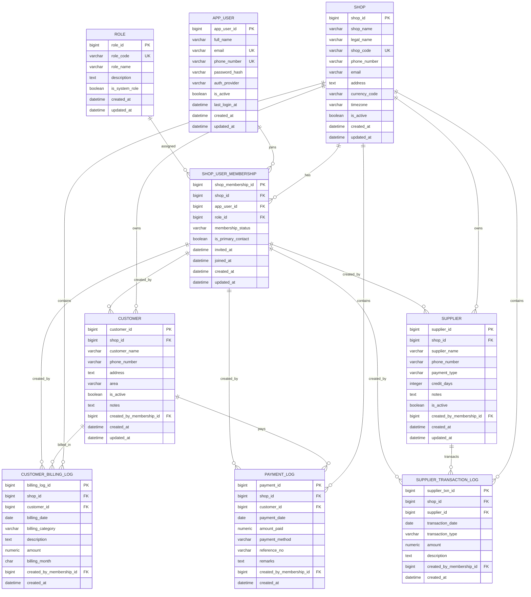

# 🏪 ShopOwner Pro — Multi-Tenant Shop Management System

> A production-ready, PostgreSQL-first blueprint for a **multi-shop**, **multi-admin**, **multi-staff** shop management application.


---

## Table of Contents

- [1. What changed from the old design](#1-what-changed-from-the-old-design)
- [2. Product vision](#2-product-vision)
- [3. Core architecture decisions](#3-core-architecture-decisions)
- [4. Authentication and tenancy model](#4-authentication-and-tenancy-model)
- [5. Role model](#5-role-model)
- [6. Mermaid ERD](#6-mermaid-erd)
- [7. Table-by-table database reference](#7-table-by-table-database-reference)
- [8. Integrity rules](#8-integrity-rules)
- [9. Correct balance calculations](#9-correct-balance-calculations)
- [10. Downloadable SQL files](#10-downloadable-sql-files)
- [11. Recommended stack](#11-recommended-stack)
- [12. Learning roadmap](#12-learning-roadmap)
- [13. Suggested project structure](#13-suggested-project-structure)
- [14. Build order](#14-build-order)
- [15. Migration notes from the old schema](#15-migration-notes-from-the-old-schema)

---

## 1. What changed from the old design

Your original draft was **owner-centric**:

- one shop owner
- one shop
- all business data tied directly to that owner

That model breaks as soon as you need:

- multiple shops in one application
- many admins per shop
- many staff users per shop
- login by users instead of a hardcoded single owner record
- future branch expansion, franchising, or chain support

### New design

This version changes the core model to:

- **`shop`** = the business workspace / tenant
- **`app_user`** = the person who can log in
- **`shop_user_membership`** = the bridge connecting users to shops with a role
- **`role`** = the permissions profile for each membership

### Why this is the correct model

A **shop** is not the thing that authenticates.  
A **person** authenticates and then works **inside a shop**.

So the right separation is:

- **Authentication** → `app_user`
- **Tenant / workspace** → `shop`
- **Authorization inside a shop** → `shop_user_membership` + `role`

---

## 2. Product vision

**ShopOwner Pro** is a database-heavy management system for shops, supermarkets, and SME retail businesses.

It is designed to handle:

- customer credit billing
- payment collection
- supplier ledgers
- staff/admin access by role
- tenant-safe data isolation
- auditability of who created each record

### Primary goals

- **Multi-tenant from day one**
- **PostgreSQL-first architecture**
- **No manually editable balance columns**
- **Accurate transaction-led balances**
- **Clear ownership and audit trail**
- **GitHub-friendly documentation**
- **Easy path from MVP to production**

---

## 3. Core architecture decisions

### 3.1 Multi-tenant by `shop_id`

Every business record belongs to exactly one `shop`.

This gives you:

- tenant isolation
- simpler authorization checks
- safer reporting
- easier scalability

### 3.2 User-based login, not shop-based login

A person logs in using their own credentials.

After login:

- if they belong to one shop → go directly into that shop
- if they belong to multiple shops → show a shop switcher

### 3.3 Membership-based auditing

Instead of only storing `user_id`, business tables store:

- `created_by_membership_id`

This is stronger because the app can prove:

- the user belonged to that shop
- the user had a specific role in that shop context

### 3.4 No balance columns

Balances are always derived from transaction data.

```text
Customer Outstanding = Total Billing - Total Payment
Supplier Outstanding = Purchases - Payments - Adjustments
```

### 3.5 PostgreSQL-first implementation

You asked to work with PostgreSQL, so this documentation treats PostgreSQL as the primary target.

You still get:

- a **raw SQL / MySQL-style schema**
- a **PostgreSQL-native schema**
- a README designed for GitHub

---

## 4. Authentication and tenancy model

### Onboarding flow

```text
1. Create the shop record
2. Create the first user account
3. Create a membership linking that user to the shop
4. Assign the OWNER role to that membership
5. From then on, OWNER/ADMIN can invite other users
6. Invited users get their own membership rows with their roles
```

### Login flow

```text
1. User logs in with email or phone + password/OTP
2. Backend validates credentials
3. Backend fetches active shop memberships
4. If only one membership exists, open that shop automatically
5. If multiple memberships exist, let user choose active shop
6. All requests are scoped by the active shop
```

### Tenant boundary rule

Every query touching business data must filter by `shop_id`.

Examples:

```sql
SELECT * FROM customer WHERE shop_id = :active_shop_id;
SELECT * FROM payment_log WHERE shop_id = :active_shop_id;
SELECT * FROM supplier_transaction_log WHERE shop_id = :active_shop_id;
```

---

## 5. Role model

### Recommended built-in roles

| Role | Purpose | Can manage users? | Can manage customers? | Can record billing/payments? | Can manage suppliers? | Can view reports? |
|---|---|---:|---:|---:|---:|---:|
| `OWNER` | Full control of the shop | ✅ | ✅ | ✅ | ✅ | ✅ |
| `ADMIN` | Administrative operator | ✅ | ✅ | ✅ | ✅ | ✅ |
| `MANAGER` | Daily operations manager | ❌ | ✅ | ✅ | ✅ | ✅ |
| `CASHIER` | Counter / billing operator | ❌ | ✅ | ✅ | ❌ | Limited |
| `STAFF` | Basic staff access | ❌ | Limited | Limited | ❌ | Limited |

> Keep roles in a table, not hardcoded only in application logic. That makes the system easier to extend later.

---

## 6. Mermaid ERD

> This ERD reflects the **new** multi-shop, multi-user design.



---

## 7. Table-by-table database reference

### 7.1 `shop`

Represents a single business unit, branch, store, or supermarket workspace.

| Column | Type | Notes |
|---|---|---|
| `shop_id` | bigint | Primary key |
| `shop_name` | varchar | Public display name |
| `legal_name` | varchar | Optional registered name |
| `shop_code` | varchar | Unique slug/code for routing and internal references |
| `phone_number` | varchar | Main business contact |
| `email` | varchar | Main business email |
| `address` | text | Full address |
| `currency_code` | varchar(3) | Example: `PKR`, `USD` |
| `timezone` | varchar | Example: `Asia/Karachi` |
| `is_active` | boolean | Soft operational status |
| `created_at` / `updated_at` | datetime | Audit timestamps |

---

### 7.2 `app_user`

Represents a real person who can sign in.

| Column | Type | Notes |
|---|---|---|
| `app_user_id` | bigint | Primary key |
| `full_name` | varchar | Full display name |
| `email` | varchar | Unique when present |
| `phone_number` | varchar | Unique when present |
| `password_hash` | varchar | Stored securely |
| `auth_provider` | varchar | Example: `password`, `otp`, `google` |
| `is_active` | boolean | Can log in or not |
| `last_login_at` | datetime | Optional audit field |
| `created_at` / `updated_at` | datetime | Audit timestamps |

> A user may belong to one or many shops.

---

### 7.3 `role`

Stores role definitions.

| Column | Type | Notes |
|---|---|---|
| `role_id` | bigint | Primary key |
| `role_code` | varchar | Example: `OWNER`, `ADMIN`, `MANAGER`, `CASHIER`, `STAFF` |
| `role_name` | varchar | Human-readable name |
| `description` | text | Role explanation |
| `is_system_role` | boolean | Prevent accidental edits/deletes |
| `created_at` / `updated_at` | datetime | Audit timestamps |

---

### 7.4 `shop_user_membership`

Bridge table connecting users to shops.

| Column | Type | Notes |
|---|---|---|
| `shop_membership_id` | bigint | Primary key |
| `shop_id` | bigint | FK → `shop.shop_id` |
| `app_user_id` | bigint | FK → `app_user.app_user_id` |
| `role_id` | bigint | FK → `role.role_id` |
| `membership_status` | varchar | `INVITED`, `ACTIVE`, `SUSPENDED`, `LEFT` |
| `is_primary_contact` | boolean | Usually true for founding owner |
| `invited_at` | datetime | Optional |
| `joined_at` | datetime | Optional |
| `created_at` / `updated_at` | datetime | Audit timestamps |

### Why this table matters

This is the heart of the new system.

Without it, you cannot model:

- multiple admins for one shop
- staff roles
- one user working in multiple shops
- tenant-safe auditing

---

### 7.5 `customer`

All customers belonging to a specific shop.

| Column | Type | Notes |
|---|---|---|
| `customer_id` | bigint | Primary key |
| `shop_id` | bigint | Tenant key |
| `customer_name` | varchar | Required |
| `phone_number` | varchar | Optional but useful |
| `address` | text | Optional/required based on product needs |
| `area` | varchar | Useful for local reporting |
| `is_active` | boolean | Active customer flag |
| `notes` | text | Optional notes |
| `created_by_membership_id` | bigint | Who created the customer |
| `created_at` / `updated_at` | datetime | Audit timestamps |

---

### 7.6 `supplier`

Suppliers for a specific shop.

| Column | Type | Notes |
|---|---|---|
| `supplier_id` | bigint | Primary key |
| `shop_id` | bigint | Tenant key |
| `supplier_name` | varchar | Required |
| `phone_number` | varchar | Optional |
| `payment_type` | varchar | `CASH` or `CREDIT` |
| `credit_days` | integer | Only meaningful when `payment_type = CREDIT` |
| `notes` | text | Optional terms/comments |
| `is_active` | boolean | Active supplier flag |
| `created_by_membership_id` | bigint | Audit |
| `created_at` / `updated_at` | datetime | Audit timestamps |

---

### 7.7 `customer_billing_log`

Stores every customer billing event.

| Column | Type | Notes |
|---|---|---|
| `billing_log_id` | bigint | Primary key |
| `shop_id` | bigint | Tenant key |
| `customer_id` | bigint | FK → customer |
| `billing_date` | date | Billing date |
| `billing_category` | varchar | Example: `GROCERIES`, `ELECTRICITY`, `OTHER` |
| `description` | text | Human-readable note |
| `amount` | numeric | Positive value only |
| `billing_month` | char(7) | Format `YYYY-MM` |
| `created_by_membership_id` | bigint | Who recorded the billing |
| `created_at` | datetime | Audit timestamp |

---

### 7.8 `payment_log`

Stores customer payments.

| Column | Type | Notes |
|---|---|---|
| `payment_id` | bigint | Primary key |
| `shop_id` | bigint | Tenant key |
| `customer_id` | bigint | FK → customer |
| `payment_date` | date | Date received |
| `amount_paid` | numeric | Positive value only |
| `payment_method` | varchar | `CASH`, `BANK`, `WALLET`, `CARD` |
| `reference_no` | varchar | Optional transaction reference |
| `remarks` | text | Optional |
| `created_by_membership_id` | bigint | Who recorded it |
| `created_at` | datetime | Audit timestamp |

---

### 7.9 `supplier_transaction_log`

Supplier ledger entries.

| Column | Type | Notes |
|---|---|---|
| `supplier_txn_id` | bigint | Primary key |
| `shop_id` | bigint | Tenant key |
| `supplier_id` | bigint | FK → supplier |
| `transaction_date` | date | Date of transaction |
| `transaction_type` | varchar | `PURCHASE`, `PAYMENT`, `ADJUSTMENT`, `BONUS`, `RETURN` |
| `amount` | numeric | Positive value only |
| `description` | text | What happened |
| `created_by_membership_id` | bigint | Audit |
| `created_at` | datetime | Audit timestamp |

> Use a positive `amount` and let `transaction_type` decide financial direction. This is cleaner for reporting than storing negative numbers directly.

---

## 8. Integrity rules

These rules make the schema safer and more accurate.

### 8.1 Same-shop integrity

A row created in a shop must reference records from the same shop.

Examples:

- a billing row cannot point to a customer from another shop
- a supplier transaction cannot point to a supplier from another shop
- a `created_by_membership_id` must belong to the same shop as the record being created

This design is enforced in the SQL files using **composite unique keys + composite foreign keys**.

### 8.2 One membership per user per shop

A user can only have one active membership row per shop.

```text
UNIQUE (shop_id, app_user_id)
```

### 8.3 Amounts are positive

Transaction amounts should be stored as positive numbers.

Direction is decided by meaning:

- customer billing → increases receivable
- payment → decreases receivable
- supplier purchase → increases payable
- supplier payment / bonus / adjustment / return → decreases payable

### 8.4 No stored balances

Never add columns like:

- `customer.balance`
- `supplier.current_balance`

Those will drift and cause data corruption over time.

---

## 9. Correct balance calculations

## 9.1 Customer outstanding balance

> Important: do **not** directly join billing rows and payment rows in one aggregation query without pre-aggregating each side first. That causes row multiplication and incorrect totals.

### Correct version

```sql
WITH billed AS (
    SELECT
        shop_id,
        customer_id,
        SUM(amount) AS total_billed
    FROM customer_billing_log
    GROUP BY shop_id, customer_id
),
paid AS (
    SELECT
        shop_id,
        customer_id,
        SUM(amount_paid) AS total_paid
    FROM payment_log
    GROUP BY shop_id, customer_id
)
SELECT
    c.shop_id,
    c.customer_id,
    c.customer_name,
    COALESCE(b.total_billed, 0) AS total_billed,
    COALESCE(p.total_paid, 0) AS total_paid,
    COALESCE(b.total_billed, 0) - COALESCE(p.total_paid, 0) AS outstanding_balance
FROM customer c
LEFT JOIN billed b
    ON b.shop_id = c.shop_id
   AND b.customer_id = c.customer_id
LEFT JOIN paid p
    ON p.shop_id = c.shop_id
   AND p.customer_id = c.customer_id
WHERE c.shop_id = :shop_id
ORDER BY c.customer_name;
```

---

## 9.2 Supplier outstanding balance

```sql
SELECT
    s.shop_id,
    s.supplier_id,
    s.supplier_name,
    COALESCE(
        SUM(
            CASE
                WHEN stl.transaction_type = 'PURCHASE' THEN stl.amount
                WHEN stl.transaction_type IN ('PAYMENT', 'ADJUSTMENT', 'BONUS', 'RETURN') THEN -stl.amount
                ELSE 0
            END
        ),
        0
    ) AS outstanding_balance
FROM supplier s
LEFT JOIN supplier_transaction_log stl
    ON stl.shop_id = s.shop_id
   AND stl.supplier_id = s.supplier_id
WHERE s.shop_id = :shop_id
GROUP BY s.shop_id, s.supplier_id, s.supplier_name
ORDER BY s.supplier_name;
```

---

## 9.3 Monthly billing summary

```sql
SELECT
    shop_id,
    billing_month,
    billing_category,
    SUM(amount) AS total_amount
FROM customer_billing_log
WHERE shop_id = :shop_id
GROUP BY shop_id, billing_month, billing_category
ORDER BY billing_month DESC, billing_category;
```

---

## 10. Downloadable SQL files

This package includes:

- [`schema.mysql.sql`](./schema_mysql.sql) → raw SQL / MySQL-style schema
- [`schema.postgresql.sql`](./schema_postgresql.sql) → PostgreSQL-native schema
- [`shopowner_pro_erd.mmd`](./shopowner_pro_erd.mmd) → standalone Mermaid ERD source

### Which one should you use?

| Scenario | File |
|---|---|
| You want a generic/raw SQL starting point | `schema_mysql.sql` |
| You want the real target implementation | `schema_postgresql.sql` |
| You want to render or edit the ERD separately | `shopowner_pro_erd.mmd` |

> Since your implementation target is PostgreSQL, start with **`schema_postgresql.sql`**.

---

## 11. Recommended stack

## 11.1 Application stack

| Layer | Recommended tool | Why it fits this project |
|---|---|---|
| Frontend app | React + TypeScript + Vite | Fast development, scalable component model, strong typing |
| Styling | Tailwind CSS | Great for fast admin dashboards and internal tools |
| Server state | TanStack Query | Excellent for caching and request lifecycle handling |
| Client state | Zustand | Minimal boilerplate for UI/session state |
| Forms + validation | React Hook Form + Zod | Strong DX, good validation flow |
| Backend API | Node.js + Express + TypeScript | Large ecosystem, fast MVP path |
| Database | PostgreSQL | Strong relational integrity, indexing, advanced SQL |
| DB access | `pg` first, ORM later if needed | Lets you learn SQL properly and keep full control |
| Auth | JWT or secure session cookies | Good fit for app users and shop switching |
| Containers | Docker + Docker Compose | Reproducible dev and deployment |
| CI/CD | GitHub Actions | Simple and powerful automation |
| Hosting | Docker-friendly VPS / Render / Railway / Fly.io | Straightforward deployment for Express + PostgreSQL stack |

---

## 11.2 Learn-the-stack table

> The point of this table is not just naming tools — it gives you a practical learning path before implementation.

| Topic | What to study first | Official docs | Best course / video to start with |
|---|---|---|---|
| React | Components, props, state, effects, routing mindset | [React Docs](https://react.dev/) | [React beginner course](https://www.youtube.com/watch?v=siTUv1L9ymM) |
| TypeScript | Types, interfaces, unions, generics, narrowing | [TypeScript Handbook](https://www.typescriptlang.org/docs/handbook/intro.html) | [TypeScript crash course](https://www.youtube.com/watch?v=BCg4U1FzODs) |
| PostgreSQL | SQL basics, joins, constraints, indexes, transactions | [PostgreSQL Docs](https://www.postgresql.org/docs/current/index.html) | [PostgreSQL tutorial for beginners](https://www.youtube.com/watch?v=SpfIwlAYaKk) |
| Tailwind CSS | Utility classes, layout, spacing, responsive design | [Tailwind Docs](https://tailwindcss.com/docs) | [Tailwind CSS v4 crash course](https://www.youtube.com/watch?v=H_kSd4kn0E8) |
| TanStack Query | fetching, caching, mutation, invalidation | [TanStack Query Docs](https://tanstack.com/query/latest) | [React Query full course](https://www.youtube.com/watch?v=KrruJTTwOgU) |
| Zustand | local app state, auth/session UI state, selectors | [Zustand Docs](https://zustand.docs.pmnd.rs/) | [Learn Zustand in 20 minutes](https://www.youtube.com/watch?v=bFhNFs9SLAA) |
| Zod | schema validation, parsing, server/client validation reuse | [Zod Docs](https://zod.dev/) | [Zod validation tutorial](https://www.youtube.com/watch?v=IcyjtsAdKRs) |
| Express | routing, middleware, validation, modular APIs | [Express Docs](https://expressjs.com/) | [Backend complete course](https://www.youtube.com/watch?v=g09PoiCob4Y) |
| Docker | images, containers, volumes, compose, env files | [Docker Docs](https://docs.docker.com/get-started/) | [Learn Docker in 2 hours](https://www.youtube.com/watch?v=zJ6WbK9zFpI) |
| GitHub Actions | CI, test/build pipelines, deployment workflows | [GitHub Actions Docs](https://docs.github.com/actions) | [Complete GitHub Actions course](https://www.youtube.com/watch?v=Xwpi0ITkL3U) |

### Suggested learning order

1. PostgreSQL
2. SQL querying
3. React
4. TypeScript
5. Express
6. Zod
7. TanStack Query
8. Zustand
9. Docker
10. GitHub Actions

---

## 12. Learning roadmap

### Phase 1 — Database mastery
Focus on:

- tables
- primary keys
- foreign keys
- unique constraints
- composite foreign keys
- indexes
- joins
- aggregate queries
- transactions

### Phase 2 — Backend
Build:

- auth
- role-aware middleware
- shop switch endpoint
- customer module
- billing module
- payment module
- supplier module

### Phase 3 — Frontend
Build:

- auth pages
- shop selector
- dashboard
- customer pages
- billing pages
- payment pages
- supplier ledger pages

### Phase 4 — Production readiness
Add:

- Docker
- migrations
- CI/CD
- environment separation
- backups
- logging
- rate limiting
- monitoring

---

## 13. Suggested project structure

```text
shopowner-pro/
├─ apps/
│  ├─ web/                          # React + TypeScript frontend
│  │  ├─ src/
│  │  │  ├─ app/
│  │  │  ├─ components/
│  │  │  ├─ features/
│  │  │  │  ├─ auth/
│  │  │  │  ├─ shops/
│  │  │  │  ├─ customers/
│  │  │  │  ├─ billing/
│  │  │  │  ├─ payments/
│  │  │  │  └─ suppliers/
│  │  │  ├─ lib/
│  │  │  ├─ routes/
│  │  │  ├─ store/
│  │  │  └─ types/
│  │  └─ package.json
│  │
│  └─ api/                          # Node.js + Express + TypeScript backend
│     ├─ src/
│     │  ├─ config/
│     │  ├─ db/
│     │  ├─ middleware/
│     │  ├─ modules/
│     │  │  ├─ auth/
│     │  │  ├─ shops/
│     │  │  ├─ memberships/
│     │  │  ├─ customers/
│     │  │  ├─ billing/
│     │  │  ├─ payments/
│     │  │  └─ suppliers/
│     │  ├─ shared/
│     │  ├─ utils/
│     │  └─ app.ts
│     └─ package.json
│
├─ database/
│  ├─ schema_mysql.sql
│  ├─ schema_postgresql.sql
│  ├─ seeds/
│  │  └─ seed_roles.sql
│  └─ diagrams/
│     └─ shopowner_pro_erd.mmd
│
├─ docker/
│  ├─ api.Dockerfile
│  └─ web.Dockerfile
│
├─ .github/
│  └─ workflows/
│     ├─ ci.yml
│     └─ deploy.yml
│
├─ docker-compose.yml
└─ README.md
```

---

## 14. Build order

### MVP order

1. Create PostgreSQL schema
2. Seed roles
3. Build auth
4. Build shop + membership bootstrap
5. Build customer CRUD
6. Build customer billing
7. Build payment logging
8. Build supplier CRUD
9. Build supplier transaction ledger
10. Build dashboard summaries
11. Add role-aware permissions
12. Dockerize
13. Add CI/CD

---

## 15. Migration notes from the old schema

### Old schema issue

The old schema tied everything to a single `shop_owner`.

That means:

- no multi-user access
- no multi-shop support
- no role system
- weak extensibility

### New mapping

| Old concept | New concept |
|---|---|
| `SHOP_OWNER` | split into `shop` + `app_user` + `shop_user_membership` |
| owner login | user login |
| single owner record | multiple users per shop |
| one-shop assumption | multi-shop / multi-tenant |
| owner-created records | membership-created records |

### Important business change

A shop now has:

- one or more users
- one or more admins
- one or more staff members
- all operational data scoped to the shop

That is exactly what your updated requirement needs.

---

## Final recommendation

If you are actually going to build this soon:

- use **PostgreSQL**
- keep **`shop` as tenant**
- keep **`app_user` for login**
- keep **`shop_user_membership` for roles**
- keep **balances calculated**
- do not collapse everything back into one owner table

---

## Included files

- `README_shopowner_pro_multitenant.md`
- `schema_mysql.sql`
- `schema_postgresql.sql`
- `shopowner_pro_erd.mmd`

---

**Built for a real multi-shop future, not a one-owner dead end.**
