# 🗄️ Entity-Relationship Model & Database Design
## Complete Lecture Notes + Enhanced Content

**Based on:** Database Management Systems (CS-222) Lectures #6-9  
**Instructor:** Dr. Syed Zaffar Qasim, CIS Department  
**Semester:** Spring 2026  
**Level:** Comprehensive with Advanced Topics

---

## 📚 Table of Contents
1. [Introduction & Rationale](#introduction)
2. [Core Concepts](#core-concepts)
3. [Attributes Deep Dive](#attributes)
4. [Relationships & Mapping Cardinality](#relationships)
5. [Constraints & Keys](#constraints)
6. [E-R Diagrams](#er-diagrams)
7. [Advanced Topics](#advanced-topics)
8. [Common Mistakes & Design Patterns](#mistakes)
9. [Interactive Learning](#interactive)

---

## <a name="introduction"></a>

# 🎯 Introduction & Rationale

## What is the Entity-Relationship Model?

The **Entity-Relationship (ER) Model** is a conceptual framework introduced by **Peter Chen in 1976** that provides a detailed, abstract representation of organizational data. It bridges the gap between real-world business requirements and physical database implementation.

### Why ER Model Matters

The ER model solves a critical problem in database design:

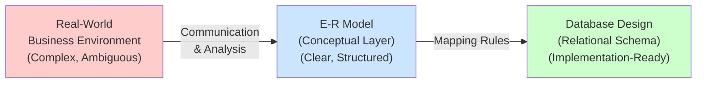

### Key Objectives of ER Modeling

| Objective | Purpose | Benefit |
|-----------|---------|---------|
| **Communication** | Create common understanding among stakeholders | Reduces ambiguity & aligns teams |
| **Documentation** | Visual representation of data structure | Easy to understand and maintain |
| **Validation** | Verify requirements with users | Ensures correct understanding |
| **Design Quality** | Logical foundation before coding | Prevents costly redesigns later |
| **Normalization** | Identify redundancy early | Improves data integrity |

### Key Principles

The ER model is based on **three fundamental principles**:

1. **Entities** - Objects that exist in the real world (nouns)
2. **Relationships** - Associations between entities (verbs)
3. **Attributes** - Properties that describe entities (adjectives)

---

## <a name="core-concepts"></a>

# 🏗️ Core Concepts

## I. Entity Sets

### Definition

An **Entity** is any distinguishable object in the real world that can be uniquely identified from all other objects.

**Key Characteristics:**
- Concrete (person, place, book) or Abstract (loan, course, payment)
- Has properties/attributes that describe it
- Values of certain attributes can uniquely identify it

### Entity Set

An **Entity Set (ES)** is a collection of entities of the same type that share identical attributes.

```
Entity Set: CUSTOMER
├─ customer_id (unique identifier)
├─ customer_name
├─ customer_address
└─ customer_phone

Extension (actual data):
├─ {ID: 001, Name: Ahmed Ali, ...}
├─ {ID: 002, Name: Fatima Khan, ...}
└─ {ID: 003, Name: Hassan Shah, ...}
```

### Real-World Examples

#### Banking Database Example

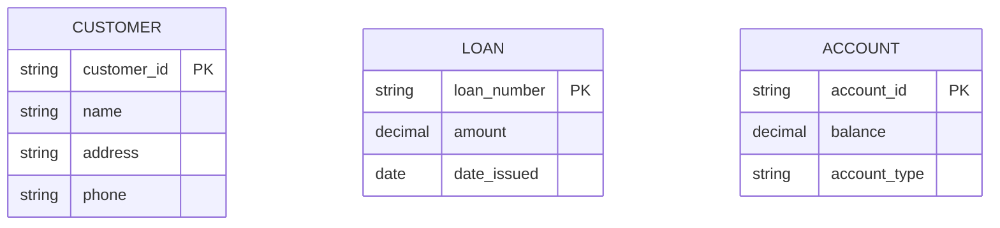

#### E-Commerce Database Example

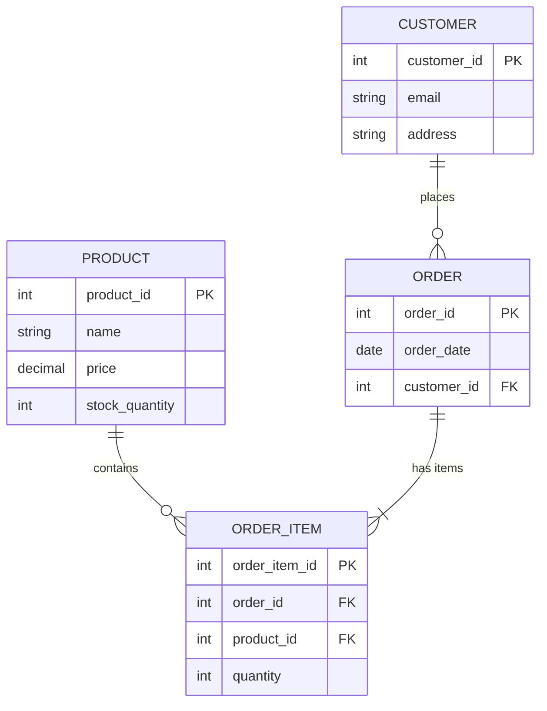

## II. Relationship Sets

### Definition

A **Relationship** is an association or connection among two or more entities.

**Mathematical Definition:**
If E₁, E₂, ..., Eₙ are entity sets, then a relationship set R is:
```
R ⊆ {(e₁, e₂, ..., eₙ) | e₁ ∈ E₁, e₂ ∈ E₂, ..., eₙ ∈ Eₙ}
```

### Relationship Instance vs. Relationship Set

```
Relationship Set: BORROWER
(association between CUSTOMER and LOAN)

Instances:
├─ (Customer: Smith, Loan: L-23)
├─ (Customer: Jones, Loan: L-15)
└─ (Customer: Hayes, Loan: L-11)
```

### Degree of Relationships

The **degree** is the number of entity sets participating in a relationship.


### Role in Recursive Relationships

When the same entity set participates multiple times, **roles** must be explicitly defined:

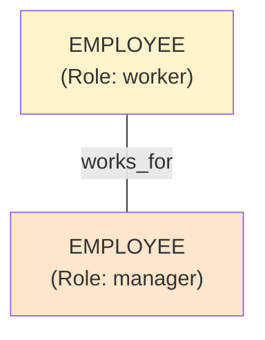

**Example:**
- Employee John (worker) works for Employee Sarah (manager)
- Sarah reports to Employee Michael (manager)

### Relationship Attributes (Descriptive Attributes)

Attributes can be associated with relationships, not just entities:

```mermaid
graph LR
    CUS["CUSTOMER"]
    REL["DEPOSITOR<br/>(access_date)<br/>(last_transaction)"]
    ACC["ACCOUNT"]
    
    CUS ------|many| REL
    REL |----one| ACC
```

| Customer | Account | access_date | last_transaction |
|----------|---------|-------------|------------------|
| Johnson  | A-101   | 2025-01-20  | Withdrawal       |
| Smith    | A-215   | 2025-01-18  | Deposit          |
| Hayes    | A-102   | 2025-01-22  | Transfer         |

---

## <a name="attributes"></a>

# 📋 Attributes: Deep Dive

Attributes are the **properties** that describe entities and relationships. Understanding attribute types is crucial for proper database design.

## Classification Framework

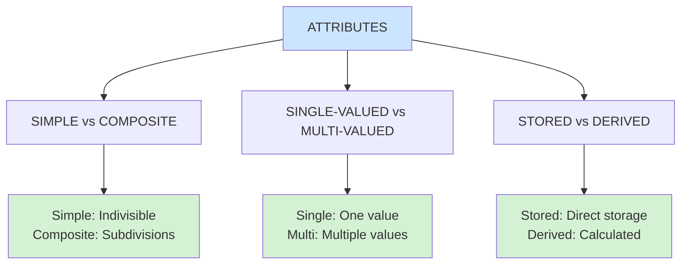

### 1. Simple vs. Composite Attributes

#### Simple Attributes
Cannot be further divided into sub-parts.

**Examples:**
```
- loan_amount: $50,000
- salary: $100,000/year
- age: 28 years
- gender: Male/Female
- student_id: CS-2025-001
```

#### Composite Attributes
Can be subdivided into simpler components that have independent meaning.

**Examples:**

```
ADDRESS (Composite)
├── street
│   ├── street_number: "123"
│   ├── street_name: "Main Street"
│   └── apartment_number: "4B"
├── city: "Karachi"
├── state/province: "Sindh"
├── postal_code: "74200"
└── country: "Pakistan"

NAME (Composite)
├── first_name: "Ahmed"
├── middle_name: "Ali"
└── last_name: "Khan"

FULL_NAME (Composite)
├── first_name
├── middle_initial
└── last_name
```

**When to Use Composite Attributes:**
- When users reference both the whole attribute AND individual parts
- When components have independent meaning
- For better data organization and clarity

### 2. Single-Valued vs. Multi-Valued Attributes

#### Single-Valued Attributes
Has exactly **one value** for each entity instance.

```
STUDENT
├── student_id: "CS-001" (one ID)
├── age: 20 (one age)
├── gpa: 3.5 (one GPA)
└── date_of_birth: "2005-03-15" (one birth date)
```

#### Multi-Valued Attributes
Can have **zero, one, or multiple values** for a single entity instance.

**Examples:**

```
EMPLOYEE
├── phone_number: {0312-1234567, 042-37101010, ...}
│   (multiple phones possible)
├── email: {ahmed@company.com, ahmed.khan@gmail.com}
│   (multiple emails possible)
└── dependent_name: {Fatima, Hassan, Zainab}
    (zero to many dependents)

STUDENT
├── skills: {Java Programming, Web Development, Data Analysis}
│   (multiple technical skills)
├── certifications: {AWS, Azure}
    (multiple certificates)
```

**Visual Representation in ER Diagrams:**
- Multi-valued attributes use **double ellipses** or **curved braces {}**

**Bounds on Multi-Valued Attributes:**
```
phone_number: {0..3}   → minimum 0, maximum 3 phone numbers
skills: {1..5}         → minimum 1, maximum 5 skills
languages: {1..*}      → minimum 1, unlimited maximum
```

### 3. Stored vs. Derived Attributes

#### Stored Attributes
Values are **explicitly stored** in the database.

```
EMPLOYEE
├── date_of_birth: "1995-05-15" ✓ Stored
├── hire_date: "2020-01-10" ✓ Stored
├── salary: 150000 ✓ Stored
└── department_id: "DEPT-03" ✓ Stored
```

#### Derived Attributes
Values are **computed/calculated** from other attributes and NOT stored.

```
EMPLOYEE
├── age: "29" ✗ NOT Stored
│   (derived from: CURRENT_YEAR - BIRTH_YEAR)
├── tenure_years: "5" ✗ NOT Stored
│   (derived from: CURRENT_DATE - hire_date)
├── loans_held: "3" ✗ NOT Stored
│   (derived from: COUNT of loans linked to customer)
└── account_balance: "50,000" ✗ NOT Stored
    (computed from: SUM of all transactions)
```

**Advantages of Derived Attributes:**
- Saves storage space
- Always up-to-date (no stale data)
- Reduces redundancy
- Improves data consistency

**Visual Representation:**
Shown with **dashed ellipses** in ER diagrams

### 4. Complex Attributes

Combinations of composite AND multi-valued attributes.

```
CONTACT_INFO (Complex)
├── phone_number (multi-valued)
│   ├── {0312-1234567, 042-37101010}
└── address (composite)
    ├── street: "Main Street"
    ├── city: "Karachi"
    └── zip: "74200"

EMPLOYEE_RECORD (Complex)
├── address (composite: multi-valued)
│   ├── {
│   │   ├── street: "A-1 Defence"
│   │   ├── city: "Karachi"
│   │   └── type: "Current"
│   │ }, {
│   │   ├── street: "Gulberg"
│   │   ├── city: "Lahore"
│   │   └── type: "Previous"
│   │ }
└── education (composite: multi-valued)
    └── {
        ├── {degree: "BS", field: "CS", year: 2020},
        └── {degree: "MS", field: "AI", year: 2023}
      }
```

### 5. Key Attributes

Attributes (or sets of attributes) that **uniquely identify** each entity instance.

```
STUDENT
├── student_id: "CS-2025-001" ← PRIMARY KEY ✓
├── cnic: "12345-6789012-3" ← UNIQUE KEY ✓
├── email: "student@university.edu" ← UNIQUE KEY ✓
├── name: "Ahmed Khan"
└── date_of_birth: "2005-01-15"
```

**Properties of a Good Primary Key:**
- ✓ Never or rarely changes
- ✓ Uniquely identifies entity
- ✓ Minimal and atomic
- ✓ Never NULL
- ✗ Avoid address (changes often)
- ✗ Avoid names (duplicates possible)
- ✓ Use: CNIC, Passport, Student ID, Employee ID

---

## <a name="relationships"></a>

# 🔗 Relationships & Mapping Cardinality

Cardinality defines the **relationship constraints** between entities—how many entities can be associated with each other.

## Mapping Cardinality Types

### 1. One-to-One (1:1)

**Definition:** Each entity in Set A is associated with **at most one** entity in Set B, and vice versa.

```
PERSON (1) ─── married_to ─── (1) PERSON
│                                  │
married_id: M-001         married_id: M-001 (same)

PASSPORT (1) ─── issued_to ─── (1) CITIZEN
```

**Real-World Examples:**

```
EMPLOYEE (1) ─── assigned_to ─── (1) OFFICE
└─ Each employee has ONE office
└─ Each office is assigned to ONE employee

STUDENT (1) ─── has_one ─── (1) TRANSCRIPT
└─ Each student has ONE official transcript
└─ Each transcript belongs to ONE student

PERSON (1) ─── owns_one ─── (1) NATIONAL_ID
```

**When to Use:**
- Exclusive relationships
- One entity cannot exist without the other (strong participation)
- Sensitive data separation

### 2. One-to-Many (1:N)

**Definition:** Each entity in Set A can be associated with **multiple** entities in Set B, but each entity in B is associated with **at most one** in A.

```
DEPARTMENT (1) ─── employs ─── (N) EMPLOYEE
│                                   │
IT Department ──many──> {John, Sarah, Ahmed}
HR Department ──many──> {Fatima, Hassan}

AUTHOR (1) ─── writes ─── (N) BOOK
```

**Real-World Examples:**

```
BANK_BRANCH (1) ─── operates ─── (N) ATM
└─ One branch operates many ATMs
└─ Each ATM belongs to exactly one branch

COURSE (1) ─── has_enrolled ─── (N) STUDENT
└─ One course has many students
└─ Each student in this course comes from one course instance

COMPANY (1) ─── manufactures ─── (N) PRODUCT
└─ One company makes many products
└─ Each product is made by one company
```

### 3. Many-to-One (N:1)

**Definition:** Multiple entities in Set A can be associated with a **single** entity in Set B.

> **Note:** Many-to-One is the reverse perspective of One-to-Many

```
EMPLOYEE (N) ─── reports_to ─── (1) MANAGER
│                                    │
{Ahmed, Fatima, Hassan} ──all report to──> Sarah
```

**Example:**

```
SURGERY (N) ─── performed_by ─── (1) SURGEON
├─ Multiple surgeries performed by one surgeon
├─ Each surgery is done by one surgeon
```

### 4. Many-to-Many (M:N)

**Definition:** Each entity in Set A can be associated with **multiple** entities in Set B, and each entity in B can be associated with **multiple** entities in A.

```
STUDENT (M) ─── enrolls_in ─── (N) COURSE
│                                   │
{Ahmed, Fatima} ──may take──> {CS-101, CS-102}
Ahmed takes both CS-101 AND CS-102
CS-101 has Ahmed AND Fatima as students
```

**Real-World Examples:**

```
PROJECT (M) ─── assigned_to ─── (N) EMPLOYEE
└─ One employee can work on multiple projects
└─ One project has multiple employees

SUPPLIER (M) ─── supplies ─── (N) PRODUCT
└─ One supplier provides many products
└─ One product can be supplied by multiple suppliers

DOCTOR (M) ─── treats ─── (N) PATIENT
└─ One doctor treats many patients
└─ One patient may be treated by multiple doctors
```

## Cardinality Comparison Table

| Cardinality | A → B | B ← A | SQL Implementation | Example |
|-------------|-------|-------|-------------------|---------|
| **1:1** | one | one | FK in either table | Person ↔ Passport |
| **1:N** | one | many | FK in "many" table (child) | Department → Employees |
| **N:1** | many | one | FK in "many" table (child) | Employees ← Department |
| **M:N** | many | many | **Junction table** needed | Students ↔ Courses |

## Handling Many-to-Many Relationships

Since relational databases cannot directly store M:N relationships, they must be converted into two 1:N relationships using a **junction table** (also called **bridge table** or **join table**).

### Problem Example

```
STUDENT (M) ─── enrolls_in ─── (N) COURSE
```

❌ **Cannot store directly** - data would be ambiguous

### Solution: Junction Table

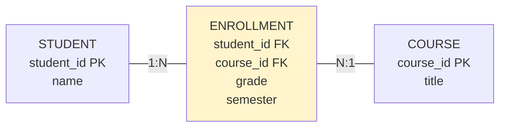

### Junction Table Implementation

```
STUDENT
├── student_id: "CS-001" (PK)
├── name: "Ahmed Ali"
└── email: "ahmed@university.edu"

ENROLLMENT (Junction Table)
├── student_id: "CS-001" (FK)
├── course_id: "CS-101" (FK)
├── grade: "A"
└── semester: "Spring 2025"

COURSE
├── course_id: "CS-101" (PK)
├── title: "Database Systems"
└── credits: 3

Primary Key of ENROLLMENT: (student_id, course_id)
```

| student_id | course_id | grade | semester |
|------------|-----------|-------|----------|
| CS-001 | CS-101 | A | Spring 2025 |
| CS-001 | CS-102 | A- | Spring 2025 |
| CS-002 | CS-101 | B+ | Spring 2025 |
| CS-002 | CS-103 | A | Fall 2024 |

---

## <a name="constraints"></a>

# 🔐 Constraints & Keys

Constraints ensure **data integrity** and enforce business rules. They are critical for maintaining data quality.

## 1. Mapping Cardinality (Already Covered Above)

See section above for 1:1, 1:N, N:1, M:N relationships.

## 2. Keys

Keys uniquely identify entities and relationships.

### Candidate Key
Any attribute or combination of attributes that can uniquely identify an entity.

```
STUDENT
├── student_id (Candidate Key 1)
├── email (Candidate Key 2)
├── cnic (Candidate Key 3)
└── name
```

### Primary Key (PK)
The **chosen** candidate key used as the main identifier.

**Characteristics:**
- ✓ Uniquely identifies entity
- ✓ Never NULL
- ✓ Never or rarely changes
- ✓ Minimal
- ✓ Stable over time

```
STUDENT
├── student_id ← PRIMARY KEY ✓
├── email (Alternate Key)
├── cnic (Alternate Key)
└── name
```

### Foreign Key (FK)
An attribute/set of attributes in one table that **references** the primary key of another table.

```
ENROLLMENT (Child/Detail Table)
├── enrollment_id (PK)
├── student_id (FK → STUDENT.student_id)
└── course_id (FK → COURSE.course_id)

References:
- STUDENT.student_id
- COURSE.course_id
```

### Keys in Relationships

For a relationship set R involving entity sets E₁, E₂, ..., Eₙ:

#### Many-to-Many Relationships

```
Primary Key = PK(E₁) ∪ PK(E₂) ∪ ... ∪ PK(Eₙ) ∪ {relationship attributes}

Example: ENROLLS_IN (Student → Course)
PK = (student_id, course_id)
```

#### One-to-Many Relationships

```
Primary Key = PK(E_many side) ∪ {relationship attributes}

Example: PLACES (Customer → Order)
Where: Customer (1) ─── PLACES ─── (N) Order
PK = order_id (only the "many" side)
```

#### One-to-One Relationships

```
Primary Key = Either PK(E₁) OR PK(E₂) (but not both)

Example: ASSIGNED (Employee → Parking Spot)
Where: Employee (1) ─── ASSIGNED ─── (1) ParkingSpot
PK = employee_id  OR  parking_spot_id (choose one)
```

## 3. Participation Constraints

Determines whether entity participation in a relationship is **mandatory** or **optional**.

### Total Participation (Mandatory)

**Definition:** Every entity in the entity set MUST participate in at least one instance of the relationship set.

**Notation:** Double line (═══)

```
LOAN (Total) ═══ borrowed_by ─── CUSTOMER

Meaning: Every loan must have at least one customer
         (No loan can exist without a borrower)
```

**Real-World Scenarios:**

```
EMPLOYEE must be in WORKS_FOR relationship
└─ Cannot have employee without knowing their department

PAYMENT must be associated with LOAN
└─ Cannot record a payment without linking it to a loan

ORDER_ITEM must reference both ORDER and PRODUCT
└─ Cannot have an order item that doesn't belong to an order
```

### Partial Participation (Optional)

**Definition:** Some entities MAY participate in the relationship; not all must.

**Notation:** Single line (───)

```
CUSTOMER (Partial) ─── borrowed_by ─── LOAN

Meaning: Not every customer borrows loans
         (Customer may have zero loans)
```

**Real-World Scenarios:**

```
EMPLOYEE may participate in SPORTS_CLUB relationship
└─ Not all employees join sports clubs

PERSON may have DRIVING_LICENSE
└─ Not all persons have a driving license

STUDENT may get SCHOLARSHIP
└─ Not all students receive scholarships
```

## Representing Constraints in ER Diagrams

```
             Total Participation (Mandatory)
             ║
CUSTOMER ─── ║ BORROWER ═══ LOAN
             ║              │
        Single line    Double line = Total
        (Partial)       (Mandatory)
```

### Constraint Examples

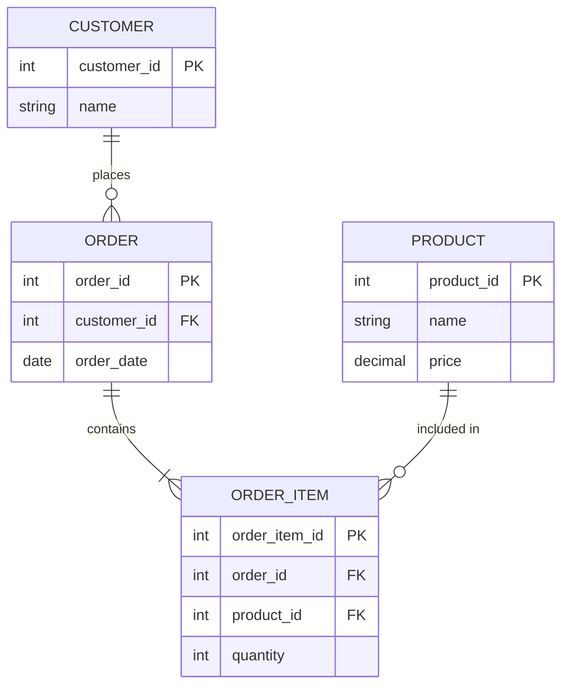

**Explanation:**
- `||--o{` : One CUSTOMER, many ORDERs (Customer may have 0+ orders)
- `||--|{` : Every ORDER_ITEM belongs to one ORDER (Total participation)
- `||--o{` : PRODUCT may be in zero or many ORDER_ITEMs

---

## <a name="er-diagrams"></a>

# 📐 E-R Diagrams & Visual Notation

Entity-Relationship Diagrams (ERD) provide a **graphical representation** of database structure.

## Components & Symbols

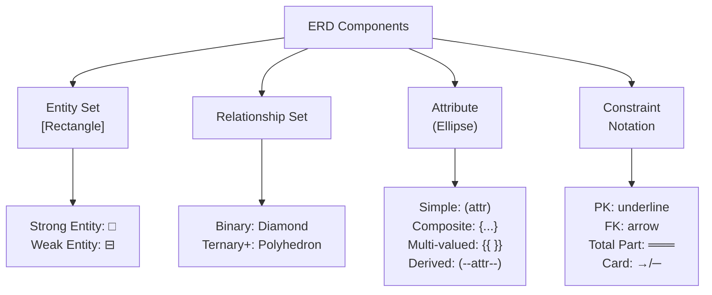

### Symbol Reference

| Symbol | Meaning | Example |
|--------|---------|---------|
| `[ ]` | Strong Entity Set | `[STUDENT]` |
| `[[ ]]` | Weak Entity Set | `[[PAYMENT]]` |
| `< >` | Relationship Set | `<enrolls_in>` |
| `( )` | Simple Attribute | `(student_id)` |
| `{ }` | Composite Attribute | `{address}` |
| `{{ }}` | Multi-valued Attribute | `{{phone}}` |
| `(- -)` | Derived Attribute | `(--age--)` |
| `───` | Partial Participation | Normal line |
| `═══` | Total Participation | Double line |
| `→` | Cardinality "One" | Arrow pointing to 1 |
| `─` | Cardinality "Many" | Regular line |
| `<u>attr</u>` | Primary Key | Underlined |

## Complete ERD Example: University System

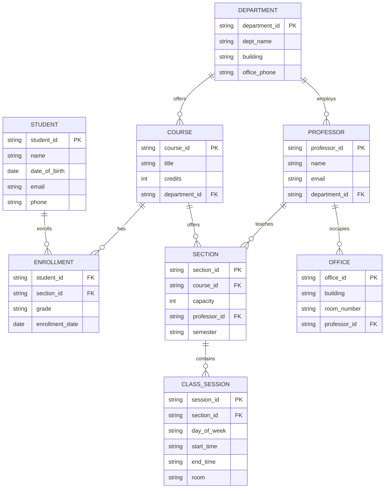

## Step-by-Step ERD Design Process

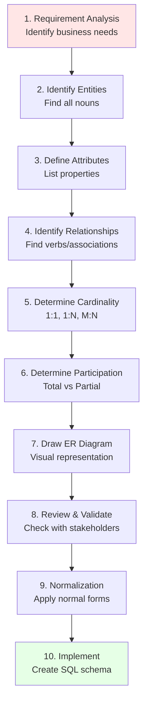

### Example: Hospital Management System

#### Step 1: Requirements
- Track doctors, patients, departments
- Record appointments and diagnoses
- Manage hospital wards and beds
- Track medications prescribed

#### Step 2-4: Entities & Attributes

```
DOCTOR
├── doctor_id (PK)
├── name (Composite: first_name, last_name)
├── specialization
├── phone_number (Multi-valued)
└── department_id (FK)

PATIENT
├── patient_id (PK)
├── name (Composite)
├── date_of_birth
├── blood_type
├── emergency_contact
└── address (Composite)

APPOINTMENT
├── appointment_id (PK)
├── doctor_id (FK)
├── patient_id (FK)
├── appointment_date
├── reason
└── diagnosis

WARD
├── ward_id (PK)
├── ward_name
├── department_id (FK)
└── capacity

BED
├── bed_id (PK)
├── ward_id (FK)
├── bed_number
└── status (available/occupied)

MEDICATION
├── medication_id (PK)
├── name
├── dosage
└── side_effects (Multi-valued)
```

#### Step 5-9: Complete ERD

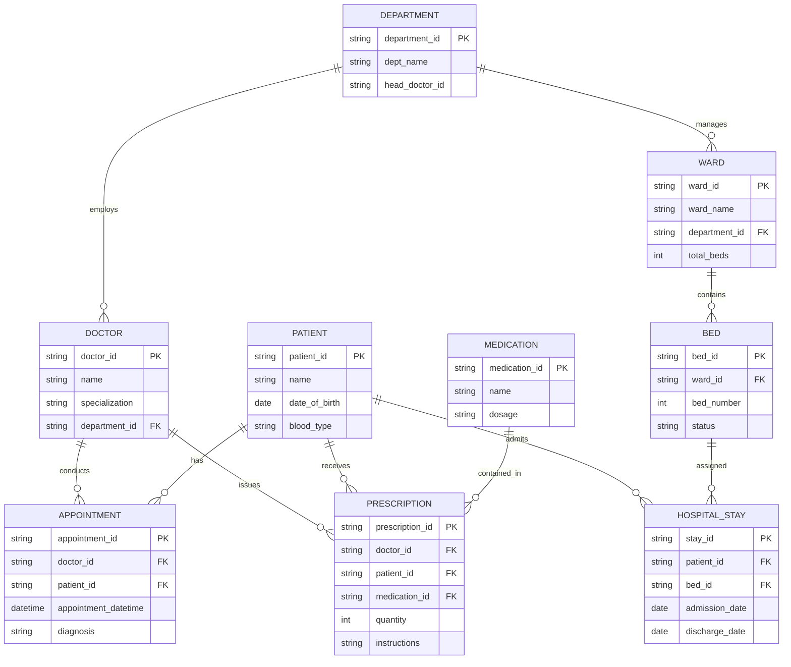

---

## <a name="advanced-topics"></a>

# 🚀 Advanced Topics

## I. Weak Entity Sets

### Definition

A **Weak Entity Set** is an entity set that **cannot be uniquely identified** by its own attributes alone. It depends on another entity (called the **owner** or **identifying** entity) for identification.

**Key Characteristics:**
- No inherent primary key
- Existence-dependent on a strong entity
- Uses a **partial key** (discriminator) + owner's PK for identification
- Always participates totally in identifying relationship

### Why Weak Entities?

```
LOAN (Strong Entity)
└── PAYMENT (Weak Entity)

Payment numbers are sequential (1, 2, 3...) for each loan
So payment_number alone is NOT unique
Example: Loan L-15 has Payment 1, Loan L-23 also has Payment 1
→ Composite key needed: (loan_number, payment_number)
```

### Structure of Weak Entities

```
Strong Entity (Owner)     Identifying Relationship    Weak Entity
┌─────────────┐          ┌──────────────────┐      ┌────────────┐
│    LOAN     │          │  loan_payment    │      │  PAYMENT   │
├─────────────┤          │(double diamond)  │      ├────────────┤
│ loan_id PK  ├─────────▶│   (1:N ratio)    ◀────┤ payment_# ∿ │
│ amount      │ (double  │  (mandatory)     │ (weak)│ payment_dt │
│ date        │   line)  │                  │      │ payment_amt│
└─────────────┘          └──────────────────┘      └────────────┘

∿ = Partial Key (dashed underline)
```

### Real-World Examples

#### 1. Course Offerings

```
COURSE (Strong)
├── course_id
├── title
└── credits

        ╔════════════════╗
        ║  offered_in    ║
        ╚════════════════╝

COURSE_OFFERING (Weak)
├── course_id (FK, PK part)
├── semester ∿ (PK part)
├── year ∿ (PK part)
└── section_number ∿ (PK part)

Primary Key: (course_id, semester, year, section_number)
```

#### 2. Employee Dependents

```
EMPLOYEE (Strong)
├── employee_id PK
├── name
└── salary

        ╔════════════════╗
        ║   has_dependent║
        ╚════════════════╝

DEPENDENT (Weak)
├── employee_id FK, PK part
├── dependent_name ∿ PK part
├── relationship
└── date_of_birth

Primary Key: (employee_id, dependent_name)
```

#### 3. Bank Account Transactions

```
ACCOUNT (Strong)
├── account_id PK
├── balance
└── account_type

        ╔════════════════╗
        ║  has_transaction║
        ╚════════════════╝

TRANSACTION (Weak)
├── account_id FK, PK part
├── transaction_# ∿ PK part
├── amount
├── type (Deposit/Withdrawal)
└── timestamp

Primary Key: (account_id, transaction_#)
```

### Identifying Relationship Properties

```
1. Relationship is Many-to-One (weak:strong = N:1)
2. Participation of weak entity is TOTAL (mandatory)
3. No descriptive attributes on relationship
4. Weak entity primary key = (Owner PK + Partial Key)
```

## II. Design Issues & Decisions

### Issue 1: Entity vs. Attribute

Should telephone be an **entity** or an **attribute**?

#### Option A: As Attribute

```
EMPLOYEE
├── employee_id
├── name
└── telephone_number (single-valued)
```

✓ **Pros:** Simple, minimal storage
✗ **Cons:** Only ONE telephone per employee; Cannot store extra info (location, type)

#### Option B: As Entity

```
EMPLOYEE ─── has ─── TELEPHONE
EMPLOYEE                    TELEPHONE
├── employee_id      ├── telephone_id
└── name             ├── phone_number
                     └── location (home/office/mobile)
```

✓ **Pros:** Multiple phones per employee; Extra attributes possible
✗ **Cons:** More complex; more tables

**Decision Rule:**
- Use **entity** if: You need multiple values OR additional attributes for the object
- Use **attribute** if: Single value only AND no additional properties needed

### Issue 2: Entity vs. Relationship

Should a loan be an **entity** or a **relationship**?

#### Option A: Loan as Relationship

```
CUSTOMER ─── loan ─── BRANCH
Attributes: loan_number, amount

Problem: Joint loans (multiple customers)
Solution: Create separate relationship instance for each customer
Result: Duplicate loan_number and amount data ❌
```

#### Option B: Loan as Entity

```
CUSTOMER ─── borrows ─── LOAN
LOAN ─── at_branch ─── BRANCH

Loan_number and amount stored once ✓
Can handle multiple borrowers elegantly ✓
```

**Decision Rule:**
- Use **relationship** if: 1:1 or 1:N relationship with no future complications
- Use **entity** if: M:N possible OR multiple attributes needed OR data replication issues

### Issue 3: Attribute Placement in Relationships

Where should relationship attributes go in different cardinalities?

#### One-to-Many Relationship

```
CUSTOMER (1) ─── depositor ─── (N) ACCOUNT
             (access_date)

Since each account belongs to ONE customer:
access_date can go to ACCOUNT table ✓
```

#### Many-to-Many Relationship

```
STUDENT (M) ─── enrolls_in ─── (N) COURSE
           (grade, semester)

grade must stay with relationship ✓
Because one student's grade in CS-101 ≠ another student's grade in CS-101
```

**Rule:**
- **1:N:** Can move attribute to "many" side table
- **M:N:** Must keep in relationship (junction table)
- **1:1:** Can place in either entity table

## III. Specialization & Generalization

### Specialization (Top-Down)

Breaking a general entity into more specific sub-entities.

```
PERSON (Supertype)
├── person_id
├── name
└── address

        ↓ Specialization

EMPLOYEE (Subtype)          STUDENT (Subtype)
├── person_id              ├── person_id
├── employee_id            ├── student_id
├── salary                 └── major
└── department_id
```

### Generalization (Bottom-Up)

Combining specific entities into a more general entity.

```
AUTOMOBILE              MOTORCYCLE           TRUCK
(Subtype)              (Subtype)            (Subtype)
├── vehicle_id         ├── vehicle_id       ├── vehicle_id
├── model              ├── model            ├── model
└── year               └── year             ├── year
                                            └── cargo_capacity

        ↑ Generalization

VEHICLE (Supertype)
├── vehicle_id
├── model
├── year
└── vehicle_type (discriminator)
```

### Constraint Types

**Total Specialization:** Every supertype entity must belong to some subtype
```
Every VEHICLE is either an AUTOMOBILE, MOTORCYCLE, or TRUCK
```

**Partial Specialization:** Some supertype entities may not belong to any subtype
```
Some PERSON entities may not be EMPLOYEE or STUDENT
```

**Disjoint:** An entity cannot be in multiple subtypes
```
VEHICLE cannot be both AUTOMOBILE and TRUCK at same time
```

**Overlapping:** An entity can be in multiple subtypes
```
PERSON can be both EMPLOYEE and STUDENT simultaneously
```

---

## <a name="mistakes"></a>

# ⚠️ Common Mistakes & Best Practices

## Common Design Mistakes

### 1. ❌ Over-Creating Weak Entities

**Mistake:** Making everything dependent on everything else

```
WRONG:
└── DEPARTMENT
    └── EMPLOYEE (weak)
        └── PROJECT (weak)
            └── TASK (weak)
```

**Better:** Most entities should be strong (have their own PK)

```
RIGHT:
DEPARTMENT ─── EMPLOYEE ─── PROJECT ─── TASK

Only TASK might be weak if:
└── (project_id, task_number) forms PK
```

### 2. ❌ Confusing Attributes with Entities

**Mistake:**
```
EMPLOYEE table with columns:
├── employee_id
├── name
├── department_id
├── department_name ❌ (redundant!)
├── department_location ❌ (redundant!)
└── department_head ❌ (redundant!)
```

**Better:** Create separate DEPARTMENT entity

```
EMPLOYEE ─── works_for ─── DEPARTMENT
├── employee_id           ├── department_id
└── name                  ├── dept_name
                          ├── location
                          └── head_id
```

### 3. ❌ Wrong Cardinality Specification

**Mistake:** Mistaking M:N for 1:N

```
Example: Company orders supplies from suppliers
WRONG: SUPPLIER (1) ─── PRODUCT (N)
Problem: One supplier for each product only!

RIGHT: SUPPLIER (M) ─── PRODUCT (N)
Reality: Suppliers provide multiple products
         Products can come from multiple suppliers

Solution: Create SUPPLY junction table
```

### 4. ❌ Missing Constraints

**Mistake:** Not specifying participation constraints

```
WRONG:
CUSTOMER ─── borrower ─── LOAN
(unclear if every loan must have a customer)

RIGHT:
CUSTOMER ─── borrower ═══ LOAN
(double line shows LOAN must have a CUSTOMER)
```

### 5. ❌ Storing Derived Data

**Mistake:**
```
STUDENT
├── date_of_birth
├── age ❌ (derived - don't store!)
├── enrollment_date
└── years_enrolled ❌ (derived!)
```

**Better:**
```
STUDENT
├── date_of_birth (store)
├── enrollment_date (store)
# age and years_enrolled calculated when needed
```

**Benefits:**
- ✓ Saves storage
- ✓ No stale data
- ✓ Always accurate
- ✓ Single source of truth

### 6. ❌ Poor Primary Key Design

**Mistake:**
```
CUSTOMER
├── name ❌ (changes, duplicates)
├── address ❌ (changes often)
└── phone_number ❌ (may change)
```

**Better:**
```
CUSTOMER
├── customer_id ✓ (never changes)
├── cnic/passport ✓ (immutable)
├── email ✓ (relatively stable)
├── name
├── address
└── phone_number
```

**Primary Key Qualities:**
- ✓ Unique
- ✓ Never/rarely changes
- ✓ Never NULL
- ✓ Minimal (few attributes)
- ✓ Immutable by nature

---

## ✅ Best Practices

### 1. Start with Business Requirements

```
Gather detailed requirements BEFORE designing
├─ Conduct interviews with stakeholders
├─ Document business processes
├─ Identify constraints and rules
└─ Get sign-off before proceeding
```

### 2. Name Entities and Attributes Clearly

```
GOOD:
├── customer_id (clear, specific)
├── order_date (obvious meaning)
└── product_category (descriptive)

AVOID:
├── id, id2, id3 (ambiguous)
├── data1, data2 (meaningless)
└── x, y, z (cryptic)
```

### 3. Use Consistent Naming Conventions

```
STANDARDS:
├── Entities: SINGULAR or PLURAL? (Pick one: CUSTOMER or CUSTOMERS)
├── Case: snake_case, PascalCase, UPPERCASE?
├── Foreign Keys: entity_id (ForeignEntity_id)
└── Derived: prefix or suffix? (calculated_age or age_calculated)

EXAMPLE (Consistent):
CUSTOMER (Entity)
├── customer_id (PK)
├── customer_name
├── order_id (FK - foreign entity name + _id)
└── num_orders (derived - prefix "num_")
```

### 4. Normalize Early

```
Apply normalization principles DURING ER design:
├─ 1NF: No repeating groups (use multi-valued attributes or separate table)
├─ 2NF: No partial dependencies (use separate entities)
├─ 3NF: No transitive dependencies (isolate independent attributes)
└─ BCNF: All determinants are candidate keys
```

### 5. Draw Multiple Iterations

```
Iteration 1: Basic entities and relationships
Iteration 2: Add attributes
Iteration 3: Specify cardinality
Iteration 4: Participation constraints
Iteration 5: Primary/Foreign keys
Iteration 6: Final review and refinement
```

### 6. Validate with Stakeholders

```
✓ Present ER diagram to users
✓ Walk through business scenarios
✓ Verify all requirements captured
✓ Get written sign-off
```

### 7. Plan for Future Growth

```
Extensibility:
├─ Avoid hardcoded values
├─ Use surrogate keys (auto-increment IDs)
├─ Plan for new relationships
├─ Consider historical data needs
└─ Design for scalability
```

---

## <a name="interactive"></a>

# 🎮 Interactive Learning

## Quiz 1: Quick Concept Check

**Question 1:** What is the minimum cardinality of STUDENT in the relationship "STUDENT enrolls_in COURSE"?

A) 0 (partial participation)  
B) 1 (total participation)  
C) N (many students per course)  
D) Cannot determine from given info  

<details>
<summary>Click to reveal answer</summary>

**Answer: D) Cannot determine from given info**

The relationship type (1:1, 1:N, M:N) doesn't tell us participation:
- Participation is about whether EVERY student must take a course
- Cardinality is about how many courses per student vs how many students per course
- Same relationship can have different participation constraints

</details>

---

**Question 2:** Which of these is a valid primary key?

A) customer_phone_number  
B) employee_name  
C) date_of_birth  
D) student_id  

<details>
<summary>Click to reveal answer</summary>

**Answer: D) student_id**

Why others fail:
- A) Phone changes (violates immutability)
- B) Names duplicate (not unique)
- C) Many people share birth dates (not unique)
- D) ✓ Stable, unique, permanent

</details>

---

**Question 3:** A COURSE entity (strong) is associated with SECTION (weak entity). What forms the primary key of SECTION?

A) section_id only  
B) course_id only  
C) course_id + section_number  
D) section_id + course_id  

<details>
<summary>Click to reveal answer</summary>

**Answer: C) course_id + section_number**

Weak entity primary key = (Owner PK + Partial Key)
- Owner: COURSE with course_id
- Partial key: section_number (e.g., Section 1, 2, 3 per course)
- Combined: (course_id, section_number) uniquely identifies each section

</details>

---

## Quiz 2: Design Scenario

### Scenario: Library Management System

**Requirements:**
- Libraries have books
- Books are written by authors (one book, multiple authors possible)
- Members borrow books
- Track borrow date and return date
- Libraries have locations (address, phone)

**Question:** What relationships do you need? (Identify cardinality)

<details>
<summary>Click to see solution</summary>

```
LIBRARY (1) ───────── (N) BOOK
"owns"       1:N

AUTHOR (N) ───────── (M) BOOK
"writes"    M:N
(Many authors write many books)

MEMBER (N) ───────── (M) BOOK
"borrows"   M:N
(via BORROW junction table)

LIBRARY (1) ───────── (1) LOCATION
"located_at"  1:1
```

**Junction Table for M:N:**
```
BORROW (Junction)
├── member_id (FK)
├── book_id (FK)
├── borrow_date
└── return_date (nullable if still borrowed)

Primary Key: (member_id, book_id, borrow_date)
```

</details>

---

## Practice Exercise 1: Hospital ERD

**Create an E-R diagram for a hospital with:**
1. Doctors (doctor_id, name, specialization)
2. Patients (patient_id, name, age)
3. Appointments (doctor, patient, date, diagnosis)
4. Prescriptions (doctor, patient, medication, dosage)
5. Medications (medication_id, name, side_effects - multi-valued)
6. Wards (ward_id, name, capacity)
7. Beds (bed_id, ward, bed_number, status)

**Your Tasks:**
- [ ] Identify primary keys
- [ ] Identify foreign keys
- [ ] Specify cardinalities (1:1, 1:N, M:N)
- [ ] Identify which attributes are multi-valued
- [ ] Specify participation constraints
- [ ] Draw the ER diagram

<details>
<summary>Click to see solution</summary>

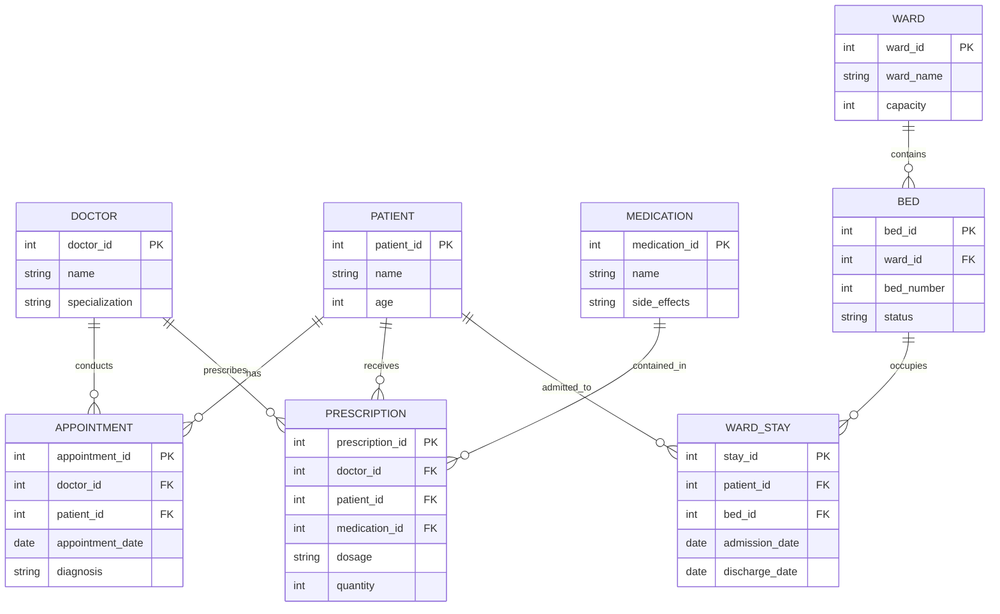

**Analysis:**
- **1:N Relationships:** Doctor→Appointment, Patient→Appointment, Patient→Prescription, Medication→Prescription, Ward→Bed
- **Multi-valued Attribute:** side_effects (multiple side effects per medication)
- **Total Participation:** Appointment, Prescription must have doctor and patient
- **Weak Entity:** Bed could be weak (depends on ward for identification)

</details>

---

## Practice Exercise 2: E-Commerce Platform

**Create an ER diagram for an online shopping platform:**

**Entities:**
- Customer (ID, Name, Email, Address - composite)
- Product (ID, Name, Price, Category)
- Order (ID, Order_Date, Total_Amount)
- Review (Rating, Review_Text, Review_Date)
- Seller (ID, Company_Name, Location)

**Relationships:**
- Customer places Orders
- Order contains Products
- Customer writes Reviews for Products
- Seller supplies Products
- Customer has multiple Phone_Numbers (multi-valued)

**Questions:**
1. What is many-to-many relationship?
2. Where do you need junction tables?
3. What are the primary keys?
4. Identify cardinality ratios
5. Draw complete ERD

<details>
<summary>Click to see solution</summary>

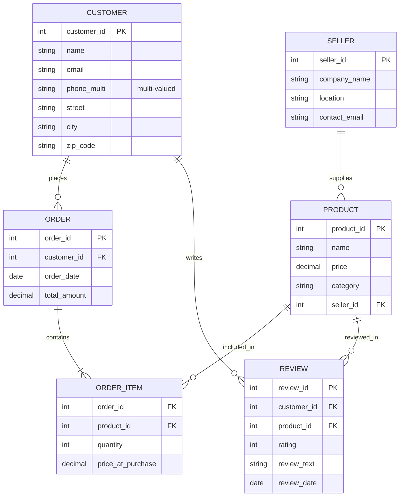

**Answers:**
1. **M:N Relationships:** CUSTOMER↔ORDER (via ORDER_ITEM), CUSTOMER↔PRODUCT (via REVIEW), PRODUCT has multiple SELLERS (potentially N:M)
2. **Junction Tables:** ORDER_ITEM (for Customer-Product purchases), potentially SUPPLY (for Product-Seller)
3. **Primary Keys:** customer_id, order_id, product_id, seller_id, review_id
4. **Cardinalities:** 
   - 1:N - Customer to Order
   - M:N - Product in multiple Orders, Order has multiple Products
   - 1:N - Seller to Product
5. **Multi-valued:** phone_multi for customer

</details>

---

## Interactive Matching Game

**Match the Attribute Type:**

| Attribute | Type |
|-----------|------|
| 1. date_of_birth | A. Simple |
| 2. address (with street, city, state) | B. Composite |
| 3. phone_number (multiple) | C. Multi-valued |
| 4. age (calculated from DOB) | D. Derived |
| 5. salary | E. All of the above |

<details>
<summary>Click to see answers</summary>

1. **A** - Simple (single value, indivisible)
2. **B** - Composite (subdivided into components)
3. **C** - Multi-valued (zero or more values)
4. **D** - Derived (calculated, not stored)
5. **A** - Simple (single value, indivisible)

</details>

---

## 🧩 Design Pattern: Junction Table Creator

**When you see M:N:**

```
Problem: STUDENT (M) ─── (N) COURSE
Can't store directly in relational database!

Solution:

Step 1: Create Junction Table
┌──────────────┐      ┌──────────────┐      ┌──────────────┐
│   STUDENT    │      │ ENROLLMENT   │      │   COURSE     │
├──────────────┤      ├──────────────┤      ├──────────────┤
│student_id PK ├─────▶│student_id FK │◀─────┤course_id PK  │
│name          │      │course_id FK  │      │title         │
│email         │      │grade         │      │credits       │
└──────────────┘      │semester      │      └──────────────┘
                      │year          │
                      └──────────────┘
                      
Primary Key: (student_id, course_id) 
            or (student_id, course_id, semester, year)

Step 2: Insert data
INSERT INTO ENROLLMENT VALUES (1, 101, 'A', 'Spring', 2025)
INSERT INTO ENROLLMENT VALUES (1, 102, 'A-', 'Spring', 2025)
INSERT INTO ENROLLMENT VALUES (2, 101, 'B+', 'Spring', 2025)
```

---

## 💡 Tips & Tricks

### Tip 1: Quickly Identify Cardinality

**Ask these questions:**
1. Can Entity A exist without Entity B? → Partial participation
2. Can Entity B exist without Entity A? → Partial participation
3. For each instance of A, how many B's? (one or many) → Cardinality from A to B
4. For each instance of B, how many A's? (one or many) → Cardinality from B to A

### Tip 2: Naming Convention Shortcut

```
Follow: entity_name + _id

Examples:
student_id (ID of student)
customer_id (ID of customer)
order_id (ID of order)
department_id (ID of department)

Foreign Keys:
student_id in ENROLLMENT table (FK to STUDENT)
course_id in ENROLLMENT table (FK to COURSE)
```

### Tip 3: Weakness Detector

**Weak entity characteristics:**
```
□ Does it have an underlined attribute? (PK)
  No? → Might be weak
□ Is every instance linked to exactly one instance of another entity?
  Yes? → Likely weak
□ Does its PK include the PK of another entity?
  Yes? → Definitely weak
```

---

# 📖 Summary & Key Takeaways

## Core Concepts at a Glance

| Concept | Definition | Example |
|---------|-----------|---------|
| **Entity** | Distinguishable object | Customer, Product, Order |
| **Entity Set** | Collection of same-type entities | All customers |
| **Attribute** | Property of entity | name, price, date |
| **Relationship** | Association between entities | Customer buys Product |
| **Cardinality** | Frequency of relationship | 1:N, M:N, 1:1 |
| **Participation** | Mandatory vs optional | Total (═) or Partial (─) |
| **PK** | Unique identifier | customer_id |
| **FK** | Reference to another PK | customer_id in ORDER |
| **Weak Entity** | Depends on owner for ID | Payment (depends on Loan) |

## Design Workflow

```
1. Gather Requirements
   ↓
2. Identify Entities & Attributes
   ↓
3. Define Relationships & Cardinality
   ↓
4. Specify Keys & Constraints
   ↓
5. Draw ER Diagram
   ↓
6. Validate with Stakeholders
   ↓
7. Normalize (Apply 1NF, 2NF, 3NF)
   ↓
8. Map to Relational Schema
   ↓
9. Implement SQL
   ↓
10. Test & Refine
```

## Common Pitfalls Checklist

- [ ] Every strong entity has a PK?
- [ ] All M:N relationships have junction tables?
- [ ] Cardinalities correctly identified?
- [ ] Participation constraints specified?
- [ ] No redundant data storage?
- [ ] Foreign keys properly placed?
- [ ] Weak entities properly identified?
- [ ] Derived attributes not stored?
- [ ] Naming conventions consistent?
- [ ] Diagram reviewed by stakeholders?

---

# 🎓 Further Learning Resources

## Recommended Topics to Explore
1. **Normalization Theory** (1NF, 2NF, 3NF, BCNF)
2. **SQL Implementation** (Creating tables from ER diagrams)
3. **Advanced ER Modeling** (Inheritance, Aggregation)
4. **Database Optimization** (Indexing, Query Optimization)
5. **Concurrency Control** (ACID properties, Transactions)

## Related Database Concepts
- Relational Model
- SQL Data Definition Language (DDL)
- Functional Dependencies
- Denormalization & Views
- Distributed Databases

---

## 🎉 Congratulations!

You now have a comprehensive understanding of **Entity-Relationship Modeling**. This foundation is essential for:

- ✅ Designing quality databases
- ✅ Communicating with stakeholders
- ✅ Preventing data inconsistencies
- ✅ Building scalable systems
- ✅ Professional database work

**Next Steps:**
1. Practice drawing ERDs for real-world scenarios
2. Study normalization
3. Learn SQL implementation
4. Build actual databases using your designs

---

**Document Version:** 2.0  
**Last Updated:** January 2026  
**Difficulty Level:** Beginner to Advanced  
**Topics Covered:** 15+ core concepts with 20+ diagrams and exercises  

---

### 🙏 Notes for Students

This comprehensive guide synthesizes:
- Original lecture materials (Lec 06-09)
- Modern database design practices (2025)
- Real-world examples and patterns
- Interactive learning elements
- Best practices and common mistakes

**Use this as:**
- Study guide for exams
- Reference for projects
- Foundation for advanced topics
- Interview preparation material

---

**Happy Learning! 🚀**