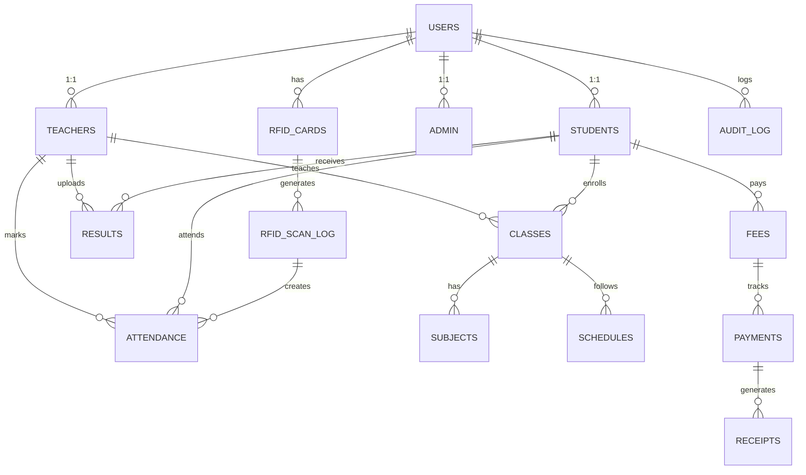

# 🚀 **School Management System - MVP (2 Weeks)**
## *Pragmatic Implementation Guide for Rapid Deployment*

---

## 📑 **Quick Navigation**

1. [Project Overview](#project-overview)
2. [Technology Stack](#technology-stack)
3. [Learning Path & Resources](#learning-path--resources)
4. [Robust Database Design](#robust-database-design)
5. [Feature Scope](#feature-scope)
6. [Week 1 Timeline](#week-1-timeline)
7. [Week 2 Timeline](#week-2-timeline)
8. [Deployment Checklist](#deployment-checklist)

---

## 🎯 **Project Overview**

### What is MVP?

**MVP = Minimum Viable Product**

The simplest version that solves the core problem. We build only essential features, deploy quickly, then add features based on user feedback.

**What We're Building:**
- Login system (teachers & admin)
- Student attendance marking (manual + RFID scanning)
- Grade upload and viewing
- Basic reports
- Simple UI

**What We're NOT Building (Phase 2):**
- Mobile app
- Advanced analytics
- Parent portal
- Chatbot
- Complex workflows

### Why MVP Approach?

| Traditional | MVP Approach |
|-----------|-------------|
| Plan 6 months | Plan 2 weeks |
| Build everything | Build essentials only |
| Deploy when perfect | Deploy at 80% quality |
| Hope users like it | Get feedback & improve |
| $100k investment | $5k investment |

---

## 🛠️ **Technology Stack**

### Frontend

| Tool | Version | Purpose | Why Chosen |
|------|---------|---------|-----------|
| **React** | 18.2+ | UI Components | Fast, industry standard |
| **Vite** | 5.x | Build tool | 10x faster than CRA |
| **TypeScript** | 5.0+ | Type safety | Catch errors early |
| **Tailwind CSS** | 3.x | Styling | No CSS files needed |
| **Axios** | 1.4+ | HTTP requests | Simple API calls |
| **React Router** | 6.x | Navigation | Page routing |
| **Zustand** | 4.x | State management | Simpler than Redux |

**Install Frontend:**
```
npm create vite@latest school-sms-frontend -- --template react
cd school-sms-frontend
npm install axios react-router-dom zustand tailwindcss
```

### Backend

| Tool | Version | Purpose | Why Chosen |
|------|---------|---------|-----------|
| **Node.js** | 18 LTS | Runtime | Fast, event-driven |
| **Express** | 4.18+ | Web framework | Lightweight, flexible |
| **TypeScript** | 5.0+ | Type safety | Maintainable code |
| **MySQL** | 8.0+ | Database | Structured data, reliable |
| **Sequelize** | 6.32+ | ORM | Database queries |
| **JWT** | 9.0+ | Authentication | Stateless login |
| **bcryptjs** | 2.4+ | Password encryption | Industry standard |
| **Nodemon** | 3.x | Auto-restart | Faster development |
| **Cors** | 2.8+ | Cross-origin | Frontend-backend talk |

**Install Backend:**
```
mkdir school-sms-backend
cd school-sms-backend
npm init -y
npm install express cors dotenv sequelize mysql2 bcryptjs jsonwebtoken
npm install --save-dev typescript nodemon ts-node @types/node @types/express
```

### Database

| Tool | Purpose |
|------|---------|
| **MySQL 8.0** | Primary database |
| **MySQL Workbench** | Visual design tool |

---

## 📚 **Learning Path & Resources**

### Week 1: Frontend Foundation (40 hours)

| Day | Topic | Hours | Resource | Priority |
|-----|-------|-------|----------|----------|
| Day 1-2 | React Basics & JSX | 8 | [React Official Docs](https://react.dev) | 🔴 Essential |
| Day 1-2 | Hooks: useState, useEffect | 8 | [Web Dev Simplified - React Hooks](https://www.youtube.com/watch?v=O6P86uwfdR0) | 🔴 Essential |
| Day 3 | Tailwind CSS Crash Course | 4 | [Tailwind Docs - Get Started](https://tailwindcss.com/docs/installation) | 🟡 Important |
| Day 3-4 | React Router Setup | 4 | [React Router Tutorial](https://reactrouter.com/en/main) | 🔴 Essential |
| Day 4-5 | Axios API Calls | 4 | [Axios GitHub Docs](https://github.com/axios/axios) | 🔴 Essential |
| Day 5 | Form Handling | 4 | [React Forms Best Practices](https://www.youtube.com/watch?v=eoyfhYI7zKg) | 🔴 Essential |

### Week 1: Backend Foundation (40 hours)

| Day | Topic | Hours | Resource | Priority |
|-----|-------|-------|----------|----------|
| Day 1-2 | Node.js & Express Basics | 8 | [Express Official Guide](https://expressjs.com/en/starter/basic-routing.html) | 🔴 Essential |
| Day 2-3 | Middleware & Routing | 6 | [Express Middleware](https://expressjs.com/en/guide/using-middleware.html) | 🔴 Essential |
| Day 3-4 | Database Setup (MySQL + Sequelize) | 8 | [Sequelize Getting Started](https://sequelize.org/docs/v6/getting-started/) | 🔴 Essential |
| Day 4-5 | Authentication (JWT + bcrypt) | 8 | [JWT Authentication](https://www.youtube.com/watch?v=7Q17ubqLfaM) | 🔴 Essential |
| Day 5 | CORS & Error Handling | 4 | [Express Error Handling](https://expressjs.com/en/guide/error-handling.html) | 🟡 Important |

### Week 2: Integration (40 hours)

| Day | Topic | Hours | Resource | Priority |
|-----|-------|-------|----------|----------|
| Day 1-2 | Connect Frontend to Backend | 8 | [Full Stack CRUD](https://www.youtube.com/watch?v=DJ5iIo4AWDg) | 🔴 Essential |
| Day 3 | Attendance Module | 6 | [Form Submission](https://www.youtube.com/watch?v=N6pxN2s8n84) | 🔴 Essential |
| Day 4 | Grades Module | 6 | [Data Tables Tutorial](https://www.youtube.com/watch?v=S2TdMV0DGFA) | 🔴 Essential |
| Day 5 | RFID Reader Setup (Optional) | 6 | [RFID with Node.js](https://github.com/shujaattariq/rfid-reader-serial) | 🟠 Nice-to-have |
| Day 5 | Testing & Debugging | 4 | [React DevTools](https://chrome.google.com/webstore/detail/react-developer-tools/) | 🔴 Essential |

### Recommended Learning Approach

**Daily Schedule (8 hours):**
- 2 hours: Watch tutorial videos
- 3 hours: Code along with instructor
- 2 hours: Build own mini-project
- 1 hour: Solve problems, debug

**Learning Style:** Project-based learning (build as you learn, not theory first)

**Week 1 Mini-Projects:**
- Login page with form validation
- Simple attendance checklist
- Fetch and display data in a table

**Week 2 Full Project:**
- Complete attendance marking system
- Grade upload and viewing
- Login with role-based access

---

## 🗄️ **Robust Database Design**

### Entity Relationship Diagram (Mermaid)



### Core Tables

#### **1. USERS Table** (Authentication)

**Purpose:** Central identity - every person in system

**Columns:**
```
- user_id (INT, Primary Key)
- username (VARCHAR(50), UNIQUE)
- email (VARCHAR(100), UNIQUE)
- password_hash (VARCHAR(255)) ← bcrypt encrypted
- role (ENUM) ← 'teacher', 'student', 'admin'
- status (ENUM) ← 'active', 'inactive'
- created_at (TIMESTAMP)
- updated_at (TIMESTAMP)
```

**Why:** Single source of truth for authentication. JWT tokens reference user_id.

#### **2. TEACHERS Table** (Teacher-specific data)

**Purpose:** Teacher details and qualifications

**Columns:**
```
- teacher_id (INT, Primary Key)
- user_id (INT, Foreign Key → USERS)
- employee_id (VARCHAR(20), UNIQUE)
- department (VARCHAR(50))
- qualification (VARCHAR(100))
- phone (VARCHAR(20))
- hire_date (DATE)
- is_class_teacher (BOOLEAN)
- created_at (TIMESTAMP)
```

**Why:** Separates teacher-specific info from generic user data. Can add more fields later (salary, experience, etc.)

#### **3. STUDENTS Table** (Student-specific data)

**Purpose:** Student enrollment and basic info

**Columns:**
```
- student_id (INT, Primary Key)
- user_id (INT, Foreign Key → USERS)
- roll_number (VARCHAR(20), UNIQUE)
- class_id (INT, Foreign Key → CLASSES)
- admission_date (DATE)
- parent_name (VARCHAR(100))
- parent_phone (VARCHAR(20))
- parent_email (VARCHAR(100))
- address (TEXT)
- created_at (TIMESTAMP)
```

**Why:** Student-specific details. Allows students to have user account + student profile.

#### **4. CLASSES Table** (Class/Section)

**Purpose:** Grade sections and class info

**Columns:**
```
- class_id (INT, Primary Key)
- class_name (VARCHAR(50)) ← "Grade 5A"
- academic_year (INT) ← 2026
- grade_level (INT) ← 5
- section (VARCHAR(10)) ← "A"
- class_teacher_id (INT, Foreign Key → TEACHERS)
- student_capacity (INT)
- total_periods_per_day (INT)
- created_at (TIMESTAMP)
```

**Why:** Organize students into classes. Multiple sections of same grade possible.

#### **5. SUBJECTS Table** (Curriculum)

**Purpose:** List of all subjects taught

**Columns:**
```
- subject_id (INT, Primary Key)
- subject_name (VARCHAR(100)) ← "Math", "English"
- subject_code (VARCHAR(20), UNIQUE) ← "MTH101"
- credit_hours (DECIMAL(3,1))
- description (TEXT)
- is_mandatory (BOOLEAN)
- created_at (TIMESTAMP)
```

**Why:** Reference for grades, schedules, and assignments.

#### **6. CLASS_SUBJECT Assignment** (Many-to-Many)

**Purpose:** Which subjects are taught in which class

**Columns:**
```
- class_subject_id (INT, Primary Key)
- class_id (INT, Foreign Key → CLASSES)
- subject_id (INT, Foreign Key → SUBJECTS)
- teacher_id (INT, Foreign Key → TEACHERS)
- academic_year (INT)
- UNIQUE KEY (class_id, subject_id, academic_year)
```

**Why:** Allows subjects to be reused across classes. Same Math course in Grade 5A and 5B taught by different teachers.

#### **7. ATTENDANCE Table** (Core Business Data)

**Purpose:** Daily attendance records

**Columns:**
```
- attendance_id (INT, Primary Key)
- student_id (INT, Foreign Key → STUDENTS)
- class_id (INT, Foreign Key → CLASSES)
- attendance_date (DATE)
- status (ENUM) ← 'present', 'absent', 'late', 'leave'
- marked_by (INT, Foreign Key → TEACHERS) ← Who marked it
- marking_method (ENUM) ← 'manual', 'rfid_scan', 'import'
- rfid_scan_id (INT, Foreign Key → RFID_SCAN_LOG) ← If from RFID
- remarks (TEXT)
- created_at (TIMESTAMP)
- updated_at (TIMESTAMP)
- UNIQUE KEY (student_id, class_id, attendance_date)
```

**Why:** 
- Unique constraint prevents duplicate entries
- Tracks marking method (manual vs. RFID)
- Stores who marked (audit trail)

#### **8. RFID_CARDS Table** (Hardware linking)

**Purpose:** Link physical RFID cards to users

**Columns:**
```
- card_id (INT, Primary Key)
- card_uid (VARCHAR(20), UNIQUE) ← Card ID from hardware
- user_id (INT, Foreign Key → USERS)
- card_type (ENUM) ← 'student', 'teacher'
- issued_date (DATE)
- expiry_date (DATE) ← Can be null (no expiry)
- status (ENUM) ← 'active', 'lost', 'replaced', 'blocked'
- created_at (TIMESTAMP)
```

**Why:** Physical card → Digital identity. Single user can have replacement cards.

#### **9. RFID_SCAN_LOG Table** (Time-series data)

**Purpose:** Log every RFID card tap (audit + source of attendance)

**Columns:**
```
- scan_id (BIGINT, Primary Key)
- card_uid (VARCHAR(20), Foreign Key → RFID_CARDS)
- user_id (INT, Foreign Key → USERS)
- scan_timestamp (DATETIME)
- reader_location (VARCHAR(100)) ← 'Main Gate', 'Library'
- event_type (ENUM) ← 'entry', 'exit', 'attendance_mark'
- scan_status (ENUM) ← 'success', 'duplicate', 'invalid'
- created_at (TIMESTAMP)
```

**Why:** 
- BIGINT for potentially millions of scans
- Timestamp for sequencing
- Duplicate prevention using scan_status

#### **10. RESULTS Table** (Grades)

**Purpose:** Student grades for exams

**Columns:**
```
- result_id (INT, Primary Key)
- student_id (INT, Foreign Key → STUDENTS)
- subject_id (INT, Foreign Key → SUBJECTS)
- exam_id (INT, Foreign Key → EXAMS)
- marks_obtained (DECIMAL(5,2))
- total_marks (DECIMAL(5,2))
- percentage (DECIMAL(5,2)) ← Auto-calculated
- grade (CHAR(1)) ← 'A', 'B', 'C'
- grade_points (DECIMAL(3,1)) ← 4.0, 3.5 (for GPA)
- uploaded_by (INT, Foreign Key → TEACHERS)
- upload_date (DATETIME)
- version (INT) ← If corrected: version 1, 2, 3
- is_final (BOOLEAN)
- created_at (TIMESTAMP)
- UNIQUE KEY (student_id, exam_id, subject_id)
```

**Why:** 
- Version control if grades corrected
- Calculated fields for percentage
- Links to subject, exam, student, teacher

#### **11. EXAMS Table** (Exam information)

**Purpose:** Exam scheduling and info

**Columns:**
```
- exam_id (INT, Primary Key)
- exam_name (VARCHAR(100)) ← "Midterm Math", "Final English"
- exam_code (VARCHAR(20), UNIQUE)
- exam_date (DATE)
- academic_year (INT)
- total_marks (INT)
- duration_minutes (INT)
- created_at (TIMESTAMP)
```

**Why:** Reference for results and schedules.

#### **12. FEES Table** (Financial tracking)

**Purpose:** Fee structure and amounts

**Columns:**
```
- fee_id (INT, Primary Key)
- student_id (INT, Foreign Key → STUDENTS)
- academic_year (INT)
- fee_type (ENUM) ← 'tuition', 'activities', 'transport'
- amount (DECIMAL(10,2))
- due_date (DATE)
- status (ENUM) ← 'pending', 'paid', 'partial'
- created_at (TIMESTAMP)
```

**Why:** Track what each student owes.

#### **13. PAYMENTS Table** (Receipt generation)

**Purpose:** Payment records (proof of payment)

**Columns:**
```
- payment_id (INT, Primary Key)
- fee_id (INT, Foreign Key → FEES)
- amount (DECIMAL(10,2))
- payment_date (DATETIME)
- payment_method (ENUM) ← 'cash', 'cheque', 'bank_transfer'
- receipt_number (VARCHAR(50), UNIQUE)
- payment_verified_by (INT, Foreign Key → USERS) ← Admin
- remarks (TEXT)
- created_at (TIMESTAMP)
```

**Why:** Proof of payment. Can generate receipt from this table.

#### **14. AUDIT_LOG Table** (Compliance)

**Purpose:** Track all data modifications (immutable log)

**Columns:**
```
- log_id (BIGINT, Primary Key)
- user_id (INT, Foreign Key → USERS) ← Who made change
- table_name (VARCHAR(50)) ← 'RESULTS', 'ATTENDANCE'
- record_id (INT) ← Which row changed
- action (ENUM) ← 'INSERT', 'UPDATE', 'DELETE'
- old_values (JSON) ← Previous values
- new_values (JSON) ← New values
- action_timestamp (DATETIME)
```

**Why:** 
- Never deleted (immutable)
- Compliance requirement
- Answer "Who changed what when?"

### Database Normalization

**What is Normalization?**
Organizing data to eliminate redundancy and prevent update anomalies.

**Three Normal Forms (3NF) Applied:**

✅ **1NF (First Normal Form)**
- No repeating groups
- Each cell contains single value
- Example: Student in one class only (not multiple)

✅ **2NF (Second Normal Form)**
- Remove partial dependencies
- Example: Teacher's name NOT in Attendance table (get from Teachers table)

✅ **3NF (Third Normal Form)**
- Remove transitive dependencies
- Example: Class name NOT in Student table (it's already in Classes table)

### Design for Future Enhancement

This database allows easy addition of:
- **Parent Portal:** Add PARENTS table, link to STUDENTS
- **Assignments:** Add ASSIGNMENTS table, link STUDENTS to ASSIGNMENTS (many-to-many)
- **Library:** Add BOOKS, CIRCULATION tables
- **SMS Notifications:** Add NOTIFICATIONS table
- **AI Chatbot:** Add CONVERSATIONS, CHAT_LOGS tables
- **Timetable:** Add TIMETABLE table with CLASS, SUBJECT, TEACHER, TIME_SLOT

---

## 🎯 **Feature Scope**

### MVP Features (What We Build in 2 Weeks)

✅ **Authentication**
- Admin login
- Teacher login
- Student login (view-only)
- JWT tokens

✅ **Attendance**
- Manual marking (teacher clicks checkboxes)
- RFID scanning (optional - adds 1 day)
- View attendance records

✅ **Grades**
- Upload grades (CSV import)
- View grades (student/teacher)
- Calculate GPA

✅ **Reports**
- Attendance summary
- Fee status
- Simple dashboard

✅ **Admin Panel**
- User management (create accounts)
- View all students/teachers
- System settings

### Phase 2 Features (Later)

❌ **NOT in MVP:**
- PDF generation (marksheets, certificates)
- Parent portal
- Email notifications
- Mobile app
- Advanced analytics
- Chatbot
- Complex workflows

---

## 📅 **Week 1 Timeline**

### Day 1-2: Project Setup

**Backend Setup (8 hours)**
- Initialize Node.js project
- Install Express, MySQL, Sequelize
- Create folder structure
- Setup .env file (database credentials)
- Create basic Express server

**Frontend Setup (8 hours)**
- Create React project with Vite
- Install dependencies (Tailwind, Axios, Router)
- Create folder structure
- Setup basic layout (navbar, sidebar)
- Create login page UI

**Deliverable:** Both projects running on localhost

### Day 3-4: Database & Authentication

**Database Setup (8 hours)**
- Create MySQL database
- Create all 14 tables in MySQL
- Setup Sequelize models (USER, TEACHER, STUDENT, etc.)
- Setup database migrations

**Authentication (8 hours)**
- Hash passwords with bcrypt
- Create /login endpoint (express)
- Generate JWT tokens
- Create login form (React)
- Store token in localStorage
- Test login flow

**Deliverable:** Login working, token stored

### Day 5: Basic CRUD Endpoints

**Create API Routes (8 hours)**
- GET /students (list all students)
- GET /teachers (list all teachers)
- POST /students (create new student)
- POST /teachers (create new teacher)
- DELETE /users/:id (delete user)

**Frontend CRUD Pages (8 hours)**
- Students list page
- Teachers list page
- Create student form
- Create teacher form
- Display data in tables

**Deliverable:** Can create/view students and teachers

---

## 📅 **Week 2 Timeline**

### Day 1-2: Attendance Module

**Backend (8 hours)**
- POST /attendance/mark (mark attendance)
- GET /attendance/:classId/:date (get attendance for a class)
- GET /attendance/student/:studentId (get student's attendance)
- Calculate attendance percentage

**Frontend (8 hours)**
- Attendance marking page (checkboxes for present/absent)
- Submit attendance button
- View attendance records
- Attendance summary

**Deliverable:** Can mark and view attendance

### Day 3: Grades Module

**Backend (6 hours)**
- POST /grades/upload (upload grades)
- GET /grades/student/:studentId (get student's grades)
- Calculate GPA
- Calculate percentage

**Frontend (6 hours)**
- Grade upload form
- View grades page
- Show GPA and percentage

**Deliverable:** Can upload and view grades

### Day 4: Reports & Dashboard

**Backend (6 hours)**
- GET /reports/attendance (attendance summary)
- GET /reports/fees (fee status)
- GET /dashboard/stats (attendance %, grades, etc.)

**Frontend (6 hours)**
- Admin dashboard with stats
- Attendance report
- Fee status report

**Deliverable:** Working dashboard and reports

### Day 5: RFID + Testing + Deployment

**Option A: RFID Setup (6 hours)**
- Connect RFID reader
- Create serial port listener
- Send scans to /rfid/scan endpoint
- Create RFID_SCAN_LOG table
- Update attendance automatically from RFID

**Option B: Testing & Polish (6 hours)**
- Fix bugs found
- Responsive design (mobile)
- Error messages
- Loading states

**Final 2 hours:**
- Deploy backend (Heroku/Railway)
- Deploy frontend (Vercel)
- Test on production

**Deliverable:** Live system at www.school-sms.com

---

## ✅ **Deployment Checklist**

### Before Going Live

**Backend Checks:**
- [ ] All endpoints tested with Postman
- [ ] Database indexes created for fast queries
- [ ] Error handling on all routes
- [ ] Environment variables secure (.env not committed)
- [ ] CORS configured correctly
- [ ] Rate limiting enabled
- [ ] Logs setup

**Frontend Checks:**
- [ ] All pages responsive (mobile-friendly)
- [ ] No console errors
- [ ] Loading states on API calls
- [ ] Error messages clear
- [ ] Forms validate inputs
- [ ] Images optimized

**Database Checks:**
- [ ] All tables created
- [ ] Foreign keys configured
- [ ] Indexes on frequently queried columns
- [ ] Backup taken

**Security Checks:**
- [ ] Passwords hashed (bcrypt)
- [ ] JWT tokens expire
- [ ] HTTPS enabled
- [ ] SQL injection prevented (use Sequelize)
- [ ] XSS prevented (React auto-escapes)
- [ ] CORS whitelist set

### Deployment Platforms

**Backend Options:**
- **Heroku** (Easy, free tier limited)
- **Railway** (Affordable, good free tier)
- **Render** (Fast, good for Node.js)
- **AWS EC2** (Powerful, more complex)

**Frontend Options:**
- **Vercel** (Optimized for React)
- **Netlify** (Simple, fast)
- **AWS S3 + CloudFront** (Scalable)

**Database Options:**
- **AWS RDS** (Managed MySQL)
- **Digital Ocean** (Affordable VPS)
- **Hostinger** (Cheap shared hosting)

---

## 📊 **Success Criteria**

### Must Have (MVP)
✅ Teachers can mark attendance  
✅ Grades can be uploaded  
✅ Students can view their grades  
✅ Admin dashboard shows basic stats  
✅ System is live and accessible  

### Nice to Have
⚠️ RFID scanning working  
⚠️ Mobile responsive  
⚠️ PDF reports  

### Don't Need (Phase 2)
❌ Chatbot  
❌ Parent app  
❌ Advanced analytics  
❌ Email notifications  

---

## 🎓 **Daily Progress Tracking**

Print or use this checklist:

```
WEEK 1

Day 1: [ ] Backend setup [ ] Frontend setup
Day 2: [ ] Both projects running [ ] Basic layouts done
Day 3: [ ] Database created [ ] Models defined
Day 4: [ ] Authentication working [ ] Login tested
Day 5: [ ] CRUD endpoints done [ ] List pages working

WEEK 2

Day 1: [ ] Attendance backend [ ] Attendance frontend
Day 2: [ ] Mark & view attendance working
Day 3: [ ] Grade upload [ ] Grade viewing
Day 4: [ ] Dashboard [ ] Reports
Day 5: [ ] RFID setup OR Deployment
```

---

## 🚀 **Quick Start Commands**

**Backend:**
```bash
mkdir school-sms && cd school-sms
mkdir backend frontend
cd backend
npm init -y
npm install express cors dotenv sequelize mysql2 bcryptjs jsonwebtoken
npm install --save-dev typescript nodemon @types/node

# Create .env file:
DB_HOST=localhost
DB_USER=root
DB_PASSWORD=your_password
DB_NAME=school_sms
JWT_SECRET=your_secret_key
PORT=5000

# Start backend:
npm run dev
```

**Frontend:**
```bash
cd frontend
npm create vite@latest . -- --template react
npm install axios react-router-dom zustand
npm run dev
```

---

## 💡 **Key Decisions**

| Decision | Choice | Reason |
|----------|--------|--------|
| **Database** | MySQL | Relational, structured data |
| **ORM** | Sequelize | Simple, good documentation |
| **Frontend** | React | Industry standard, fast |
| **Build Tool** | Vite | 10x faster than CRA |
| **Styling** | Tailwind | No CSS files, utility-first |
| **State** | Zustand | Simpler than Redux |
| **Timeline** | 2 weeks | MVP approach, fast feedback |

---

## 📞 **Support Resources**

**When Stuck:**
1. Check video tutorials (links above)
2. Google error message
3. Check Stack Overflow
4. Check official documentation
5. Ask in Discord/communities

**Best Communities:**
- r/react on Reddit
- r/node on Reddit
- Stack Overflow (tag: react, node.js)
- Discord servers for MERN developers

---

**Status:** 🚀 Ready to Start Building!

**Duration:** 2 weeks (80 hours total)

**Tech Stack:** React 18 + Node.js + MySQL + Sequelize

**Deployment:** Vercel + Railway/Heroku

**Next Phase:** After MVP launch, gather feedback and add Phase 2 features

---

*Happy coding! You've got this! 💪*
