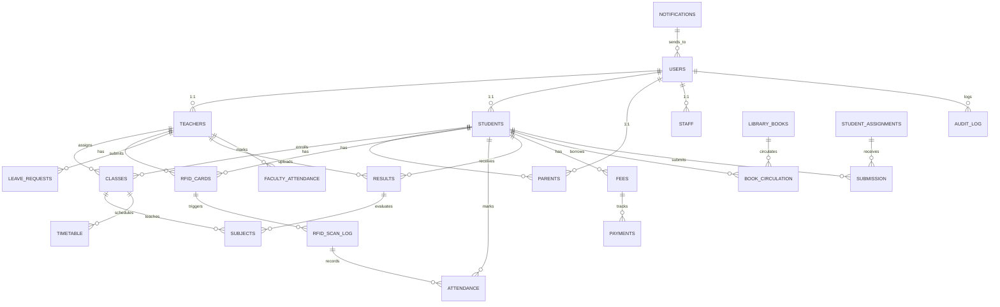

# 🏫 **Advanced School Management System**
## *RFID Integration | PDF Generation | AI-Powered | Enterprise-Grade Database*

---

### 📋 **Table of Contents**
1. [Project Vision](#project-vision)
2. [Technology Stack Deep Dive](#technology-stack)
3. [Learning Roadmap](#learning-roadmap)
4. [Database Architecture](#database-architecture)
5. [RFID Integration Strategy](#rfid-integration)
6. [PDF Generation Pipeline](#pdf-generation)
7. [AI Features Implementation](#ai-features)
8. [Development Phases](#development-phases)
9. [Deployment & DevOps](#deployment)
10. [Security Considerations](#security)

---

## 🎯 **Project Vision**

### Core Objectives
Transform traditional school administration through:
- **Real-time RFID card scanning** for teachers, parents, and students identification
- **Automated PDF generation** for reports, marksheets, transcripts, and certificates
- **AI-powered chatbot** for student/parent inquiries and administrative support
- **Role-based dashboard system** with 7+ user types
- **Enterprise-grade database** designed for multi-campus scalability

### Target Users & Capabilities

| User Role | Key Capabilities | RFID Usage |
|-----------|------------------|-----------|
| **Super Admin** | System configuration, user management, audit logs | ID verification |
| **Principal/Admin** | Reports, staff management, policy enforcement | Staff presence tracking |
| **Teacher** | Attendance marking, grade uploading, class management | Time-in/out scanning |
| **Librarian** | Book inventory, circulation tracking | Patron ID verification |
| **Accountant** | Fee management, payment processing, receipts | Transaction verification |
| **Student** | View marks, attendance, timetable, submit assignments | Library access, campus entry |
| **Parent** | View child's progress, download reports, request meetings | Pick-up verification |

---

## 🛠️ **Technology Stack Deep Dive**

### Frontend Architecture
```javascript
// Stack: React.js + Modern Ecosystem
// Purpose: Responsive, component-driven dashboards

Technology         | Version | Purpose
------------------|---------|------------------------------------------
React.js          | 18.2+   | UI component framework & state management
TypeScript        | 5.0+    | Type safety for enterprise code
React Router v6   | 6.x     | Client-side navigation & routing
Redux Toolkit     | 1.9+    | Global state management (auth, user data)
Tailwind CSS      | 3.x     | Utility-first CSS framework
React Query       | 4.x     | Server state management & caching
Axios             | 1.4+    | HTTP client for API communication
Socket.io-client  | 4.x     | Real-time notifications (RFID scans, alerts)
React-PDF         | 3.x     | PDF viewing in browser
```

**Why These Choices?**
- React 18 provides concurrent rendering for smooth UI updates during bulk attendance entry
- Redux Toolkit handles complex auth state across user roles without prop drilling
- React Query eliminates manual API caching logic
- Socket.io enables real-time RFID scan feedback on admin dashboards
- TypeScript prevents runtime errors in database layer interactions

### Backend Architecture
```javascript
// Stack: Node.js + Express.js
// Purpose: RESTful APIs, RFID hardware interfacing, PDF generation

Technology         | Version | Purpose
------------------|---------|------------------------------------------
Node.js           | 18.x LTS| JavaScript runtime for server-side
Express.js        | 4.18+   | Lightweight web framework & middleware
TypeScript        | 5.0+    | Type safety for scalable backend
JWT (jsonwebtoken)| 9.0+    | Stateless authentication tokens
bcryptjs          | 2.4.x   | Password hashing & security
dotenv            | 16.x    | Environment variable management
Cors              | 2.8.x   | Cross-origin resource sharing
Multer            | 1.4.x   | File upload handling (RFID imports)
Sequelize         | 6.32+   | ORM for MySQL/PostgreSQL
Joi               | 17.x    | Schema validation & sanitization
Winston           | 3.x     | Enterprise logging system
```

**Backend Features:**
- Middleware chain for auth → role validation → rate limiting
- Connection pooling for database efficiency
- Error handling with custom error classes
- Request logging for audit trails
- Graceful shutdown handling

### Database Strategy
```sql
-- Primary: MySQL 8.0+ or PostgreSQL 14+
-- Why MySQL? Industry standard for schools, lower licensing costs
-- Why PostgreSQL? Better JSONB support, row-level security

Database        | Engine     | Notes
----------------|------------|------------------------------------------
users           | Relational | Central auth repository
teachers        | Relational | Employment records + RFID IDs
students        | Relational | Academic data + parent linking
parents         | Relational | Contact info + student relationships
attendance      | Relational | Daily records + RFID scan logs
rfid_logs       | Time-Series| Every scan event (indexing critical)
fees            | Relational | Payments + receipts + audit trail
results         | Relational | Grades + exam marks + transcripts
leave_requests  | Relational | Teacher leave workflows
audit_trail     | Audit     | All data modifications (who/when/what)
ai_interactions | Log       | Chatbot Q&A history for training
```

### RFID Hardware Integration
```
Hardware Options:
├── RC522 (USB/Serial) - Cost: $5-15, Range: 5cm, Ideal for: Raspberry Pi
├── EM4100 Readers - Cost: $20-50, Range: 2-20cm, Ideal for: Turnstiles
├── RFID + Mobile (QR Code) - Cost: Free-$100, Dual scanning capability
└── Access Control System - Cost: $500+, Enterprise-grade with timestamps

Node.js Libraries:
├── serialport (v9.x)        - Serial communication with RFID readers
├── rc522                     - Raspberry Pi GPIO interface
├── mfrc522-python           - MIFARE Classic card support
└── usb-detection            - Hot-plug reader detection
```

---

## 📚 **Learning Roadmap**

### Phase 1: React Fundamentals & Advanced Patterns (Weeks 1-4)

| Topic | Duration | Key Concepts | Learning Resource | Milestones |
|-------|----------|--------------|-------------------|------------|
| **React Hooks Deep Dive** | 6 days | useState, useEffect, useContext, custom hooks, performance optimization | [Academind - React Hooks Course](https://www.youtube.com/watch?v=VQcoG48e8Wi) | Build 3 custom hooks for attendance state |
| **Context API vs Redux** | 4 days | Global state patterns, Redux Toolkit setup, selectors, async middleware | [Redux Essentials (Official Docs)](https://redux.js.org/tutorials/essentials/part-1-overview-and-setup) | Implement user auth state with Redux |
| **React Router v6** | 3 days | Dynamic routing, nested routes, route guards, lazy loading | [React Router Official Tutorial](https://reactrouter.com/en/main) | Create protected dashboard routing |
| **TypeScript in React** | 5 days | Type annotations, interfaces, generics, prop types | [TypeScript Handbook - React](https://www.typescriptlang.org/docs/handbook/react.html) | Type entire auth component |
| **Form Handling & Validation** | 4 days | Formik, React Hook Form, Joi validation | [React Hook Form Master](https://www.youtube.com/watch?v=RkXY2qaYvJ4) | Build attendance marking form |
| **Performance Optimization** | 3 days | Code splitting, memo, lazy loading, bundle analysis | [Web.dev - React Performance](https://web.dev/react/) | Reduce dashboard load time by 40% |

**Deliverable:** Responsive multi-role dashboard prototype with authentication

### Phase 2: Backend & Database Foundation (Weeks 5-8)

| Topic | Duration | Key Concepts | Learning Resource | Milestones |
|-------|----------|--------------|-------------------|------------|
| **Node.js & Express Fundamentals** | 5 days | Event loop, streams, middleware, routing, middleware chains | [The Complete Node.js Course - Mosh Hamedani](https://www.youtube.com/watch?v=NQwtyBwLa4U) | Build 5-endpoint REST API |
| **Database Design Principles** | 6 days | Normalization, indexing, foreign keys, query optimization | [Database Design Fundamentals](https://www.youtube.com/watch?v=ztHopE5Wnpc) | Design school SMS schema (20+ tables) |
| **Sequelize ORM Setup** | 4 days | Model definitions, associations, migrations, raw queries | [Sequelize Official Documentation](https://sequelize.org/docs/v6/getting-started/) | Create models for students, teachers, attendance |
| **JWT Authentication** | 4 days | Token generation, verification, refresh tokens, rate limiting | [JWT Best Practices](https://www.youtube.com/watch?v=7Q17ubqLfaM) | Implement role-based middleware |
| **Error Handling & Logging** | 3 days | Custom error classes, Winston logging, centralized error handling | [Express Error Handling](https://expressjs.com/en/guide/error-handling.html) | Production-grade error pipeline |
| **API Documentation** | 2 days | Swagger/OpenAPI, Postman collection generation | [OpenAPI 3.0 Specification](https://swagger.io/specification/) | Document 50+ endpoints |

**Deliverable:** Fully functional REST API with authentication, logging, and documentation

### Phase 3: RFID Integration & Hardware Communication (Weeks 9-11)

| Topic | Duration | Key Concepts | Learning Resource | Milestones |
|-------|----------|--------------|-------------------|------------|
| **Serial Port Communication** | 4 days | Buffer parsing, baud rates, flow control, error handling | [Node Serialport Documentation](https://serialport.io/docs/guide-platform-support) | Read RFID card UID reliably |
| **RFID Protocol Understanding** | 3 days | ISO 14443A, MIFARE Classic, CRC checksums, frame parsing | [RFID Basics - SparkFun](https://learn.sparkfun.com/tutorials/rfid-basics) | Decode RFID hex strings correctly |
| **Database Sync & Logging** | 3 days | Insert scan logs, timestamp accuracy, duplicate prevention | [Time-Series Database Best Practices](https://www.youtube.com/watch?v=qJFpNqPYzME) | 1000 scans/second handling |
| **Real-time Updates with Socket.io** | 3 days | Socket events, namespaces, authentication, scaling | [Socket.io Real-time Apps](https://www.youtube.com/watch?v=pgdNvHKN-iI) | Live dashboard RFID feed |
| **RFID Hardware Testing** | 2 days | Calibration, range testing, multi-reader setup | Manufacturer documentation | Multi-reader deployment plan |

**Deliverable:** Working RFID scanning system pushing real-time data to dashboard

### Phase 4: PDF Generation Pipeline (Weeks 12-13)

| Topic | Duration | Key Concepts | Learning Resource | Milestones |
|-------|----------|--------------|-------------------|------------|
| **PDFKit Library Mastery** | 3 days | Document creation, fonts, images, tables, complex layouts | [PDFKit Documentation](http://pdfkit.org/) | Generate attendance sheets |
| **Puppeteer for HTML→PDF** | 3 days | Headless Chrome control, React to PDF conversion, scaling | [Puppeteer Tutorial](https://www.youtube.com/watch?v=Vh4yp9KHJ-E) | Convert React dashboards to PDF |
| **Template Engines** | 2 days | Handlebars, EJS for dynamic PDF content | [Handlebars.js Guide](https://handlebarsjs.com/) | Marksheet templates |
| **Email with Attachments** | 2 days | Nodemailer, SMTP configuration, bulk sending, scheduling | [Nodemailer Guide](https://nodemailer.com/smtp/) | Send result PDFs to parents |
| **Background Jobs** | 2 days | Bull queue, scheduled tasks, cron jobs | [Bull Queue Tutorial](https://www.youtube.com/watch?v=EkFsV-JkUgU) | Nightly report generation |

**Deliverable:** Automated multi-format PDF generation system (reports, marksheets, certificates)

### Phase 5: AI Chatbot Integration (Weeks 14-15)

| Topic | Duration | Key Concepts | Learning Resource | Milestones |
|-------|----------|--------------|-------------------|------------|
| **OpenAI API Integration** | 3 days | GPT-4 API, prompt engineering, rate limits, cost optimization | [OpenAI API Documentation](https://platform.openai.com/docs/guides/gpt) | Custom prompts for school context |
| **Chatbot Architecture** | 3 days | Intent recognition, conversation flow, context memory | [Dialogflow Tutorial](https://www.youtube.com/watch?v=f5GRlvaXgQ4) | Multi-turn conversations |
| **Knowledge Base Setup** | 2 days | Vector embeddings, semantic search, retrieval-augmented generation | [Langchain Documentation](https://python.langchain.com/docs/modules/data_connection/retrievers/) | School FAQ indexing |
| **Frontend Chat UI** | 2 days | React chat component, message history, typing indicators | [React Chat UI Component](https://www.youtube.com/watch?v=3pUE6Z5YJLU) | Embedded chat widget |
| **Safety & Filtering** | 1 day | Content moderation, prompt injection prevention, data privacy | [AI Safety Best Practices](https://openai.com/safety) | FERPA-compliant responses |

**Deliverable:** Intelligent chatbot handling admissions, attendance, fee inquiries, grade questions

---

## 🗄️ **Database Architecture**

### Enterprise-Grade Schema Design



### Detailed Table Specifications

#### **USERS (Authentication Core)**
```sql
CREATE TABLE users (
    id INT PRIMARY KEY AUTO_INCREMENT,
    uuid CHAR(36) UNIQUE NOT NULL,  -- External reference
    username VARCHAR(50) UNIQUE NOT NULL,
    email VARCHAR(100) UNIQUE NOT NULL,
    password_hash VARCHAR(255) NOT NULL,  -- bcrypt hash
    password_salt VARCHAR(255) NOT NULL,
    role ENUM('super_admin','admin','teacher','student','parent','librarian','accountant') NOT NULL,
    status ENUM('active','inactive','suspended') DEFAULT 'active',
    last_login DATETIME,
    login_attempts INT DEFAULT 0,
    locked_until DATETIME,
    two_factor_enabled BOOLEAN DEFAULT FALSE,
    two_factor_secret VARCHAR(255),
    created_at TIMESTAMP DEFAULT CURRENT_TIMESTAMP,
    updated_at TIMESTAMP DEFAULT CURRENT_TIMESTAMP ON UPDATE CURRENT_TIMESTAMP,
    created_by INT REFERENCES users(id),
    
    INDEX idx_username (username),
    INDEX idx_email (email),
    INDEX idx_role (role),
    INDEX idx_status (status)
);
```

#### **RFID_CARDS (Hardware Linking)**
```sql
CREATE TABLE rfid_cards (
    id INT PRIMARY KEY AUTO_INCREMENT,
    card_uid VARCHAR(20) UNIQUE NOT NULL,  -- RFID UID from hardware
    user_id INT NOT NULL REFERENCES users(id),
    card_type ENUM('student','teacher','parent','visitor','temporary') NOT NULL,
    issued_date DATE NOT NULL,
    expiry_date DATE,
    status ENUM('active','inactive','blocked','lost','replaced') DEFAULT 'active',
    physical_card_number VARCHAR(50) UNIQUE,
    memo TEXT,
    deactivated_at DATETIME,
    replacement_of INT REFERENCES rfid_cards(id),
    created_at TIMESTAMP DEFAULT CURRENT_TIMESTAMP,
    updated_at TIMESTAMP DEFAULT CURRENT_TIMESTAMP ON UPDATE CURRENT_TIMESTAMP,
    
    INDEX idx_card_uid (card_uid),
    INDEX idx_user_id (user_id),
    INDEX idx_status (status),
    INDEX idx_expiry (expiry_date)
);
```

#### **RFID_SCAN_LOG (Time-Series Data)**
```sql
CREATE TABLE rfid_scan_log (
    id BIGINT PRIMARY KEY AUTO_INCREMENT,
    rfid_card_id INT NOT NULL REFERENCES rfid_cards(id),
    user_id INT NOT NULL REFERENCES users(id),
    scan_timestamp DATETIME(3) NOT NULL,  -- Millisecond precision
    reader_device_id VARCHAR(50),  -- Which scanner device
    reader_location VARCHAR(100),  -- Gate/Turnstile location
    event_type ENUM('entry','exit','library_checkout','library_return','attendance_mark') NOT NULL,
    signal_strength INT,  -- RSSI value for debugging
    scan_status ENUM('success','duplicate','failed','invalid') DEFAULT 'success',
    ip_address VARCHAR(45),  -- IPv4 or IPv6
    device_info JSON,  -- Reader metadata
    created_at TIMESTAMP(3) DEFAULT CURRENT_TIMESTAMP(3),
    
    INDEX idx_timestamp (scan_timestamp),
    INDEX idx_user_id (user_id),
    INDEX idx_reader (reader_device_id),
    INDEX idx_event_type (event_type),
    FULLTEXT idx_search (reader_location)
);
```

#### **ATTENDANCE (Core Business Logic)**
```sql
CREATE TABLE attendance (
    id INT PRIMARY KEY AUTO_INCREMENT,
    student_id INT NOT NULL REFERENCES students(id),
    class_id INT NOT NULL REFERENCES classes(id),
    subject_id INT REFERENCES subjects(id),
    attendance_date DATE NOT NULL,
    
    -- Multiple marking methods
    marked_by INT NOT NULL REFERENCES teachers(id),  -- Teacher ID
    marking_method ENUM('manual','rfid_scan','biometric','api_import') DEFAULT 'manual',
    rfid_scan_id BIGINT REFERENCES rfid_scan_log(id),
    
    status ENUM('present','absent','late','half_day','leave') NOT NULL,
    time_in TIME,
    time_out TIME,
    remarks TEXT,
    
    -- Audit trail
    created_at TIMESTAMP DEFAULT CURRENT_TIMESTAMP,
    updated_at TIMESTAMP DEFAULT CURRENT_TIMESTAMP ON UPDATE CURRENT_TIMESTAMP,
    updated_by INT REFERENCES users(id),
    
    -- Prevent duplicates
    UNIQUE KEY unique_attendance (student_id, class_id, attendance_date),
    
    INDEX idx_date (attendance_date),
    INDEX idx_student (student_id),
    INDEX idx_class (class_id),
    INDEX idx_status (status)
);
```

#### **RESULTS (Grades & Performance)**
```sql
CREATE TABLE results (
    id INT PRIMARY KEY AUTO_INCREMENT,
    student_id INT NOT NULL REFERENCES students(id),
    subject_id INT NOT NULL REFERENCES subjects(id),
    teacher_id INT NOT NULL REFERENCES teachers(id),
    exam_id INT NOT NULL REFERENCES exams(id),
    
    marks_obtained DECIMAL(5, 2) NOT NULL,
    total_marks DECIMAL(5, 2) NOT NULL,
    percentage DECIMAL(5, 2) GENERATED ALWAYS AS (marks_obtained / total_marks * 100) STORED,
    grade CHAR(1),  -- A, B, C, D, F
    grade_points DECIMAL(3, 1),  -- 4.0, 3.5, 3.0 etc
    
    version_number INT DEFAULT 1,  -- Track grade changes
    is_final BOOLEAN DEFAULT FALSE,
    upload_date DATETIME NOT NULL,
    uploaded_by INT NOT NULL REFERENCES users(id),
    
    remarks TEXT,
    created_at TIMESTAMP DEFAULT CURRENT_TIMESTAMP,
    updated_at TIMESTAMP DEFAULT CURRENT_TIMESTAMP ON UPDATE CURRENT_TIMESTAMP,
    
    INDEX idx_student (student_id),
    INDEX idx_exam (exam_id),
    INDEX idx_subject (subject_id),
    INDEX idx_date (upload_date)
);
```

#### **LEAVE_REQUESTS (Workflow Table)**
```sql
CREATE TABLE leave_requests (
    id INT PRIMARY KEY AUTO_INCREMENT,
    teacher_id INT NOT NULL REFERENCES teachers(id),
    leave_type ENUM('casual','medical','earned','unpaid','maternity','study') NOT NULL,
    
    start_date DATE NOT NULL,
    end_date DATE NOT NULL,
    total_days INT GENERATED ALWAYS AS (DATEDIFF(end_date, start_date) + 1) STORED,
    
    reason TEXT NOT NULL,
    attachment_path VARCHAR(255),  -- Medical certificates, etc
    
    -- Workflow
    status ENUM('pending','approved','rejected','cancelled') DEFAULT 'pending',
    submitted_at TIMESTAMP DEFAULT CURRENT_TIMESTAMP,
    approved_by INT REFERENCES users(id),
    approval_date DATETIME,
    rejection_reason TEXT,
    
    created_at TIMESTAMP DEFAULT CURRENT_TIMESTAMP,
    updated_at TIMESTAMP DEFAULT CURRENT_TIMESTAMP ON UPDATE CURRENT_TIMESTAMP,
    
    INDEX idx_teacher (teacher_id),
    INDEX idx_status (status),
    INDEX idx_dates (start_date, end_date)
);
```

#### **AUDIT_LOG (Compliance)**
```sql
CREATE TABLE audit_log (
    id BIGINT PRIMARY KEY AUTO_INCREMENT,
    user_id INT NOT NULL REFERENCES users(id),
    table_name VARCHAR(50) NOT NULL,
    record_id INT NOT NULL,
    action ENUM('INSERT','UPDATE','DELETE','EXPORT','DOWNLOAD') NOT NULL,
    
    old_values JSON,  -- Previous state
    new_values JSON,  -- Current state
    changed_fields JSON,  -- List of changed fields
    
    ip_address VARCHAR(45),
    user_agent TEXT,
    action_timestamp DATETIME(3) DEFAULT CURRENT_TIMESTAMP(3),
    
    reason TEXT,  -- Why action was taken
    
    INDEX idx_user (user_id),
    INDEX idx_table (table_name),
    INDEX idx_action (action),
    INDEX idx_timestamp (action_timestamp)
);
```

### Indexing Strategy for Performance

```sql
-- For high-volume RFID scans
CREATE INDEX idx_rfid_by_timestamp ON rfid_scan_log (scan_timestamp DESC, user_id);

-- For daily attendance queries
CREATE INDEX idx_attendance_by_date_class ON attendance (attendance_date DESC, class_id);

-- For student result lookups
CREATE INDEX idx_results_student_exam ON results (student_id, exam_id);

-- For fee payment tracking
CREATE INDEX idx_payments_by_student_month ON payments (student_id, YEAR(payment_date), MONTH(payment_date));
```

---

## 🔌 **RFID Integration Strategy**

### Hardware Setup Options

#### **Option A: USB RFID Reader (Budget: $15-50)**
```javascript
// Node.js implementation
const SerialPort = require('serialport');
const Readline = require('@serialport/parser-readline');

class RFIDReader {
  constructor(portPath = '/dev/ttyUSB0', baudRate = 9600) {
    this.port = new SerialPort(portPath, { baudRate });
    this.parser = this.port.pipe(new Readline({ delimiter: '\r\n' }));
    
    this.parser.on('data', (rawData) => {
      const rfidUID = this.parseRFIDData(rawData);
      this.handleScan(rfidUID);
    });
  }

  parseRFIDData(rawData) {
    // RFID data parsing: convert hex to readable UID
    // Example: "0015642441" → "MT_0E00635C65"
    const hexArray = rawData.split('');
    let uid = '';
    
    for (let i = 0; i < hexArray.length; i += 2) {
      uid += hexArray[i] + hexArray[i + 1];
    }
    
    return uid;
  }

  async handleScan(rfidUID) {
    try {
      // Prevent duplicate scans within 2 seconds
      if (this.lastScan === rfidUID && 
          (Date.now() - this.lastScanTime) < 2000) {
        console.log('Duplicate scan prevented');
        return;
      }

      // Query database for RFID card
      const card = await RFIDCard.findOne({ card_uid: rfidUID });
      
      if (!card) {
        console.log('Unknown card');
        this.emitToSocket('scan_error', { reason: 'Unknown card' });
        return;
      }

      // Create scan log
      const scanLog = await RFIDScanLog.create({
        rfid_card_id: card.id,
        user_id: card.user_id,
        scan_timestamp: new Date(),
        reader_device_id: this.deviceId,
        reader_location: this.location,
        event_type: this.getEventType(card),
        scan_status: 'success'
      });

      // Update attendance if applicable
      if (card.user_id) {
        await this.updateAttendance(card.user_id, scanLog);
      }

      // Emit real-time update to dashboard
      this.io.emit('rfid_scan', { 
        user_id: card.user_id, 
        timestamp: scanLog.scan_timestamp,
        location: this.location 
      });

      this.lastScan = rfidUID;
      this.lastScanTime = Date.now();

    } catch (error) {
      console.error('RFID Processing Error:', error);
      this.emitToSocket('scan_error', { reason: error.message });
    }
  }

  getEventType(card) {
    // Logic to determine if entry, exit, or attendance mark
    const currentHour = new Date().getHours();
    
    if (this.lastEvent === 'entry' || !this.lastEvent) {
      this.lastEvent = 'entry';
      return 'entry';
    } else {
      this.lastEvent = 'exit';
      return 'exit';
    }
  }

  emitToSocket(event, data) {
    // Send to dashboard via Socket.io
    if (this.io) {
      this.io.emit(event, data);
    }
  }
}

module.exports = RFIDReader;
```

#### **Option B: Raspberry Pi + GPIO RFID (Budget: $30-60)**
```javascript
const rc522 = require('rc522');

class RaspberryPiRFID {
  constructor() {
    this.initReader();
  }

  initReader() {
    rc522((rfidSerialNumber) => {
      console.log('RFID UID detected:', rfidSerialNumber);
      this.processRFIDCard(rfidSerialNumber);
    });
  }

  async processRFIDCard(rfidUID) {
    // Same processing as USB reader
    // Benefits: Lower power, embedded deployment
  }
}

module.exports = RaspberryPiRFID;
```

### Backend RFID Service Architecture

```javascript
// services/rfidService.js
const express = require('express');
const io = require('socket.io');
const RFIDReader = require('./readers/rfidReader');

class RFIDService {
  constructor(app) {
    this.app = app;
    this.io = io(app);
    this.readers = new Map();
    this.initializeReaders();
  }

  initializeReaders() {
    // Initialize multiple readers for different locations
    const config = [
      { location: 'Main Gate', port: '/dev/ttyUSB0', deviceId: 'gate-001' },
      { location: 'Library', port: '/dev/ttyUSB1', deviceId: 'lib-001' },
      { location: 'Admin Building', port: '/dev/ttyUSB2', deviceId: 'admin-001' }
    ];

    config.forEach(cfg => {
      const reader = new RFIDReader(cfg.port);
      reader.location = cfg.location;
      reader.deviceId = cfg.deviceId;
      reader.io = this.io;
      
      this.readers.set(cfg.deviceId, reader);
      console.log(`RFID Reader initialized at ${cfg.location}`);
    });
  }

  // Socket.io handlers for real-time dashboard
  setupSocketHandlers() {
    this.io.on('connection', (socket) => {
      console.log('Dashboard connected:', socket.id);

      socket.on('request_scan_history', async (data) => {
        const history = await RFIDScanLog.findAll({
          where: { reader_device_id: data.reader_id },
          order: [['scan_timestamp', 'DESC']],
          limit: 50
        });
        socket.emit('scan_history', history);
      });

      socket.on('disconnect', () => {
        console.log('Dashboard disconnected:', socket.id);
      });
    });
  }

  // REST endpoint for attendance updates
  getAttendanceRoutes() {
    const router = express.Router();

    router.post('/mark-attendance', async (req, res) => {
      const { rfidUID, eventType } = req.body;

      try {
        const card = await RFIDCard.findOne({ card_uid: rfidUID });
        const attendance = await Attendance.create({
          student_id: card.user_id,
          status: eventType === 'entry' ? 'present' : 'marked_out',
          marked_by: 1,  // System user
          marking_method: 'rfid_scan'
        });

        res.json({ success: true, attendance });
      } catch (error) {
        res.status(400).json({ error: error.message });
      }
    });

    return router;
  }
}

module.exports = RFIDService;
```

---

## 📄 **PDF Generation Pipeline**

### PDF Generation Architecture

```javascript
// services/pdfService.js
const PDFDocument = require('pdfkit');
const puppeteer = require('puppeteer');
const nodemailer = require('nodemailer');
const fs = require('fs').promises;
const path = require('path');

class PDFService {
  constructor() {
    this.pdfOutputDir = path.join(__dirname, '../pdfs');
    this.templateDir = path.join(__dirname, '../templates');
    this.initMailer();
  }

  initMailer() {
    this.transporter = nodemailer.createTransport({
      service: 'Gmail',
      auth: {
        user: process.env.EMAIL_USER,
        pass: process.env.EMAIL_PASSWORD
      }
    });
  }

  // Method 1: PDFKit - Simple structured documents
  async generateMarksheet(studentId, examId) {
    const student = await Student.findByPk(studentId);
    const results = await Result.findAll({
      where: { student_id: studentId, exam_id: examId },
      include: [{ model: Subject }]
    });

    return new Promise((resolve, reject) => {
      const doc = new PDFDocument({ size: 'A4', margin: 50 });
      const filename = `marksheet_${studentId}_${examId}.pdf`;
      const filepath = path.join(this.pdfOutputDir, filename);
      const stream = fs.createWriteStream(filepath);

      doc.pipe(stream);

      // Header
      doc.fontSize(20).text('School Marksheet', { align: 'center' });
      doc.fontSize(12).text(`Student: ${student.full_name}`, { align: 'left' });
      doc.text(`Roll Number: ${student.roll_number}`);
      doc.text(`Class: ${student.class_section}`, { width: 250 });
      doc.moveTo(50, 150).lineTo(545, 150).stroke();

      // Table: Subject | Marks | Grade | Percentage
      const tableTop = 170;
      const col1 = 60, col2 = 250, col3 = 400, col4 = 480;

      // Header row
      doc.fontSize(10).font('Helvetica-Bold');
      doc.text('Subject', col1, tableTop);
      doc.text('Marks', col2, tableTop);
      doc.text('Grade', col3, tableTop);
      doc.text('%', col4, tableTop);

      // Data rows
      doc.font('Helvetica');
      let yPosition = tableTop + 25;
      let totalMarks = 0, totalObtained = 0;

      results.forEach(result => {
        doc.text(result.Subject.name, col1, yPosition);
        doc.text(`${result.marks_obtained}/${result.total_marks}`, col2, yPosition);
        doc.text(result.grade, col3, yPosition);
        doc.text(`${result.percentage.toFixed(2)}%`, col4, yPosition);

        totalMarks += result.total_marks;
        totalObtained += result.marks_obtained;
        yPosition += 20;
      });

      // Summary
      doc.moveTo(50, yPosition).lineTo(545, yPosition).stroke();
      yPosition += 10;

      doc.fontSize(11).font('Helvetica-Bold');
      doc.text('Total', col1, yPosition);
      doc.text(`${totalObtained}/${totalMarks}`, col2, yPosition);
      const overallPercentage = (totalObtained / totalMarks * 100).toFixed(2);
      doc.text(`${overallPercentage}%`, col4, yPosition);

      // Footer
      doc.fontSize(8).font('Helvetica-Italic');
      doc.text('Generated on: ' + new Date().toLocaleDateString(), 50, 700);

      doc.end();

      stream.on('finish', () => {
        resolve(filename);
      });

      stream.on('error', reject);
    });
  }

  // Method 2: Puppeteer - React components to PDF
  async generateReportFromReact(studentId, reportType) {
    const browser = await puppeteer.launch({
      headless: 'new',
      args: ['--no-sandbox', '--disable-setuid-sandbox']
    });

    try {
      const page = await browser.newPage();
      
      // Navigate to React report component
      await page.goto(
        `http://localhost:3000/reports/${reportType}?studentId=${studentId}`,
        { waitUntil: 'networkidle2' }
      );

      const filename = `report_${studentId}_${reportType}.pdf`;
      const filepath = path.join(this.pdfOutputDir, filename);

      await page.pdf({
        path: filepath,
        format: 'A4',
        margin: {
          top: '20px',
          right: '20px',
          bottom: '20px',
          left: '20px'
        },
        displayHeaderFooter: true,
        headerTemplate: '<div style="width:100%; text-align:center; font-size:10px;">School Report</div>',
        footerTemplate: '<div style="width:100%; text-align:center; font-size:10px;"><span class="pageNumber"></span>/<span class="totalPages"></span></div>'
      });

      return filename;
    } finally {
      await browser.close();
    }
  }

  // Method 3: Batch PDF generation with email
  async generateAndEmailMarksheets(examId) {
    const students = await Student.findAll();

    for (const student of students) {
      try {
        // Generate PDF
        const filename = await this.generateMarksheet(student.id, examId);
        const filepath = path.join(this.pdfOutputDir, filename);

        // Get parent email
        const parent = await Parent.findOne({
          where: { student_id: student.id }
        });

        if (parent && parent.email) {
          // Send email
          await this.transporter.sendMail({
            from: process.env.EMAIL_USER,
            to: parent.email,
            subject: `${student.full_name}'s Marksheet - ${new Date().getFullYear()}`,
            html: `
              <h2>Marksheet Notification</h2>
              <p>Dear Parent,</p>
              <p>Please find attached the marksheet for ${student.full_name}.</p>
              <p>Regards,<br>School Administration</p>
            `,
            attachments: [{
              filename: filename,
              path: filepath
            }]
          });

          console.log(`Marksheet emailed to ${parent.email}`);
        }
      } catch (error) {
        console.error(`Error processing student ${student.id}:`, error);
      }
    }
  }

  // Certificate generation
  async generateCertificate(studentId, certificateType = 'completion') {
    const doc = new PDFDocument({ size: 'A4', margin: 0 });
    const filename = `certificate_${studentId}_${certificateType}.pdf`;
    const filepath = path.join(this.pdfOutputDir, filename);

    return new Promise((resolve, reject) => {
      const stream = fs.createWriteStream(filepath);
      doc.pipe(stream);

      // Decorative border
      doc.rect(30, 30, 535, 735).lineWidth(3).stroke();
      doc.rect(40, 40, 515, 715).lineWidth(1).stroke();

      // Title
      doc.fontSize(36).font('Helvetica-Bold');
      doc.text('CERTIFICATE OF COMPLETION', 50, 100, { align: 'center' });

      // Body text
      doc.fontSize(14).font('Helvetica');
      doc.text('This is proudly presented to', 50, 200, { align: 'center', width: 475 });

      const student = await Student.findByPk(studentId);
      doc.fontSize(24).font('Helvetica-Bold');
      doc.text(student.full_name.toUpperCase(), 50, 250, { align: 'center', width: 475 });

      // Additional text
      doc.fontSize(12).font('Helvetica');
      doc.text(
        `For successfully completing the academic year ${new Date().getFullYear()}.`,
        50, 320, { align: 'center', width: 475 }
      );

      // Signature line
      doc.moveTo(100, 500).lineTo(300, 500).stroke();
      doc.fontSize(10).text('Principal Signature', 150, 510);

      doc.end();

      stream.on('finish', resolve);
      stream.on('error', reject);
    });
  }
}

module.exports = new PDFService();
```

### Frontend PDF Integration

```javascript
// components/PDFDownloader.jsx
import React from 'react';
import axios from 'axios';
import { FiDownload, FiShare2 } from 'react-icons/fi';

export const PDFDownloader = ({ studentId, reportType }) => {
  const [loading, setLoading] = React.useState(false);

  const handleDownload = async () => {
    setLoading(true);
    try {
      const response = await axios.get(
        `/api/pdf/generate/${studentId}/${reportType}`,
        { responseType: 'blob' }
      );

      const url = window.URL.createObjectURL(new Blob([response.data]));
      const link = document.createElement('a');
      link.href = url;
      link.setAttribute('download', `${reportType}_${studentId}.pdf`);
      document.body.appendChild(link);
      link.click();
    } catch (error) {
      console.error('Download failed:', error);
    } finally {
      setLoading(false);
    }
  };

  const handleShare = async () => {
    // Share via email or messaging
  };

  return (
    <div className="flex gap-2">
      <button
        onClick={handleDownload}
        disabled={loading}
        className="flex items-center gap-2 px-4 py-2 bg-blue-600 text-white rounded hover:bg-blue-700"
      >
        <FiDownload /> Download PDF
      </button>
      <button
        onClick={handleShare}
        className="flex items-center gap-2 px-4 py-2 bg-green-600 text-white rounded hover:bg-green-700"
      >
        <FiShare2 /> Share
      </button>
    </div>
  );
};
```

---

## 🤖 **AI Features Implementation**

### AI Chatbot Architecture

```javascript
// services/aiChatbot.js
const { OpenAI } = require('openai');

class SchoolAIChatbot {
  constructor() {
    this.client = new OpenAI({
      apiKey: process.env.OPENAI_API_KEY
    });

    this.conversationHistory = new Map();  // Store per-user history
    this.systemPrompt = this.buildSystemPrompt();
  }

  buildSystemPrompt() {
    return `You are a helpful AI assistant for XYZ School Management System.

Your capabilities:
1. Answer questions about student grades and performance
2. Provide attendance information
3. Help with fee and payment inquiries
4. Guide students on admission processes
5. Answer about school policies and schedules
6. Provide academic counseling suggestions

IMPORTANT RULES:
- Always be respectful and professional
- Never share other students' personal information
- Ensure FERPA compliance - only share student info with authorized users
- If asked sensitive questions, ask for authentication
- Redirect critical issues to administrators
- Keep conversations focused on school-related topics

Current Date: ${new Date().toLocaleDateString()}
School Name: XYZ School
Support Email: admin@xyzschool.edu`;
  }

  async chat(userId, userMessage, userRole = 'student') {
    try {
      // Get or create conversation history
      if (!this.conversationHistory.has(userId)) {
        this.conversationHistory.set(userId, []);
      }

      const history = this.conversationHistory.get(userId);

      // Add user message to history
      history.push({
        role: 'user',
        content: userMessage
      });

      // Get student context if student
      let studentContext = '';
      if (userRole === 'student') {
        const student = await Student.findOne({ where: { user_id: userId } });
        if (student) {
          const attendance = await Attendance.aggregate('status', 'count', {
            raw: true,
            where: { student_id: student.id, status: 'present' }
          });

          studentContext = `
          Current student information:
          - Name: ${student.full_name}
          - Class: ${student.class_section}
          - Current Attendance: ${attendance[0]?.count || 0} days present`;
        }
      }

      // Call OpenAI API
      const response = await this.client.chat.completions.create({
        model: 'gpt-4',
        messages: [
          { role: 'system', content: this.systemPrompt + '\n' + studentContext },
          ...history.slice(-10)  // Keep last 10 messages for context window
        ],
        temperature: 0.7,
        max_tokens: 500
      });

      const assistantMessage = response.choices[0].message.content;

      // Add assistant response to history
      history.push({
        role: 'assistant',
        content: assistantMessage
      });

      // Keep history limited
      if (history.length > 20) {
        this.conversationHistory.set(userId, history.slice(-20));
      }

      // Log interaction for analytics
      await this.logInteraction(userId, userMessage, assistantMessage);

      return assistantMessage;

    } catch (error) {
      console.error('AI Chat Error:', error);
      return 'I apologize, but I encountered an error. Please try again or contact support.';
    }
  }

  async logInteraction(userId, userMessage, assistantMessage) {
    try {
      await AIInteraction.create({
        user_id: userId,
        user_message: userMessage,
        assistant_message: assistantMessage,
        timestamp: new Date(),
        satisfaction_rating: null  // To be filled by user
      });
    } catch (error) {
      console.error('Failed to log interaction:', error);
    }
  }

  // Intent-based routing for specific tasks
  async handleSpecificRequest(userId, intent, parameters) {
    switch (intent) {
      case 'get_grades':
        return await this.getStudentGrades(parameters.studentId);

      case 'check_attendance':
        return await this.getStudentAttendance(parameters.studentId);

      case 'fee_status':
        return await this.getFeeStatus(parameters.studentId);

      case 'apply_leave':
        return await this.initiateLeaveRequest(userId, parameters);

      default:
        return null;
    }
  }

  async getStudentGrades(studentId) {
    const results = await Result.findAll({
      where: { student_id: studentId },
      include: [Subject, Exam],
      order: [['createdAt', 'DESC']],
      limit: 10
    });

    if (results.length === 0) {
      return 'No grades found for this student.';
    }

    let response = 'Here are your recent grades:\n\n';
    results.forEach(result => {
      response += `📚 ${result.Subject.name}: ${result.marks_obtained}/${result.total_marks} (${result.percentage.toFixed(1)}%) - Grade: ${result.grade}\n`;
    });

    return response;
  }

  async getStudentAttendance(studentId) {
    const attendance = await sequelize.query(
      `SELECT status, COUNT(*) as count 
       FROM attendance 
       WHERE student_id = ? 
       GROUP BY status`,
      { replacements: [studentId] }
    );

    let response = 'Your attendance status:\n\n';
    attendance[0].forEach(record => {
      response += `${record.status}: ${record.count} days\n`;
    });

    return response;
  }

  async getFeeStatus(studentId) {
    const totalFees = await Fee.sum('amount', { where: { student_id: studentId } });
    const paidFees = await Payment.sum('amount', { where: { student_id: studentId } });
    const pending = totalFees - (paidFees || 0);

    return `
    💰 Fee Status:
    Total Fees: Rs. ${totalFees}
    Paid: Rs. ${paidFees || 0}
    Pending: Rs. ${pending}
    `;
  }
}

module.exports = SchoolAIChatbot;
```

### Frontend Chat Widget

```javascript
// components/ChatWidget.jsx
import React, { useState, useRef, useEffect } from 'react';
import axios from 'axios';
import { FiMessageCircle, FiX, FiSend } from 'react-icons/fi';

export const ChatWidget = () => {
  const [isOpen, setIsOpen] = useState(false);
  const [messages, setMessages] = useState([]);
  const [input, setInput] = useState('');
  const [loading, setLoading] = useState(false);
  const messagesEndRef = useRef(null);

  const scrollToBottom = () => {
    messagesEndRef.current?.scrollIntoView({ behavior: 'smooth' });
  };

  useEffect(() => {
    scrollToBottom();
  }, [messages]);

  const handleSendMessage = async () => {
    if (!input.trim()) return;

    const userMessage = {
      id: Date.now(),
      text: input,
      sender: 'user',
      timestamp: new Date()
    };

    setMessages(prev => [...prev, userMessage]);
    setInput('');
    setLoading(true);

    try {
      const response = await axios.post('/api/ai/chat', {
        message: input
      });

      const botMessage = {
        id: Date.now() + 1,
        text: response.data.reply,
        sender: 'bot',
        timestamp: new Date()
      };

      setMessages(prev => [...prev, botMessage]);
    } catch (error) {
      const errorMessage = {
        id: Date.now() + 2,
        text: 'Sorry, I encountered an error. Please try again.',
        sender: 'bot',
        timestamp: new Date()
      };

      setMessages(prev => [...prev, errorMessage]);
    } finally {
      setLoading(false);
    }
  };

  return (
    <div className="fixed bottom-4 right-4 z-50">
      {isOpen ? (
        <div className="w-96 h-[500px] bg-white rounded-lg shadow-lg flex flex-col">
          {/* Header */}
          <div className="bg-blue-600 text-white p-4 rounded-t-lg flex justify-between items-center">
            <span className="font-bold">School Assistant</span>
            <button
              onClick={() => setIsOpen(false)}
              className="hover:bg-blue-700 p-1 rounded"
            >
              <FiX size={20} />
            </button>
          </div>

          {/* Messages */}
          <div className="flex-1 overflow-y-auto p-4 space-y-4">
            {messages.length === 0 && (
              <div className="text-gray-500 text-sm text-center mt-4">
                Hi! I'm here to help. Ask me about grades, attendance, fees, or anything school-related.
              </div>
            )}

            {messages.map(msg => (
              <div
                key={msg.id}
                className={`flex ${msg.sender === 'user' ? 'justify-end' : 'justify-start'}`}
              >
                <div
                  className={`max-w-xs px-4 py-2 rounded-lg ${
                    msg.sender === 'user'
                      ? 'bg-blue-600 text-white'
                      : 'bg-gray-200 text-gray-900'
                  }`}
                >
                  {msg.text}
                </div>
              </div>
            ))}

            {loading && (
              <div className="flex justify-start">
                <div className="bg-gray-200 px-4 py-2 rounded-lg">
                  <span className="animate-pulse">Typing...</span>
                </div>
              </div>
            )}

            <div ref={messagesEndRef} />
          </div>

          {/* Input */}
          <div className="border-t p-4 flex gap-2">
            <input
              type="text"
              value={input}
              onChange={e => setInput(e.target.value)}
              onKeyPress={e => e.key === 'Enter' && handleSendMessage()}
              placeholder="Type your question..."
              className="flex-1 border rounded px-3 py-2 focus:outline-none focus:ring-2 focus:ring-blue-600"
              disabled={loading}
            />
            <button
              onClick={handleSendMessage}
              disabled={loading || !input.trim()}
              className="bg-blue-600 text-white p-2 rounded hover:bg-blue-700 disabled:opacity-50"
            >
              <FiSend size={20} />
            </button>
          </div>
        </div>
      ) : (
        <button
          onClick={() => setIsOpen(true)}
          className="bg-blue-600 text-white rounded-full p-4 shadow-lg hover:bg-blue-700"
        >
          <FiMessageCircle size={24} />
        </button>
      )}
    </div>
  );
};
```

---

## 📅 **Development Phases**

### Phase-Wise Breakdown with Timelines

```
MONTH 1: Foundation & Setup (Weeks 1-4)
├─ Week 1: Project Initialization
│   ├─ Setup Node.js + Express backend
│   ├─ Initialize React frontend (Vite/Create React App)
│   ├─ Configure database (MySQL connection pooling)
│   ├─ Git repository setup & CI/CD pipeline
│   └─ Setup development environment (Docker containers)
│
├─ Week 2: Core Backend Development
│   ├─ Create Sequelize ORM models (8 primary tables)
│   ├─ Build authentication middleware (JWT + bcrypt)
│   ├─ Setup role-based access control (RBAC middleware)
│   ├─ Create API routes for CRUD operations
│   └─ Implement error handling & logging (Winston)
│
├─ Week 3: Frontend Foundation
│   ├─ Setup React routing & authentication flow
│   ├─ Build reusable component library
│   ├─ Implement Redux store for auth state
│   ├─ Create dashboard layouts (Principal, Teacher, Student)
│   └─ Setup API integration (Axios interceptors)
│
└─ Week 4: Integration & Testing
    ├─ Connect frontend to backend APIs
    ├─ Unit testing (Jest for React, Mocha for Node)
    ├─ Postman collection documentation
    └─ Fix integration bugs

MONTH 2: Feature Development (Weeks 5-8)
├─ Week 5: Attendance Module Phase 1
│   ├─ Backend: Build attendance marking API
│   ├─ Frontend: Teacher attendance marking UI
│   ├─ Database: Index optimization for attendance queries
│   ├─ Testing: Load test with 1000+ concurrent marks
│   └─ Socket.io setup for real-time updates
│
├─ Week 6: RFID Integration
│   ├─ Hardware procurement & setup
│   ├─ Serialport communication testing
│   ├─ RFID scan logging & database records
│   ├─ Duplicate scan prevention logic
│   ├─ Multi-reader deployment architecture
│   └─ Admin dashboard for real-time scan feed
│
├─ Week 7: Results & Grades Module
│   ├─ Backend: Grade upload & calculation APIs
│   ├─ Frontend: Grade entry forms with validation
│   ├─ Grade calculation engine (GPA, percentages)
│   ├─ Results export functionality
│   └─ Version control for grade changes
│
└─ Week 8: Leave Management & Notifications
    ├─ Backend: Leave request workflow (submit→approve→reject)
    ├─ Frontend: Leave application forms
    ├─ Email notifications (Nodemailer integration)
    ├─ SMS notifications (Twilio integration - optional)
    └─ In-app notifications (Socket.io)

MONTH 3: Advanced Features & Deployment (Weeks 9-12)
├─ Week 9: PDF Generation
│   ├─ Marksheet PDF generation (PDFKit)
│   ├─ Certificate generation
│   ├─ Batch report generation
│   ├─ Email attachments with Nodemailer
│   └─ Background job processing (Bull queues)
│
├─ Week 10: AI Chatbot Implementation
│   ├─ OpenAI API integration
│   ├─ Intent recognition & routing
│   ├─ Knowledge base setup (school FAQs)
│   ├─ Conversation history management
│   └─ Chat widget deployment on frontend
│
├─ Week 11: Reports & Analytics
│   ├─ Attendance summary reports
│   ├─ Performance analytics dashboards
│   ├─ Fee collection reports
│   ├─ Data visualization (Chart.js/Recharts)
│   └─ Export to Excel/PDF functionality
│
└─ Week 12: Testing & Deployment
    ├─ End-to-end testing (Cypress)
    ├─ Security audit & penetration testing
    ├─ Performance optimization
    ├─ Docker containerization
    ├─ Cloud deployment (AWS/Digital Ocean)
    ├─ SSL/TLS certificate setup
    └─ Production monitoring & logging setup
```

---

## 🚀 **Deployment & DevOps**

### Docker Deployment Strategy

```dockerfile
# Dockerfile.backend
FROM node:18-alpine

WORKDIR /app

COPY package*.json ./
RUN npm ci --only=production

COPY . .

EXPOSE 5000

CMD ["node", "server.js"]
```

```dockerfile
# Dockerfile.frontend
FROM node:18-alpine as builder

WORKDIR /app
COPY package*.json ./
RUN npm ci

COPY . .
RUN npm run build

FROM nginx:alpine
COPY --from=builder /app/dist /usr/share/nginx/html
COPY nginx.conf /etc/nginx/conf.d/default.conf

EXPOSE 80
CMD ["nginx", "-g", "daemon off;"]
```

```yaml
# docker-compose.yml
version: '3.8'

services:
  backend:
    build: ./backend
    ports:
      - "5000:5000"
    environment:
      - DATABASE_URL=mysql://root:password@db:3306/school_sms
      - JWT_SECRET=${JWT_SECRET}
      - NODE_ENV=production
    depends_on:
      - db
      - redis
    volumes:
      - ./logs:/app/logs

  frontend:
    build: ./frontend
    ports:
      - "3000:80"
    depends_on:
      - backend

  db:
    image: mysql:8.0
    environment:
      - MYSQL_ROOT_PASSWORD=root
      - MYSQL_DATABASE=school_sms
    volumes:
      - dbdata:/var/lib/mysql
    ports:
      - "3306:3306"

  redis:
    image: redis:7-alpine
    ports:
      - "6379:6379"

volumes:
  dbdata:
```

### Cloud Deployment (AWS Example)

```yaml
# AWS deployment configuration
Infrastructure:
  - EC2 Instance (t3.medium for backend)
  - RDS MySQL (db.t3.small)
  - S3 bucket (PDF storage)
  - CloudFront (CDN for frontend)
  - Route 53 (DNS management)
  - Certificate Manager (SSL/TLS)

Monitoring:
  - CloudWatch (logs & metrics)
  - SNS (alerts & notifications)
  - X-Ray (performance tracing)
```

---

## 🔐 **Security Considerations**

```javascript
// Security Best Practices

1. Authentication & Authorization
   ✓ JWT with 24-hour expiration + refresh tokens
   ✓ bcrypt password hashing (cost factor: 12)
   ✓ Role-based access control (RBAC) middleware
   ✓ IP whitelisting for admin accounts

2. Data Protection
   ✓ AES-256 encryption for sensitive fields
   ✓ HTTPS/TLS for all communications
   ✓ Database encryption at rest
   ✓ Regular backups to S3 with encryption

3. API Security
   ✓ Rate limiting (100 requests/minute per IP)
   ✓ CORS configuration (whitelist domains)
   ✓ SQL injection prevention (parameterized queries)
   ✓ XSS prevention (input sanitization)
   ✓ CSRF token validation

4. Compliance
   ✓ FERPA compliance (US schools)
   ✓ GDPR compliance (EU schools)
   ✓ Audit trail for all data modifications
   ✓ Regular security audits & penetration testing

5. RFID Security
   ✓ Card UID validation against database
   ✓ Duplicate scan prevention (2-second window)
   ✓ Reader authentication (API key for readers)
   ✓ Encrypted communication between reader & server
```

---

## 📊 **Success Metrics & KPIs**

```
Performance Targets:
├─ Page Load Time: < 2 seconds
├─ API Response Time: < 200ms (p95)
├─ Attendance Processing: < 100ms per RFID scan
├─ System Uptime: 99.5% (4 hours downtime/month max)
├─ Database Query Time: < 50ms (p95)
└─ PDF Generation: < 5 seconds per document

User Adoption Metrics:
├─ Teacher daily active users: 85% target
├─ Parent portal access: 60% target
├─ Chatbot query volume: 500+/day
└─ Mobile app downloads: 1000+ (Phase 2)

Business Impact:
├─ Administrative time reduction: 40%
├─ Attendance accuracy improvement: 95%+
├─ Fee collection efficiency: 90%
├─ Parent satisfaction score: 4.5/5
└─ Support ticket reduction: 60%
```

---

## 🎓 **Recommended Learning Path Summary**

**Total Time Investment: 15-16 weeks**

| Week Block | Focus | Time Investment | Difficulty |
|-----------|-------|-----------------|------------|
| 1-4 | React + TypeScript + Redux + Routing | 60 hours | ⭐⭐⭐ |
| 5-8 | Node.js + Express + Databases + ORM | 64 hours | ⭐⭐⭐⭐ |
| 9-11 | RFID Hardware + Serial Communication | 48 hours | ⭐⭐⭐⭐⭐ |
| 12-13 | PDF Generation + Email Integration | 32 hours | ⭐⭐⭐ |
| 14-15 | AI Chatbot + OpenAI Integration | 32 hours | ⭐⭐⭐⭐ |
| **Total** | **Full Stack SMS + Advanced Features** | **~236 hours** | **⭐⭐⭐⭐⭐** |

---

## 🎯 **Next Steps**

1. **Week 1**: Start with React Hooks & TypeScript fundamentals
2. **Week 2**: Begin backend setup with Express & database design
3. **Week 3**: Implement authentication & role-based access
4. **Week 4**: Build core CRUD APIs
5. **Week 5+**: Follow the detailed phase breakdown above

---

**Document Version**: 1.0  
**Last Updated**: February 1, 2026  
**Author**: Advanced School Management System Specification  
**Status**: Ready for Development ✅
