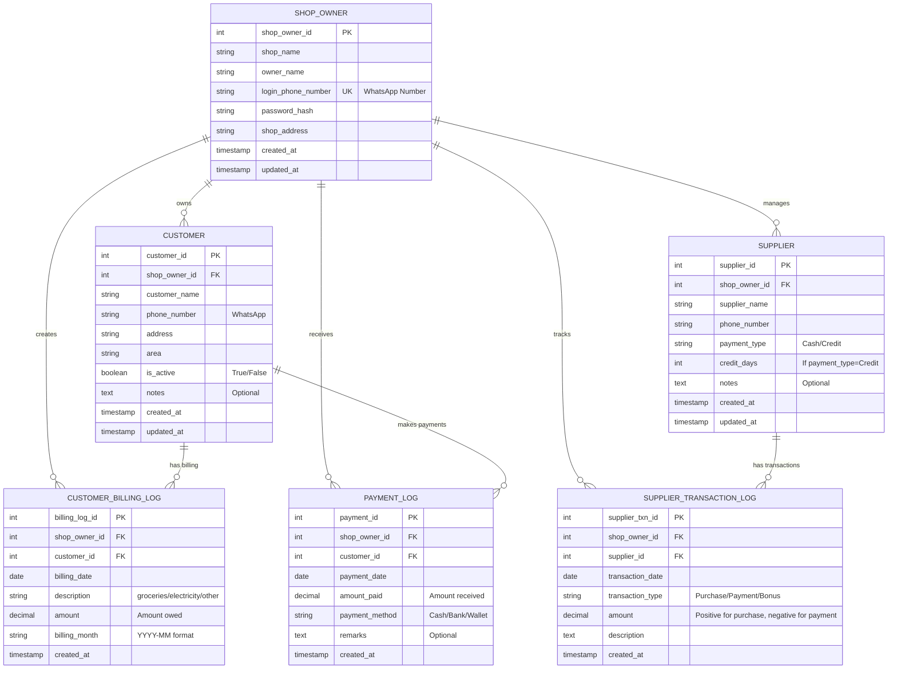

# 🏪 ShopOwner Pro
### Smart Shop Management System for SME Owners


---

## 📋 Overview

**ShopOwner Pro** is an intelligent, database-heavy shop management system built exclusively for small and medium-sized shop owners. Unlike generic billing or inventory apps, this system **understands how shops actually run** — tracking stock movement, supplier behavior, sales patterns, peak hours, losses, and human mistakes — and transforms this data into **clear, actionable decisions**.

### The Problem We Solve

- ❌ Manual Excel spreadsheets that break
- ❌ Lost billing records with no balance history
- ❌ No insight into supplier payment terms
- ❌ Impossible to track daily customer debts
- ❌ Zero visibility into stock movement patterns
- ❌ Guesswork instead of data-driven decisions

### The Solution

✅ **Single Source of Truth**: All transactions logged in specialized tables  
✅ **Smart Balance Calculation**: Real-time customer debt computation  
✅ **Supplier Intelligence**: Complete transaction history per supplier  
✅ **Pattern Recognition**: Identify trends in sales, losses, and customer behavior  
✅ **Zero Trust Architecture**: No manual balance entry = no human error  
✅ **Owner-Only Access**: Secure, focused interface for one user  

---

## 🎯 Key Features

### 1. **Customer Billing Management**
- Track monthly billing customers (उधार / credit customers)
- Real-time balance calculation from transaction logs
- Payment history with multiple methods (Cash/Bank/Wallet)
- Customer status tracking (active/inactive)
- Area/location-based customer grouping

### 2. **Supplier Transaction Ledger**
- Complete supplier payment history
- Transaction types: Purchase, Payment, Bonus/Adjustments
- Credit term tracking (payment_type, credit_days)
- Real-time supplier balance = SUM of all transactions
- Supplier performance analytics

### 3. **Billing Intelligence**
- Daily/Weekly/Monthly billing on single table
- Flexible billing descriptions (groceries, electricity, other)
- Month-wise billing aggregation
- No fixed billing structure = maximum flexibility

### 4. **Smart Insights** (MVP Phase)
- Customer payment trends
- Supplier punctuality scoring
- Peak billing periods
- High-risk overdue accounts
- Supplier cost analysis

### 5. **Security & Access Control**
- Single shop owner authentication
- WhatsApp Business number login
- Session management
- Audit trail for all transactions

---

## 🗄️ Database Architecture

### Core Philosophy

**No Balance Columns** → All balances are **calculated in real-time**

```
Outstanding Balance = SUM(CustomerBillingLog) - SUM(PaymentLog)
Supplier Balance = SUM(SupplierTransactionLog)
```

This ensures:
- ✅ Single source of truth
- ✅ No data inconsistency
- ✅ Complete audit trail
- ✅ Easy debugging and recovery

---

## 📊 Entity Relationship Diagram (ERD)

### Full Database Schema Diagram



---

## 📋 Database Tables Reference

### 1️⃣ **ShopOwner** (Parent Entity)

| Column | Type | Constraints | Purpose |
|--------|------|-------------|---------|
| `shop_owner_id` | INT | PK, AUTO_INCREMENT | Unique shop identifier |
| `shop_name` | VARCHAR(255) | NOT NULL | Display name of shop |
| `owner_name` | VARCHAR(255) | NOT NULL | Owner's full name |
| `login_phone_number` | VARCHAR(20) | NOT NULL, UNIQUE | WhatsApp Business number |
| `password_hash` | VARCHAR(255) | NOT NULL | Hashed password (bcrypt) |
| `shop_address` | TEXT | NOT NULL | Complete shop address |
| `created_at` | TIMESTAMP | DEFAULT CURRENT_TIMESTAMP | Account creation date |
| `updated_at` | TIMESTAMP | ON UPDATE CURRENT_TIMESTAMP | Last update timestamp |

**Indexes:**
- PRIMARY KEY: `shop_owner_id`
- UNIQUE: `login_phone_number`

---

### 2️⃣ **Customer**

| Column | Type | Constraints | Purpose |
|--------|------|-------------|---------|
| `customer_id` | INT | PK, AUTO_INCREMENT | Unique customer identifier |
| `shop_owner_id` | INT | FK → ShopOwner | Owner reference |
| `customer_name` | VARCHAR(255) | NOT NULL | Customer full name |
| `phone_number` | VARCHAR(20) | NOT NULL | WhatsApp contact |
| `address` | TEXT | NOT NULL | Customer's address |
| `area` | VARCHAR(100) | Nullable | Area/locality name |
| `is_active` | BOOLEAN | DEFAULT TRUE | Active status |
| `notes` | TEXT | Nullable | Additional notes |
| `created_at` | TIMESTAMP | DEFAULT CURRENT_TIMESTAMP | Record creation |
| `updated_at` | TIMESTAMP | ON UPDATE CURRENT_TIMESTAMP | Last modification |

**Indexes:**
- PRIMARY KEY: `customer_id`
- FOREIGN KEY: `shop_owner_id`
- INDEX: `area` (for area-based queries)
- UNIQUE: (`shop_owner_id`, `phone_number`)

---

### 3️⃣ **CustomerBillingLog** (Most Important)

| Column | Type | Constraints | Purpose |
|--------|------|-------------|---------|
| `billing_log_id` | INT | PK, AUTO_INCREMENT | Unique log entry |
| `shop_owner_id` | INT | FK → ShopOwner | Owner reference |
| `customer_id` | INT | FK → Customer | Customer reference |
| `billing_date` | DATE | NOT NULL | Date of billing |
| `description` | VARCHAR(255) | NOT NULL | What was billed (groceries/electricity/other) |
| `amount` | DECIMAL(10,2) | NOT NULL | Amount owed |
| `billing_month` | VARCHAR(7) | Nullable | YYYY-MM format for monthly aggregation |
| `created_at` | TIMESTAMP | DEFAULT CURRENT_TIMESTAMP | Log creation timestamp |

**Indexes:**
- PRIMARY KEY: `billing_log_id`
- FOREIGN KEY: `shop_owner_id`, `customer_id`
- INDEX: `billing_date` (for date range queries)
- INDEX: `billing_month` (for monthly reports)
- COMPOSITE INDEX: (`shop_owner_id`, `customer_id`) (for customer balance)

**Sample Data:**
```
| billing_log_id | customer_id | billing_date | description | amount | billing_month |
|---|---|---|---|---|---|
| 1 | 5 | 2025-01-20 | Groceries - Week 1 | 2500.00 | 2025-01 |
| 2 | 5 | 2025-01-27 | Electricity share | 1200.00 | 2025-01 |
| 3 | 7 | 2025-01-20 | Other charges | 300.00 | 2025-01 |
```

---

### 4️⃣ **PaymentLog**

| Column | Type | Constraints | Purpose |
|--------|------|-------------|---------|
| `payment_id` | INT | PK, AUTO_INCREMENT | Unique payment identifier |
| `shop_owner_id` | INT | FK → ShopOwner | Owner reference |
| `customer_id` | INT | FK → Customer | Customer reference |
| `payment_date` | DATE | NOT NULL | Payment date |
| `amount_paid` | DECIMAL(10,2) | NOT NULL | Amount received from customer |
| `payment_method` | ENUM | ('Cash','Bank','Wallet') | Payment method |
| `remarks` | TEXT | Nullable | Additional notes |
| `created_at` | TIMESTAMP | DEFAULT CURRENT_TIMESTAMP | Log creation timestamp |

**Indexes:**
- PRIMARY KEY: `payment_id`
- FOREIGN KEY: `shop_owner_id`, `customer_id`
- INDEX: `payment_date` (for date range queries)
- COMPOSITE INDEX: (`shop_owner_id`, `customer_id`) (for customer balance)

**Sample Data:**
```
| payment_id | customer_id | payment_date | amount_paid | payment_method | remarks |
|---|---|---|---|---|---|
| 1 | 5 | 2025-01-18 | 1500.00 | Cash | Partial payment |
| 2 | 5 | 2025-01-20 | 2000.00 | Bank | Full settlement |
| 3 | 7 | 2025-01-21 | 300.00 | Wallet | Complete |
```

---

### 5️⃣ **Supplier**

| Column | Type | Constraints | Purpose |
|--------|------|-------------|---------|
| `supplier_id` | INT | PK, AUTO_INCREMENT | Unique supplier identifier |
| `shop_owner_id` | INT | FK → ShopOwner | Owner reference |
| `supplier_name` | VARCHAR(255) | NOT NULL | Supplier company name |
| `phone_number` | VARCHAR(20) | NOT NULL | Contact number |
| `payment_type` | ENUM | ('Cash','Credit') | Payment arrangement |
| `credit_days` | INT | Nullable | Days allowed for payment if credit |
| `notes` | TEXT | Nullable | Terms, contacts, notes |
| `created_at` | TIMESTAMP | DEFAULT CURRENT_TIMESTAMP | Record creation |
| `updated_at` | TIMESTAMP | ON UPDATE CURRENT_TIMESTAMP | Last modification |

**Indexes:**
- PRIMARY KEY: `supplier_id`
- FOREIGN KEY: `shop_owner_id`
- UNIQUE: (`shop_owner_id`, `supplier_name`)

---

### 6️⃣ **SupplierTransactionLog** (Ledger-Style)

| Column | Type | Constraints | Purpose |
|--------|------|-------------|---------|
| `supplier_txn_id` | INT | PK, AUTO_INCREMENT | Unique transaction identifier |
| `shop_owner_id` | INT | FK → ShopOwner | Owner reference |
| `supplier_id` | INT | FK → Supplier | Supplier reference |
| `transaction_date` | DATE | NOT NULL | Date of transaction |
| `transaction_type` | ENUM | ('Purchase','Payment','Bonus') | Type of transaction |
| `amount` | DECIMAL(10,2) | NOT NULL | Amount (+ for purchase, - for payment) |
| `description` | VARCHAR(255) | NOT NULL | What was purchased/paid/adjusted |
| `created_at` | TIMESTAMP | DEFAULT CURRENT_TIMESTAMP | Log creation timestamp |

**Indexes:**
- PRIMARY KEY: `supplier_txn_id`
- FOREIGN KEY: `shop_owner_id`, `supplier_id`
- INDEX: `transaction_date` (for date range queries)
- COMPOSITE INDEX: (`shop_owner_id`, `supplier_id`) (for supplier balance)

**Sample Data:**
```
| supplier_txn_id | supplier_id | transaction_date | transaction_type | amount | description |
|---|---|---|---|---|---|
| 1 | 3 | 2025-01-15 | Purchase | 50000.00 | Wholesale groceries |
| 2 | 3 | 2025-01-18 | Payment | -30000.00 | Partial payment |
| 3 | 3 | 2025-01-20 | Bonus | -5000.00 | Discount adjustment |
```

**Current Balance:** 50000 - 30000 - 5000 = **Rs. 15,000 owed**

---

## 🔢 Key Calculations (Not Stored, Always Calculated)

### Customer Outstanding Balance

```sql
SELECT 
    c.customer_id,
    c.customer_name,
    COALESCE(SUM(CASE WHEN cbl.amount THEN cbl.amount ELSE 0 END), 0) as total_billed,
    COALESCE(SUM(CASE WHEN pl.amount_paid THEN pl.amount_paid ELSE 0 END), 0) as total_paid,
    COALESCE(SUM(CASE WHEN cbl.amount THEN cbl.amount ELSE 0 END), 0) 
    - COALESCE(SUM(CASE WHEN pl.amount_paid THEN pl.amount_paid ELSE 0 END), 0) as outstanding_balance
FROM CUSTOMER c
LEFT JOIN CUSTOMER_BILLING_LOG cbl ON c.customer_id = cbl.customer_id
LEFT JOIN PAYMENT_LOG pl ON c.customer_id = pl.customer_id
GROUP BY c.customer_id, c.customer_name;
```

### Supplier Outstanding Balance

```sql
SELECT 
    s.supplier_id,
    s.supplier_name,
    SUM(CASE 
        WHEN stl.transaction_type = 'Purchase' THEN stl.amount
        WHEN stl.transaction_type = 'Payment' THEN -stl.amount
        WHEN stl.transaction_type = 'Bonus' THEN -stl.amount
    END) as outstanding_balance
FROM SUPPLIER s
LEFT JOIN SUPPLIER_TRANSACTION_LOG stl ON s.supplier_id = stl.supplier_id
GROUP BY s.supplier_id, s.supplier_name;
```

---

## 🏗️ Tech Stack

### Frontend
- **React 18+** (UI Framework)
- **TypeScript** (Type safety)
- **Tailwind CSS** (Styling)
- **React Query** (Data fetching)
- **Zustand** (State management)
- **React Router** (Navigation)
- **Chart.js / Recharts** (Data visualization)
- **Zod** (Form validation)

### Backend
- **Node.js + Express** (API Server)
- **JWT** (Authentication)
- **bcryptjs** (Password hashing)

### Database
- **MySQL 8.0+** (Primary database)
- **Connection Pool** (HikariCP or equivalent)

### DevOps & Deployment
- **Docker** (Containerization)
- **GitHub Actions** (CI/CD)
- **AWS RDS** (Managed database)
- **AWS EC2 / Vercel** (Hosting)

---

## 🎯 Before You Start Development

### Prerequisites

1. **Node.js** v18+ installed
2. **MySQL 8.0+** running locally or cloud instance
3. **Git** for version control
4. Basic understanding of:
   - React hooks and functional components
   - SQL queries and database design
   - REST API design
   - Authentication flows

### Development Checklist

- [ ] **Read this entire README** (you're doing it!)
- [ ] **Understand the ER diagram** — mental model of how tables relate
- [ ] **Know the calculation philosophy** — balances = SUM, never stored
- [ ] **Single user assumption** — only shop owner uses the system
- [ ] **WhatsApp authentication** — login via phone number (MVP)
- [ ] **Audit trail** — every transaction needs `created_at`
- [ ] **No balance columns** — enforce this architectural rule
- [ ] **Indexes on FKs** — for query performance
- [ ] **Composite indexes** — for fast balance calculations

---

## 📱 User Workflows

### Login Workflow

```
1. Shop owner opens app
2. Enters WhatsApp phone number
3. System sends OTP via WhatsApp
4. Owner confirms OTP
5. JWT token issued + session starts
6. Redirected to dashboard
```

### Add Billing (Daily Operation)

```
1. Owner clicks "Add Billing"
2. Selects customer from dropdown
3. Selects description (groceries/electricity/other)
4. Enters amount
5. System auto-fills billing_date = today
6. System auto-fills billing_month = current month
7. Entry logged in CUSTOMER_BILLING_LOG
8. Customer balance automatically recalculated
```

### Record Payment (Daily Operation)

```
1. Owner clicks "Add Payment"
2. Selects customer
3. Enters amount received
4. Selects payment method
5. Optional: adds remarks
6. Entry logged in PAYMENT_LOG
7. Customer balance immediately updates
8. Payment receipt generated
```

### View Customer Balance (Anytime)

```
1. Go to Customers → View All
2. Click on customer name
3. System calculates:
   - Total billed from CUSTOMER_BILLING_LOG
   - Total paid from PAYMENT_LOG
   - Outstanding = Total Billed - Total Paid
4. Monthly breakdown shown
5. Payment history listed
```

---

## 🚀 Project Structure (Recommended)

```
shopowner-pro/
├── frontend/                 # React application
│   ├── src/
│   │   ├── components/
│   │   │   ├── Auth/
│   │   │   ├── Dashboard/
│   │   │   ├── Customers/
│   │   │   ├── Billing/
│   │   │   ├── Payments/
│   │   │   ├── Suppliers/
│   │   │   └── Reports/
│   │   ├── hooks/           # Custom React hooks
│   │   ├── services/        # API calls
│   │   ├── store/           # Zustand store
│   │   ├── types/           # TypeScript interfaces
│   │   ├── pages/
│   │   └── App.tsx
│   ├── public/
│   └── package.json
│
├── backend/                  # Node.js Express API
│   ├── src/
│   │   ├── controllers/     # Request handlers
│   │   ├── routes/
│   │   ├── middleware/      # Auth, validation
│   │   ├── services/        # Business logic
│   │   ├── models/          # Database queries
│   │   ├── types/           # TypeScript interfaces
│   │   ├── utils/
│   │   └── app.ts
│   ├── database/
│   │   ├── schema.sql       # All table definitions
│   │   └── migrations/
│   └── package.json
│
├── docker-compose.yml       # Local MySQL setup
├── .env.example
└── README.md
```

---

## 💾 Database Setup

### Step 1: Create Database

```sql
CREATE DATABASE IF NOT EXISTS shopowner_db;
USE shopowner_db;
```

### Step 2: Create Tables (See schema.sql below)

```sql
-- SHOP_OWNER TABLE
CREATE TABLE SHOP_OWNER (
    shop_owner_id INT PRIMARY KEY AUTO_INCREMENT,
    shop_name VARCHAR(255) NOT NULL,
    owner_name VARCHAR(255) NOT NULL,
    login_phone_number VARCHAR(20) NOT NULL UNIQUE,
    password_hash VARCHAR(255) NOT NULL,
    shop_address TEXT NOT NULL,
    created_at TIMESTAMP DEFAULT CURRENT_TIMESTAMP,
    updated_at TIMESTAMP DEFAULT CURRENT_TIMESTAMP ON UPDATE CURRENT_TIMESTAMP
);

-- CUSTOMER TABLE
CREATE TABLE CUSTOMER (
    customer_id INT PRIMARY KEY AUTO_INCREMENT,
    shop_owner_id INT NOT NULL,
    customer_name VARCHAR(255) NOT NULL,
    phone_number VARCHAR(20) NOT NULL,
    address TEXT NOT NULL,
    area VARCHAR(100),
    is_active BOOLEAN DEFAULT TRUE,
    notes TEXT,
    created_at TIMESTAMP DEFAULT CURRENT_TIMESTAMP,
    updated_at TIMESTAMP DEFAULT CURRENT_TIMESTAMP ON UPDATE CURRENT_TIMESTAMP,
    FOREIGN KEY (shop_owner_id) REFERENCES SHOP_OWNER(shop_owner_id) ON DELETE CASCADE,
    INDEX idx_area (area),
    UNIQUE KEY unique_customer (shop_owner_id, phone_number)
);

-- CUSTOMER_BILLING_LOG TABLE
CREATE TABLE CUSTOMER_BILLING_LOG (
    billing_log_id INT PRIMARY KEY AUTO_INCREMENT,
    shop_owner_id INT NOT NULL,
    customer_id INT NOT NULL,
    billing_date DATE NOT NULL,
    description VARCHAR(255) NOT NULL,
    amount DECIMAL(10, 2) NOT NULL,
    billing_month VARCHAR(7),
    created_at TIMESTAMP DEFAULT CURRENT_TIMESTAMP,
    FOREIGN KEY (shop_owner_id) REFERENCES SHOP_OWNER(shop_owner_id) ON DELETE CASCADE,
    FOREIGN KEY (customer_id) REFERENCES CUSTOMER(customer_id) ON DELETE CASCADE,
    INDEX idx_billing_date (billing_date),
    INDEX idx_billing_month (billing_month),
    INDEX idx_customer_balance (shop_owner_id, customer_id)
);

-- PAYMENT_LOG TABLE
CREATE TABLE PAYMENT_LOG (
    payment_id INT PRIMARY KEY AUTO_INCREMENT,
    shop_owner_id INT NOT NULL,
    customer_id INT NOT NULL,
    payment_date DATE NOT NULL,
    amount_paid DECIMAL(10, 2) NOT NULL,
    payment_method ENUM('Cash', 'Bank', 'Wallet') NOT NULL,
    remarks TEXT,
    created_at TIMESTAMP DEFAULT CURRENT_TIMESTAMP,
    FOREIGN KEY (shop_owner_id) REFERENCES SHOP_OWNER(shop_owner_id) ON DELETE CASCADE,
    FOREIGN KEY (customer_id) REFERENCES CUSTOMER(customer_id) ON DELETE CASCADE,
    INDEX idx_payment_date (payment_date),
    INDEX idx_customer_payment (shop_owner_id, customer_id)
);

-- SUPPLIER TABLE
CREATE TABLE SUPPLIER (
    supplier_id INT PRIMARY KEY AUTO_INCREMENT,
    shop_owner_id INT NOT NULL,
    supplier_name VARCHAR(255) NOT NULL,
    phone_number VARCHAR(20) NOT NULL,
    payment_type ENUM('Cash', 'Credit') NOT NULL,
    credit_days INT,
    notes TEXT,
    created_at TIMESTAMP DEFAULT CURRENT_TIMESTAMP,
    updated_at TIMESTAMP DEFAULT CURRENT_TIMESTAMP ON UPDATE CURRENT_TIMESTAMP,
    FOREIGN KEY (shop_owner_id) REFERENCES SHOP_OWNER(shop_owner_id) ON DELETE CASCADE,
    UNIQUE KEY unique_supplier (shop_owner_id, supplier_name)
);

-- SUPPLIER_TRANSACTION_LOG TABLE
CREATE TABLE SUPPLIER_TRANSACTION_LOG (
    supplier_txn_id INT PRIMARY KEY AUTO_INCREMENT,
    shop_owner_id INT NOT NULL,
    supplier_id INT NOT NULL,
    transaction_date DATE NOT NULL,
    transaction_type ENUM('Purchase', 'Payment', 'Bonus') NOT NULL,
    amount DECIMAL(10, 2) NOT NULL,
    description VARCHAR(255) NOT NULL,
    created_at TIMESTAMP DEFAULT CURRENT_TIMESTAMP,
    FOREIGN KEY (shop_owner_id) REFERENCES SHOP_OWNER(shop_owner_id) ON DELETE CASCADE,
    FOREIGN KEY (supplier_id) REFERENCES SUPPLIER(supplier_id) ON DELETE CASCADE,
    INDEX idx_transaction_date (transaction_date),
    INDEX idx_supplier_balance (shop_owner_id, supplier_id)
);
```

---

## 🔐 Security Best Practices

### Authentication
- ✅ JWT tokens with 24-hour expiry
- ✅ Refresh tokens stored in HTTP-only cookies
- ✅ Password hashing with bcryptjs (12 rounds)
- ✅ OTP verification for login via WhatsApp

### Data Protection
- ✅ All transactions logged with timestamps
- ✅ No balance columns (prevent tampering)
- ✅ Foreign key constraints for referential integrity
- ✅ Soft deletes where applicable

### API Security
- ✅ HTTPS enforced in production
- ✅ CORS configured for frontend origin only
- ✅ Rate limiting on auth endpoints
- ✅ Input validation with Zod/Joi
- ✅ SQL injection prevention (parameterized queries)

---

## 📊 Analytics & Reporting (Phase 2+)

Once MVP is stable, add:

1. **Customer Analytics**
   - Top paying customers
   - Highest outstanding balances
   - Payment trends by month
   - Area-wise performance

2. **Supplier Analytics**
   - Most frequently purchased from
   - Payment punctuality scoring
   - Cost trends
   - Bonus/discount history

3. **Shop Analytics**
   - Daily revenue
   - Peak billing periods
   - Customer acquisition rate
   - Cash flow projections

---

## 🎓 Learning Path Before Starting

### Day 1: Database Design
- [ ] Understand ER diagrams and relationships
- [ ] Study this schema completely
- [ ] Practice writing the balance calculation query
- [ ] Create the database locally

### Day 2: Backend Setup
- [ ] Set up Express.js API server
- [ ] Create database connection pool
- [ ] Write CRUD operations for each table
- [ ] Test with Postman

### Day 3: Frontend Setup
- [ ] Set up React + TypeScript project
- [ ] Create layout and navigation
- [ ] Build auth flow (login/logout)
- [ ] Set up API integration layer

### Day 4-5: Core Features
- [ ] Customer CRUD
- [ ] Billing log entries
- [ ] Payment tracking
- [ ] Balance calculations

### Day 6: Testing & Polish
- [ ] Database query optimization
- [ ] UI/UX refinements
- [ ] Error handling
- [ ] Production deployment setup

---

## 🐛 Common Mistakes to Avoid

### ❌ DON'T

1. **Add balance columns** — calculate on-the-fly always
2. **Skip indexes on foreign keys** — performance killer
3. **Allow manual balance edits** — source of truth is transactions
4. **Store passwords in plain text** — use bcryptjs
5. **Forget billing_month field** — essential for monthly reports
6. **Create a loan table** — unnecessary complexity
7. **Skip audit trail** — always log created_at, updated_at
8. **Allow multiple shop owners in one app** — single owner only
9. **Forget transaction timestamps** — essential for debugging

### ✅ DO

1. **Always calculate balances** from source transactions
2. **Index heavily** — this is a calculation-heavy app
3. **Keep data normalized** — avoid redundancy
4. **Add comprehensive logging** — debug like a pro
5. **Write clear descriptions** in billing logs
6. **Use enums for fixed values** — payment_method, transaction_type
7. **Test calculations thoroughly** — balance accuracy is critical
8. **Plan for scale** — support 1000s of customers later

---

## 📞 API Endpoints (MVP v1.0)

### Authentication
- `POST /api/auth/request-otp` — Request OTP
- `POST /api/auth/verify-otp` — Verify OTP & get JWT
- `POST /api/auth/logout` — Logout

### Customers
- `GET /api/customers` — List all
- `GET /api/customers/:id` — Get single
- `POST /api/customers` — Create
- `PUT /api/customers/:id` — Update
- `GET /api/customers/:id/balance` — Calculate balance

### Billing
- `GET /api/billing` — List all logs
- `POST /api/billing` — Add billing log
- `GET /api/billing/customer/:id` — Customer's billing history
- `GET /api/billing/month/:month` — Monthly summary

### Payments
- `GET /api/payments` — List all
- `POST /api/payments` — Record payment
- `GET /api/payments/customer/:id` — Customer's payment history

### Suppliers
- `GET /api/suppliers` — List all
- `POST /api/suppliers` — Add supplier
- `GET /api/suppliers/:id/balance` — Calculate balance
- `GET /api/suppliers/:id/transactions` — Transaction history

### Supplier Transactions
- `POST /api/supplier-transactions` — Log transaction
- `GET /api/supplier-transactions/:id` — Supplier transactions

---

## 🚨 Important Assumptions & Constraints

1. **Single Shop Owner** → Only one user per database instance
2. **No Inventory** → This is billing-focused, not inventory management
3. **No Stock Levels** → SupplierTransactionLog is for payments, not inventory
4. **Monthly Billing** → Designed for monthly settlement customers
5. **WhatsApp Primary** → Phone number is the unique identifier
6. **Pakistan Market** → Supports Rupees, dates in DD-MM-YYYY format
7. **Hindi/Urdu Support** → Customer names can be in Urdu

---

## 📈 Scalability Considerations

### Current Design Scales To:
- ✅ 10,000+ customers
- ✅ 100,000+ billing log entries
- ✅ 1,000+ suppliers
- ✅ Daily concurrent access

### When to Optimize:
- [ ] Billing logs exceed 1M rows → Add data archival
- [ ] Queries exceed 1s → Add more indexes
- [ ] Database size exceeds 5GB → Archive old data
- [ ] Multiple app instances needed → Add API caching layer

---

## 🎯 Success Metrics

Your MVP is successful when:

✅ Shop owner can log in with WhatsApp OTP  
✅ Add/view customers without errors  
✅ Record billing entries and payments  
✅ Customer balance calculates correctly  
✅ Can view monthly billing summary  
✅ All transactions logged with timestamps  
✅ UI is intuitive for non-technical user  
✅ Database scales to 1000+ customers  
✅ Zero data inconsistencies  

---

## 📚 References & Resources

### Database Design
- [MySQL 8.0 Documentation](https://dev.mysql.com/doc/)
- [Database Design Best Practices](https://www.postgresql.org/docs/current/ddl.html)
- [Normalization Guide](https://en.wikipedia.org/wiki/Database_normalization)

### React Development
- [React Documentation](https://react.dev)
- [TypeScript Handbook](https://www.typescriptlang.org/docs/)
- [React Query Guide](https://tanstack.com/query/latest)

### Backend Development
- [Express.js Guide](https://expressjs.com/)
- [JWT Authentication](https://jwt.io/introduction)
- [Security Best Practices](https://owasp.org/)

---

## 📝 Quick Reference Checklist

Before writing your first line of code:

- [ ] Understand all 6 tables and their relationships
- [ ] Know that balances are calculated, never stored
- [ ] Plan authentication flow with WhatsApp OTP
- [ ] Design React component structure
- [ ] Set up Express routes matching the API endpoints
- [ ] Create database schema in MySQL
- [ ] Plan deployment strategy (Docker + AWS/Vercel)
- [ ] Think about error handling and validation
- [ ] Consider mobile-responsive UI for shop owner
- [ ] Plan testing strategy

---

## 🎉 Next Steps

1. **Clone the repository** (when ready)
2. **Set up local development environment** (Node + MySQL)
3. **Create database using schema.sql**
4. **Start backend server** (Express)
5. **Start frontend app** (React)
6. **Build features in order:**
   - Auth (1-2 days)
   - Customer management (1 day)
   - Billing & Payments (2 days)
   - Suppliers (1 day)
   - Reports & Polish (2 days)

---

## 💬 Project Philosophy

> "Instead of just storing data, the system understands how a shop runs."

Every feature should answer one of these questions:
- How can the owner make better decisions?
- How can we prevent human error?
- How can we save the owner time?
- How can we turn data into insights?

Keep this in mind while building. Good luck! 🚀

---

**Built with ❤️ for small shop owners who deserve better tools**

**Questions?** Review this README thoroughly before starting. All answers are here.
